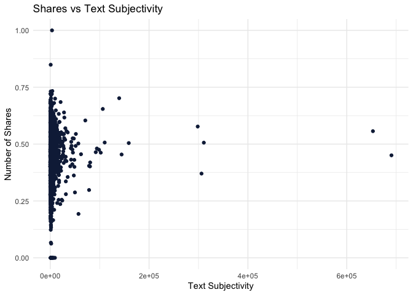

Online News Popularity Analysis
================
Matthieu Cartron and Sneha Karanjai
2022-12-08

- <a href="#introduction" id="toc-introduction">1 Introduction</a>
- <a href="#setup" id="toc-setup">2 Setup</a>
- <a href="#data-import" id="toc-data-import">3 Data Import</a>
- <a href="#exploratory-data-analysis"
  id="toc-exploratory-data-analysis">4 Exploratory Data Analysis</a>
  - <a href="#column-description" id="toc-column-description">4.1 Column
    Description</a>
  - <a href="#summary-statistics" id="toc-summary-statistics">4.2 Summary
    Statistics</a>
  - <a href="#target-variable-distribution"
    id="toc-target-variable-distribution">4.3 Target Variable
    Distribution</a>
  - <a href="#title-tokens-vs-shares" id="toc-title-tokens-vs-shares">4.4
    Title Tokens vs Shares</a>
  - <a href="#number-of-links-in-the-articles-vs-shares"
    id="toc-number-of-links-in-the-articles-vs-shares">4.5 Number of Links
    in the Articles vs Shares</a>
  - <a href="#number-of-images-vs-shares"
    id="toc-number-of-images-vs-shares">4.6 Number of Images vs Shares</a>
  - <a href="#number-of-videos-vs-shares"
    id="toc-number-of-videos-vs-shares">4.7 Number of Videos vs Shares</a>
  - <a href="#days-of-the-week-and-shares"
    id="toc-days-of-the-week-and-shares">4.8 Days of the Week and Shares</a>
  - <a href="#title-polarity-vs-shares"
    id="toc-title-polarity-vs-shares">4.9 Title Polarity vs Shares</a>
  - <a href="#global-polarity-vs-shares"
    id="toc-global-polarity-vs-shares">4.10 Global Polarity vs Shares</a>
  - <a href="#subjectivity-and-shares" id="toc-subjectivity-and-shares">4.11
    Subjectivity and Shares</a>
  - <a
    href="#how-does-the-rate-of-negative-words-in-an-article-affect-the-shares"
    id="toc-how-does-the-rate-of-negative-words-in-an-article-affect-the-shares">4.12
    How does the rate of negative words in an article affect the Shares?</a>
  - <a href="#correlation-analysis" id="toc-correlation-analysis">4.13
    Correlation Analysis</a>
- <a href="#data-splitting" id="toc-data-splitting">5 Data Splitting</a>
- <a href="#modeling" id="toc-modeling">6 Modeling</a>
  - <a href="#linear-regression" id="toc-linear-regression">6.1 Linear
    Regression</a>
    - <a href="#linear-regression-with-dimensionality-reduction"
      id="toc-linear-regression-with-dimensionality-reduction">6.1.1 Linear
      Regression with Dimensionality Reduction</a>
  - <a href="#random-forest" id="toc-random-forest">6.2 Random Forest</a>
  - <a href="#boosted-tree" id="toc-boosted-tree">6.3 Boosted Tree</a>
- <a href="#model-comparison" id="toc-model-comparison">7 Model
  Comparison</a>
  - <a href="#train-model-comparison" id="toc-train-model-comparison">7.1
    Train Model Comparison</a>
  - <a href="#test-model-comparison" id="toc-test-model-comparison">7.2 Test
    Model Comparison</a>
- <a href="#conclusion" id="toc-conclusion">8 Conclusion</a>

# 1 Introduction

The following analysis uses the “Online News Popularity” data set from
the UCI machine learning repository. It consists of a number variables
describing different features of articles, each of which belonging to
one of six “channels.” These channels are effectively genres, and are
the following:

- Lifestyle
- Entertainment
- Business
- Social Media
- World News

For this analysis, we are primarily concerned with the “shares”
variable, which simply describes the number of times an article has been
shared. We often hear that news travels more quickly depending on its
content, title, and maybe even the number of images it uses. In a
similar vein, we would like, for each of the different data channels, to
use certain variables describing the articles to predict the number of
times an article might be shared. But how do we know which variables to
choose?

We could use simple intuition to pick variables. For example, it makes
sense to think that articles with high sentiment polarity (positive or
negative) would tend to, on average, have more shares. We could go
through the variables and pick those that we think would have the
greatest impact on the number of shares. The issue, however, is that
they may change from one data channel to the next. Are lifestyle
articles and world news articles going to be affected by the same
variables? If we choose the same variables across all the different data
channels, then this is the assumption we will be making. To avoid making
this assumption, we will automate the process of variable selection by
deleting one variable of each of the pairs of collinear variables.

# 2 Setup

``` r
library(tidyverse)
library(caret)
library(brainGraph)
library(corrplot)
library(GGally)
```

# 3 Data Import

``` r
unzippedNewDataCSV <- unzip("OnlineNewsPopularity.zip")

newsDataName <- read_csv(unzippedNewDataCSV[1]) # This is the names file
newsData <- read_csv(unzippedNewDataCSV[2])

head(newsData)
```

    ## # A tibble: 6 × 61
    ##   url            timedelta n_tokens_title n_tokens_content n_unique_tokens n_non_stop_words n_non_stop_uniqu… num_hrefs
    ##   <chr>              <dbl>          <dbl>            <dbl>           <dbl>            <dbl>             <dbl>     <dbl>
    ## 1 http://mashab…       731             12              219           0.664             1.00             0.815         4
    ## 2 http://mashab…       731              9              255           0.605             1.00             0.792         3
    ## 3 http://mashab…       731              9              211           0.575             1.00             0.664         3
    ## 4 http://mashab…       731              9              531           0.504             1.00             0.666         9
    ## 5 http://mashab…       731             13             1072           0.416             1.00             0.541        19
    ## 6 http://mashab…       731             10              370           0.560             1.00             0.698         2
    ## # … with 53 more variables: num_self_hrefs <dbl>, num_imgs <dbl>, num_videos <dbl>, average_token_length <dbl>,
    ## #   num_keywords <dbl>, data_channel_is_lifestyle <dbl>, data_channel_is_entertainment <dbl>,
    ## #   data_channel_is_bus <dbl>, data_channel_is_socmed <dbl>, data_channel_is_tech <dbl>, data_channel_is_world <dbl>,
    ## #   kw_min_min <dbl>, kw_max_min <dbl>, kw_avg_min <dbl>, kw_min_max <dbl>, kw_max_max <dbl>, kw_avg_max <dbl>,
    ## #   kw_min_avg <dbl>, kw_max_avg <dbl>, kw_avg_avg <dbl>, self_reference_min_shares <dbl>,
    ## #   self_reference_max_shares <dbl>, self_reference_avg_sharess <dbl>, weekday_is_monday <dbl>,
    ## #   weekday_is_tuesday <dbl>, weekday_is_wednesday <dbl>, weekday_is_thursday <dbl>, weekday_is_friday <dbl>, …

We will subset the data according to the channel passed to analyze
articles in one data channel at a time. Additionally according to the
data report, `url` and `timedelta` are two non-predictive columns so we
will remove them.

``` r
subsettingData <- function(data, area){
  #getting the naming convention as per the dataframe
  subsetVar <- paste("data_channel_is_", area, sep = "")
  
  # filtering the data and removing the data_channel_is_ columns, url, and timedelta
  subsetData <- data %>% 
    filter(!!as.symbol(subsetVar)==1) %>% 
    select(-c(starts_with("data_channel_is_"), url, timedelta))
  
  return(list(subsetData, subsetVar))
}

subsettingDataReturn <- subsettingData(newsData, params$channel)
data <- subsettingDataReturn[[1]]
channel <- subsettingDataReturn[[2]]
```

# 4 Exploratory Data Analysis

## 4.1 Column Description

Let us take a look at the columns available.

``` r
colnames(data)
```

    ##  [1] "n_tokens_title"               "n_tokens_content"             "n_unique_tokens"             
    ##  [4] "n_non_stop_words"             "n_non_stop_unique_tokens"     "num_hrefs"                   
    ##  [7] "num_self_hrefs"               "num_imgs"                     "num_videos"                  
    ## [10] "average_token_length"         "num_keywords"                 "kw_min_min"                  
    ## [13] "kw_max_min"                   "kw_avg_min"                   "kw_min_max"                  
    ## [16] "kw_max_max"                   "kw_avg_max"                   "kw_min_avg"                  
    ## [19] "kw_max_avg"                   "kw_avg_avg"                   "self_reference_min_shares"   
    ## [22] "self_reference_max_shares"    "self_reference_avg_sharess"   "weekday_is_monday"           
    ## [25] "weekday_is_tuesday"           "weekday_is_wednesday"         "weekday_is_thursday"         
    ## [28] "weekday_is_friday"            "weekday_is_saturday"          "weekday_is_sunday"           
    ## [31] "is_weekend"                   "LDA_00"                       "LDA_01"                      
    ## [34] "LDA_02"                       "LDA_03"                       "LDA_04"                      
    ## [37] "global_subjectivity"          "global_sentiment_polarity"    "global_rate_positive_words"  
    ## [40] "global_rate_negative_words"   "rate_positive_words"          "rate_negative_words"         
    ## [43] "avg_positive_polarity"        "min_positive_polarity"        "max_positive_polarity"       
    ## [46] "avg_negative_polarity"        "min_negative_polarity"        "max_negative_polarity"       
    ## [49] "title_subjectivity"           "title_sentiment_polarity"     "abs_title_subjectivity"      
    ## [52] "abs_title_sentiment_polarity" "shares"

``` r
str(data)
```

    ## tibble [6,258 × 53] (S3: tbl_df/tbl/data.frame)
    ##  $ n_tokens_title              : num [1:6258] 9 9 8 13 11 8 10 12 6 13 ...
    ##  $ n_tokens_content            : num [1:6258] 255 211 397 244 723 708 142 444 109 306 ...
    ##  $ n_unique_tokens             : num [1:6258] 0.605 0.575 0.625 0.56 0.491 ...
    ##  $ n_non_stop_words            : num [1:6258] 1 1 1 1 1 ...
    ##  $ n_non_stop_unique_tokens    : num [1:6258] 0.792 0.664 0.806 0.68 0.642 ...
    ##  $ num_hrefs                   : num [1:6258] 3 3 11 3 18 8 2 9 3 3 ...
    ##  $ num_self_hrefs              : num [1:6258] 1 1 0 2 1 3 1 8 2 2 ...
    ##  $ num_imgs                    : num [1:6258] 1 1 1 1 1 1 1 23 1 1 ...
    ##  $ num_videos                  : num [1:6258] 0 0 0 0 0 1 0 0 0 0 ...
    ##  $ average_token_length        : num [1:6258] 4.91 4.39 5.45 4.42 5.23 ...
    ##  $ num_keywords                : num [1:6258] 4 6 6 4 6 7 5 10 6 10 ...
    ##  $ kw_min_min                  : num [1:6258] 0 0 0 0 0 0 0 0 0 217 ...
    ##  $ kw_max_min                  : num [1:6258] 0 0 0 0 0 0 0 0 0 5700 ...
    ##  $ kw_avg_min                  : num [1:6258] 0 0 0 0 0 ...
    ##  $ kw_min_max                  : num [1:6258] 0 0 0 0 0 0 0 0 0 0 ...
    ##  $ kw_max_max                  : num [1:6258] 0 0 0 0 0 0 0 0 0 17100 ...
    ##  $ kw_avg_max                  : num [1:6258] 0 0 0 0 0 ...
    ##  $ kw_min_avg                  : num [1:6258] 0 0 0 0 0 0 0 0 0 0 ...
    ##  $ kw_max_avg                  : num [1:6258] 0 0 0 0 0 0 0 0 0 5700 ...
    ##  $ kw_avg_avg                  : num [1:6258] 0 0 0 0 0 ...
    ##  $ self_reference_min_shares   : num [1:6258] 0 918 0 2800 0 6100 0 585 821 0 ...
    ##  $ self_reference_max_shares   : num [1:6258] 0 918 0 2800 0 6100 0 1600 821 0 ...
    ##  $ self_reference_avg_sharess  : num [1:6258] 0 918 0 2800 0 ...
    ##  $ weekday_is_monday           : num [1:6258] 1 1 1 1 1 1 1 1 1 0 ...
    ##  $ weekday_is_tuesday          : num [1:6258] 0 0 0 0 0 0 0 0 0 1 ...
    ##  $ weekday_is_wednesday        : num [1:6258] 0 0 0 0 0 0 0 0 0 0 ...
    ##  $ weekday_is_thursday         : num [1:6258] 0 0 0 0 0 0 0 0 0 0 ...
    ##  $ weekday_is_friday           : num [1:6258] 0 0 0 0 0 0 0 0 0 0 ...
    ##  $ weekday_is_saturday         : num [1:6258] 0 0 0 0 0 0 0 0 0 0 ...
    ##  $ weekday_is_sunday           : num [1:6258] 0 0 0 0 0 0 0 0 0 0 ...
    ##  $ is_weekend                  : num [1:6258] 0 0 0 0 0 0 0 0 0 0 ...
    ##  $ LDA_00                      : num [1:6258] 0.8 0.218 0.867 0.3 0.867 ...
    ##  $ LDA_01                      : num [1:6258] 0.05 0.0333 0.0333 0.05 0.0333 ...
    ##  $ LDA_02                      : num [1:6258] 0.0501 0.0334 0.0333 0.05 0.0333 ...
    ##  $ LDA_03                      : num [1:6258] 0.0501 0.0333 0.0333 0.05 0.0333 ...
    ##  $ LDA_04                      : num [1:6258] 0.05 0.6822 0.0333 0.5497 0.0333 ...
    ##  $ global_subjectivity         : num [1:6258] 0.341 0.702 0.374 0.332 0.375 ...
    ##  $ global_sentiment_polarity   : num [1:6258] 0.1489 0.3233 0.2125 -0.0923 0.1827 ...
    ##  $ global_rate_positive_words  : num [1:6258] 0.0431 0.0569 0.0655 0.0164 0.0636 ...
    ##  $ global_rate_negative_words  : num [1:6258] 0.01569 0.00948 0.01008 0.02459 0.0083 ...
    ##  $ rate_positive_words         : num [1:6258] 0.733 0.857 0.867 0.4 0.885 ...
    ##  $ rate_negative_words         : num [1:6258] 0.267 0.143 0.133 0.6 0.115 ...
    ##  $ avg_positive_polarity       : num [1:6258] 0.287 0.496 0.382 0.292 0.341 ...
    ##  $ min_positive_polarity       : num [1:6258] 0.0333 0.1 0.0333 0.1364 0.0333 ...
    ##  $ max_positive_polarity       : num [1:6258] 0.7 1 1 0.433 1 ...
    ##  $ avg_negative_polarity       : num [1:6258] -0.119 -0.467 -0.145 -0.456 -0.214 ...
    ##  $ min_negative_polarity       : num [1:6258] -0.125 -0.8 -0.2 -1 -0.6 -0.5 -0.3 0 -0.1 0 ...
    ##  $ max_negative_polarity       : num [1:6258] -0.1 -0.133 -0.1 -0.125 -0.1 ...
    ##  $ title_subjectivity          : num [1:6258] 0 0 0 0.7 0.5 ...
    ##  $ title_sentiment_polarity    : num [1:6258] 0 0 0 -0.4 0.5 ...
    ##  $ abs_title_subjectivity      : num [1:6258] 0.5 0.5 0.5 0.2 0 ...
    ##  $ abs_title_sentiment_polarity: num [1:6258] 0 0 0 0.4 0.5 ...
    ##  $ shares                      : num [1:6258] 711 1500 3100 852 425 3200 575 819 732 1200 ...

Whew! That is a long list of columns to analyze. Instead of analyzing
them all, let us think about our data. What might we expect to be
related to how many times an article is shared? We hear frequently about
how the dissemination of news and the content thereof are related in
some way. For our data channels, let’s pay close attention to the number
of shares (dissemination) and variables that we might be able to link to
it. Can we find any interesting relationships in the exploratory
analysis? And do these relationships change across the different
channels? Maybe the sharing of lifestyle articles is less correlated
with sentiment than, say, world news articles.

First, let’s take a look at the variable descriptions for some better
understanding. Here is a data description from the UCI Machine Learning
Repository:

- n_tokens_title: Number of words in the title
- n_tokens_content Number of words in the content
- n_unique_tokens: Rate of unique words in the content
- n_non_stop_unique_tokens: Rate of unique non-stop words in the content
- num_hrefs: Number of links
- num_self_hrefs: Number of links to other articles published by
  Mashable
- num_imgs: Number of images
- num_videos: Number of videos
- average_token_length: Average length of the words in the content
- num_keywords: Number of keywords in the metadata
- self_reference_min_shares: Min. shares of referenced articles in
  Mashable
- self_reference_max_shares: Max. shares of referenced articles in
  Mashable
- self_reference_avg_sharess: Avg. shares of referenced articles in
  Mashable
- global_subjectivity: Text subjectivity
- global_sentiment_polarity: Text sentiment polarity
- global_rate_positive_words: Rate of positive words in the content
- global_rate_negative_words: Rate of negative words in the content
- rate_positive_words: Rate of positive words among non-neutral tokens
- rate_negative_words: Rate of negative words among non-neutral tokens
- title_subjectivity: Title subjectivity
- title_sentiment_polarity: Title polarity
- abs_title_subjectivity: Absolute subjectivity level
- abs_title_sentiment_polarity: Absolute polarity level
- shares: Number of shares (target)

Below we run the five-number summary for each of the variables thus far
still included.

## 4.2 Summary Statistics

``` r
print(paste("******Summary Statistics of", channel, "******"))
```

    ## [1] "******Summary Statistics of data_channel_is_bus ******"

``` r
summary(data)
```

    ##  n_tokens_title  n_tokens_content n_unique_tokens  n_non_stop_words n_non_stop_unique_tokens   num_hrefs      
    ##  Min.   : 3.00   Min.   :   0.0   Min.   :0.0000   Min.   :0.0000   Min.   :0.0000           Min.   :  0.000  
    ##  1st Qu.: 9.00   1st Qu.: 244.0   1st Qu.:0.4783   1st Qu.:1.0000   1st Qu.:0.6482           1st Qu.:  4.000  
    ##  Median :10.00   Median : 400.0   Median :0.5480   Median :1.0000   Median :0.7038           Median :  7.000  
    ##  Mean   :10.28   Mean   : 539.9   Mean   :0.5461   Mean   :0.9963   Mean   :0.7031           Mean   :  9.356  
    ##  3rd Qu.:12.00   3rd Qu.: 727.0   3rd Qu.:0.6116   3rd Qu.:1.0000   3rd Qu.:0.7600           3rd Qu.: 12.000  
    ##  Max.   :19.00   Max.   :6336.0   Max.   :0.8732   Max.   :1.0000   Max.   :0.9730           Max.   :122.000  
    ##  num_self_hrefs      num_imgs        num_videos      average_token_length  num_keywords     kw_min_min    
    ##  Min.   : 0.000   Min.   : 0.000   Min.   : 0.0000   Min.   :0.000        Min.   : 2.00   Min.   : -1.00  
    ##  1st Qu.: 1.000   1st Qu.: 1.000   1st Qu.: 0.0000   1st Qu.:4.527        1st Qu.: 5.00   1st Qu.: -1.00  
    ##  Median : 2.000   Median : 1.000   Median : 0.0000   Median :4.690        Median : 6.00   Median : -1.00  
    ##  Mean   : 2.803   Mean   : 1.808   Mean   : 0.6365   Mean   :4.688        Mean   : 6.49   Mean   : 29.27  
    ##  3rd Qu.: 4.000   3rd Qu.: 1.000   3rd Qu.: 0.0000   3rd Qu.:4.857        3rd Qu.: 8.00   3rd Qu.:  4.00  
    ##  Max.   :56.000   Max.   :51.000   Max.   :75.0000   Max.   :6.383        Max.   :10.00   Max.   :318.00  
    ##    kw_max_min       kw_avg_min        kw_min_max       kw_max_max       kw_avg_max       kw_min_avg     kw_max_avg    
    ##  Min.   :     0   Min.   :   -1.0   Min.   :     0   Min.   :     0   Min.   :     0   Min.   :   0   Min.   :     0  
    ##  1st Qu.:   437   1st Qu.:  153.0   1st Qu.:     0   1st Qu.:690400   1st Qu.:235125   1st Qu.:   0   1st Qu.:  3484  
    ##  Median :   633   Median :  251.3   Median :  1600   Median :843300   Median :312820   Median :1082   Median :  4087  
    ##  Mean   :  1042   Mean   :  315.9   Mean   : 20260   Mean   :742811   Mean   :315461   Mean   :1108   Mean   :  5265  
    ##  3rd Qu.:  1100   3rd Qu.:  373.8   3rd Qu.:  7400   3rd Qu.:843300   3rd Qu.:400644   3rd Qu.:1945   3rd Qu.:  5297  
    ##  Max.   :298400   Max.   :42827.9   Max.   :690400   Max.   :843300   Max.   :767414   Max.   :3531   Max.   :298400  
    ##    kw_avg_avg    self_reference_min_shares self_reference_max_shares self_reference_avg_sharess weekday_is_monday
    ##  Min.   :    0   Min.   :     0            Min.   :     0            Min.   :     0.0           Min.   :0.0000   
    ##  1st Qu.: 2331   1st Qu.:   257            1st Qu.:   635            1st Qu.:   610.4           1st Qu.:0.0000   
    ##  Median : 2770   Median :  1100            Median :  2500            Median :  2000.0           Median :0.0000   
    ##  Mean   : 2952   Mean   :  3582            Mean   : 10461            Mean   :  6185.2           Mean   :0.1842   
    ##  3rd Qu.: 3343   3rd Qu.:  2300            3rd Qu.:  6100            3rd Qu.:  4250.0           3rd Qu.:0.0000   
    ##  Max.   :43568   Max.   :690400            Max.   :690400            Max.   :690400.0           Max.   :1.0000   
    ##  weekday_is_tuesday weekday_is_wednesday weekday_is_thursday weekday_is_friday weekday_is_saturday weekday_is_sunday
    ##  Min.   :0.0000     Min.   :0.0000       Min.   :0.0000      Min.   :0.0000    Min.   :0.00000     Min.   :0.00000  
    ##  1st Qu.:0.0000     1st Qu.:0.0000       1st Qu.:0.0000      1st Qu.:0.0000    1st Qu.:0.00000     1st Qu.:0.00000  
    ##  Median :0.0000     Median :0.0000       Median :0.0000      Median :0.0000    Median :0.00000     Median :0.00000  
    ##  Mean   :0.1889     Mean   :0.2031       Mean   :0.1972      Mean   :0.1329    Mean   :0.03883     Mean   :0.05481  
    ##  3rd Qu.:0.0000     3rd Qu.:0.0000       3rd Qu.:0.0000      3rd Qu.:0.0000    3rd Qu.:0.00000     3rd Qu.:0.00000  
    ##  Max.   :1.0000     Max.   :1.0000       Max.   :1.0000      Max.   :1.0000    Max.   :1.00000     Max.   :1.00000  
    ##    is_weekend          LDA_00           LDA_01            LDA_02            LDA_03            LDA_04       
    ##  Min.   :0.00000   Min.   :0.1031   Min.   :0.01820   Min.   :0.01818   Min.   :0.01818   Min.   :0.01818  
    ##  1st Qu.:0.00000   1st Qu.:0.5124   1st Qu.:0.02857   1st Qu.:0.02857   1st Qu.:0.02857   1st Qu.:0.02867  
    ##  Median :0.00000   Median :0.7015   Median :0.04000   Median :0.04000   Median :0.03338   Median :0.04000  
    ##  Mean   :0.09364   Mean   :0.6551   Mean   :0.07692   Mean   :0.08083   Mean   :0.06615   Mean   :0.12099  
    ##  3rd Qu.:0.00000   3rd Qu.:0.8400   3rd Qu.:0.05001   3rd Qu.:0.05010   3rd Qu.:0.05000   3rd Qu.:0.16003  
    ##  Max.   :1.00000   Max.   :0.9200   Max.   :0.71244   Max.   :0.79897   Max.   :0.83654   Max.   :0.81535  
    ##  global_subjectivity global_sentiment_polarity global_rate_positive_words global_rate_negative_words
    ##  Min.   :0.0000      Min.   :-0.23929          Min.   :0.00000            Min.   :0.00000           
    ##  1st Qu.:0.3867      1st Qu.: 0.08612          1st Qu.:0.03216            1st Qu.:0.00905           
    ##  Median :0.4397      Median : 0.13588          Median :0.04225            Median :0.01402           
    ##  Mean   :0.4358      Mean   : 0.13579          Mean   :0.04321            Mean   :0.01473           
    ##  3rd Qu.:0.4888      3rd Qu.: 0.18573          3rd Qu.:0.05360            3rd Qu.:0.01934           
    ##  Max.   :1.0000      Max.   : 0.62258          Max.   :0.12500            Max.   :0.06422           
    ##  rate_positive_words rate_negative_words avg_positive_polarity min_positive_polarity max_positive_polarity
    ##  Min.   :0.0000      Min.   :0.0000      Min.   :0.0000        Min.   :0.00000       Min.   :0.000        
    ##  1st Qu.:0.6667      1st Qu.:0.1667      1st Qu.:0.3068        1st Qu.:0.03333       1st Qu.:0.600        
    ##  Median :0.7500      Median :0.2500      Median :0.3549        Median :0.10000       Median :0.800        
    ##  Mean   :0.7377      Mean   :0.2583      Mean   :0.3533        Mean   :0.08663       Mean   :0.768        
    ##  3rd Qu.:0.8333      3rd Qu.:0.3333      3rd Qu.:0.4017        3rd Qu.:0.10000       3rd Qu.:1.000        
    ##  Max.   :1.0000      Max.   :1.0000      Max.   :0.7950        Max.   :0.70000       Max.   :1.000        
    ##  avg_negative_polarity min_negative_polarity max_negative_polarity title_subjectivity title_sentiment_polarity
    ##  Min.   :-1.0000       Min.   :-1.0000       Min.   :-1.0000       Min.   :0.00000    Min.   :-1.00000        
    ##  1st Qu.:-0.3003       1st Qu.:-0.7000       1st Qu.:-0.1250       1st Qu.:0.00000    1st Qu.: 0.00000        
    ##  Median :-0.2359       Median :-0.5000       Median :-0.1000       Median :0.06667    Median : 0.00000        
    ##  Mean   :-0.2428       Mean   :-0.4802       Mean   :-0.1092       Mean   :0.24907    Mean   : 0.08019        
    ##  3rd Qu.:-0.1771       3rd Qu.:-0.2500       3rd Qu.:-0.0500       3rd Qu.:0.45833    3rd Qu.: 0.13636        
    ##  Max.   : 0.0000       Max.   : 0.0000       Max.   : 0.0000       Max.   :1.00000    Max.   : 1.00000        
    ##  abs_title_subjectivity abs_title_sentiment_polarity     shares        
    ##  Min.   :0.0000         Min.   :0.0000               Min.   :     1.0  
    ##  1st Qu.:0.1667         1st Qu.:0.0000               1st Qu.:   952.2  
    ##  Median :0.5000         Median :0.0000               Median :  1400.0  
    ##  Mean   :0.3408         Mean   :0.1391               Mean   :  3063.0  
    ##  3rd Qu.:0.5000         3rd Qu.:0.2143               3rd Qu.:  2500.0  
    ##  Max.   :0.5000         Max.   :1.0000               Max.   :690400.0

## 4.3 Target Variable Distribution

Let’s take a look at the distribution of our target variable using a
histogram.

``` r
ggplot(data) +
  aes(x = shares) +
  geom_histogram(bins = 26L, fill = "#112446") +
  labs(title = "Distribution of Shares") +
  theme_gray()
```

<!-- -->

*What does the distribution show? Does the distribution follow a known
distribution? Is there skewness? What might these features tell us about
the number of shares? The number of shares is plotted along the x-axis,
with frequency (count) on the y-axis.*

## 4.4 Title Tokens vs Shares

Now let’s analyze the affect of the different variables on the shares.
Starting with the number of words in the title and how they affect the
shares.

``` r
data %>% 
  group_by(n_tokens_title) %>% 
  summarise(avgShares = mean(shares)) %>% 
  ggplot() +
  aes(x = avgShares, y = n_tokens_title) +
  geom_point(shape = "circle", size = 1.5, colour = "#112446") +
  labs(title = "Average Shares vs Title Tokens") +
  theme_gray()
```

<!-- --> *The average
number of shares is plotted on the x-axis while the numvber of words in
the article title is plotted on the y-axis. Can we see any relationship
between the two variables?*

## 4.5 Number of Links in the Articles vs Shares

``` r
data %>% 
  group_by(num_hrefs) %>% 
  summarise(avgShares = mean(shares)) %>% 
  ggplot() +
  aes(x = avgShares, y = num_hrefs) +
  geom_point(shape = "circle", size = 1.5, colour = "#112446") +
  labs(title = "Average Shares vs Number of Links") +
  theme_gray()
```

<!-- --> *The average
number of shares is plotted on the x-axis while the number of hyperlinks
is plotted on the y-axis. Like with the previous plot, we use a scatter
plot because we have two numeric variables, with the average number of
shares being continuous. Can we see any relationship between the two
variables?*

## 4.6 Number of Images vs Shares

``` r
data %>% 
  group_by(factor(num_imgs)) %>% 
  summarise(sumShares = sum(shares)) %>% 
  ggplot() +
  aes(x = `factor(num_imgs)`, y = sumShares) +
  geom_col(fill = "#112446") +
  labs(title = "Shares vs Images", x = "Number of Images", y = "Shares(Sum)") +
  theme_minimal()
```

<!-- --> *The above bar
plot demonstrates the relationship between the number of images in an
article (x-axis) and the sum of the shares the article experienced. Can
we see any patterns in the above visualization?*

## 4.7 Number of Videos vs Shares

``` r
data %>% 
  group_by(factor(num_videos)) %>% 
  summarise(sumShares = sum(shares)) %>% 
  ggplot() +
  aes(x = `factor(num_videos)`, y = sumShares) +
  geom_col(fill = "#112446") +
  labs(title = "Shares vs Videos", x = "Number of Videos", y = "Shares(Sum)") +
  theme_minimal()
```

<!-- -->

*In the above bar plot the number of videos featured in an article is
plotted against the summed shares per video number. Do we notice any
patterns? Can we make any comparisons between this plot (with videos) vs
the previous plot, which looks at the number of images in an article?*

## 4.8 Days of the Week and Shares

``` r
mon <- data %>% 
  select(starts_with("weekday_is_monday"), shares) %>% 
  group_by(weekday_is_monday) %>% 
  summarise(sumShares = sum(shares)) %>% 
  rename(day = weekday_is_monday) %>% 
  filter(day==1) 
mon$day[mon$day==1] <- "MON"

tue <- data %>% 
  select(starts_with("weekday_is_tuesday"), shares) %>% 
  group_by(weekday_is_tuesday) %>% 
  summarise(sumShares = sum(shares)) %>% 
  rename(day = weekday_is_tuesday) %>% 
  filter(day==1)
tue$day[tue$day==1] <- "TUE"


wed <- data %>% 
  select(starts_with("weekday_is_wednesday"), shares) %>% 
  group_by(weekday_is_wednesday) %>% 
  summarise(sumShares = sum(shares)) %>% 
  rename(day = weekday_is_wednesday) %>% 
  filter(day==1)
wed$day[wed$day==1] <- "WED"


thu <- data %>% 
  select(starts_with("weekday_is_thursday"), shares) %>% 
  group_by(weekday_is_thursday) %>% 
  summarise(sumShares = sum(shares)) %>% 
  rename(day = weekday_is_thursday) %>% 
  filter(day==1)
thu$day[thu$day==1] <- "THU"

fri <- data %>% 
  select(starts_with("weekday_is_friday"), shares) %>% 
  group_by(weekday_is_friday) %>% 
  summarise(sumShares = sum(shares)) %>% 
  rename(day = weekday_is_friday) %>% 
  filter(day==1)
fri$day[fri$day==1] <- "FRI"

sat <- data %>% 
  select(starts_with("weekday_is_saturday"), shares) %>% 
  group_by(weekday_is_saturday) %>% 
  summarise(sumShares = sum(shares)) %>% 
  rename(day = weekday_is_saturday) %>% 
  filter(day==1)
sat$day[sat$day==1] <- "SAT"

sun <- data %>% 
  select(starts_with("weekday_is_sunday"), shares) %>% 
  group_by(weekday_is_sunday) %>% 
  summarise(sumShares = sum(shares)) %>% 
  rename(day = weekday_is_sunday) %>% 
  filter(day==1)
sun$day[sun$day==1] <- "SUN"

mon %>% 
  bind_rows(tue, wed, thu, fri, sat, sun) %>% 
  ggplot() +
  aes(x = day, y = sumShares) +
  geom_col(fill = "#112446") +
  labs(title = "Most Shared Articles by the Day of the Week") +
  theme_gray()
```

<!-- -->

*The above bar plot looks at the sum of shares given for each day of the
week. Are there any patterns? Are there differences in the number of
shares between weekdays and the weekend? If so, what might cause this?
Are articles also most likely to be published on certain days of the
week, and thus more likely to be shared on those days? We can
speculate.*

*In the three scatter plots below, we take a magnifying glass to some of
the variables measuring features of article sentiment. We suspect there
might be some patterns below (not guaranteed!). Can we use this as a
starting point for investigating how article sentiment influences the
dissemination of information (if at all)?*

## 4.9 Title Polarity vs Shares

Polarity is a float which lies in the range of \[-1,1\] where 1 refers
to a positive statement and -1 refers to a negative statement. Does
title polarity affect the average number of shares?

``` r
data %>% 
  ggplot() +
  aes(x = title_sentiment_polarity, y = shares) +
  geom_point() +
  geom_jitter() +
  labs(title = "Shares vs Title Polarity", x = "Title Polarity", y = "Number of Shares") +
  theme_minimal()
```

<!-- -->

*The above scatter plot looks at title polarity (how negative or
positive an article title might be) and the number of shares for a given
article. Can we see any initial patterns worth exploring? *

## 4.10 Global Polarity vs Shares

``` r
data %>% 
  ggplot() +
  aes(x = global_sentiment_polarity, y = shares) +
  geom_point() +
  geom_jitter() +
  labs(title = "Shares vs Text Polarity", x = "Text Polarity", y = "Number of Shares") +
  theme_minimal()
```

<!-- -->

*The above scatter plot is similar to the previous scatter plot, though
this time we take a look at the text polarity (how positive or negative
the words of the article are) and plot it against the number of times a
given article is shared (y-axis). Again, do we notice any patterns?*

## 4.11 Subjectivity and Shares

Subjective sentences generally refer to personal opinion, emotion or
judgment whereas objective refers to factual information. Subjectivity
is a float which lies in the range of \[0,1\]. A value closer to 0 means
an opinion or an emotion and 1 means a fact. How does the text having a
factual tone or an author’s emotion/opinion affect the total shares?

``` r
ggplot(data) +
  aes(x = shares, y = global_subjectivity) +
  geom_point(shape = "circle", size = 1.5, colour = "#112446") +
  labs(title = "Shares vs Text Subjectivity", x = "Text Subjectivity", y = "Number of Shares") +
  theme_minimal()
```

<!-- -->

*In the above scatter plot, we plot the text subjectivity against the
number of times an article is shared (y-axis). Though subjectivity is
not sentiment, we might have reason to suspect that they could be
related–are subjective articles more mysterious, more enticing, more
prone to “clickbait”? Does this scatter plot seem to convey anything
like this?*

## 4.12 How does the rate of negative words in an article affect the Shares?

``` r
data %>% 
  group_by(rate_negative_words) %>% 
  summarise(avgShares = mean(shares)) %>% 
  ggplot() +
  aes(x = avgShares, y = rate_negative_words) +
  geom_point(shape = "circle", size = 1.5, colour = "#112446") +
  labs(title = "Average Shares vs Rate of Negative Words") +
  theme_gray()
```

<!-- -->

*Here we see how the rate of the usage of negative words throughout the
article tends to affect the shares. Does an article with higher number
of negative words tend to have lesser shares?*

## 4.13 Correlation Analysis

Now that we have completed analysis of how the shares changes with the
different variables, we do notice that there are way too many variables
in this dataset. Feeding all these variables into the training models
would mean “Garbage In and Garbage Out”. One of the easiest ways to
choose the variables to fit into the models is by checking the
correlation. Potential predictors with high correlation between each
other can prove problematic as they introduce multicollinearity into the
model. We can remove some of this redundancy from the outset. While
there are some models that thrive on correlated predictors. other models
may benefit from reducing the level of correlation between the
predictors.

Let us first understand the pair plots for all the variables explaining
keywords.

``` r
pairs(~ kw_min_min + kw_max_min + kw_min_max + kw_avg_max + kw_max_avg + kw_avg_min + kw_max_max + kw_min_avg + kw_avg_avg, data = data)
```

<!-- -->

``` r
cor(data[, c('kw_min_min', 'kw_max_min', 'kw_min_max', 'kw_avg_max', 'kw_max_avg', 'kw_avg_min', 'kw_max_max', 'kw_min_avg', 'kw_avg_avg')])
```

    ##              kw_min_min   kw_max_min  kw_min_max  kw_avg_max  kw_max_avg  kw_avg_min   kw_max_max   kw_min_avg
    ## kw_min_min  1.000000000 -0.001798752 -0.07630116 -0.64736134 -0.06770646  0.09594152 -0.855275650 -0.182740454
    ## kw_max_min -0.001798752  1.000000000 -0.03484750 -0.02730533  0.53333908  0.97691564  0.003197343 -0.005685375
    ## kw_min_max -0.076301160 -0.034847505  1.00000000  0.44417368  0.04637250 -0.06760583  0.078887966  0.380633758
    ## kw_avg_max -0.647361344 -0.027305333  0.44417368  1.00000000  0.10828884 -0.13271771  0.673416559  0.464451752
    ## kw_max_avg -0.067706458  0.533339084  0.04637250  0.10828884  1.00000000  0.51276139  0.077864395  0.046447816
    ## kw_avg_min  0.095941518  0.976915645 -0.06760583 -0.13271771  0.51276139  1.00000000 -0.093842745 -0.035437015
    ## kw_max_max -0.855275650  0.003197343  0.07888797  0.67341656  0.07786440 -0.09384275  1.000000000  0.200398003
    ## kw_min_avg -0.182740454 -0.005685375  0.38063376  0.46445175  0.04644782 -0.03543701  0.200398003  1.000000000
    ## kw_avg_avg -0.205441723  0.436796569  0.18660956  0.36480441  0.87907999  0.40787438  0.232716734  0.355871369
    ##            kw_avg_avg
    ## kw_min_min -0.2054417
    ## kw_max_min  0.4367966
    ## kw_min_max  0.1866096
    ## kw_avg_max  0.3648044
    ## kw_max_avg  0.8790800
    ## kw_avg_min  0.4078744
    ## kw_max_max  0.2327167
    ## kw_min_avg  0.3558714
    ## kw_avg_avg  1.0000000

``` r
kwCorData <- as.data.frame(as.table(cor(data[, c('kw_min_min', 'kw_max_min', 'kw_min_max', 'kw_avg_max', 'kw_max_avg', 'kw_avg_min', 'kw_max_max', 'kw_min_avg', 'kw_avg_avg')])))

colRemove <- kwCorData %>% 
  filter(abs(Freq)>0.8 & Freq!=1 )

colRemove <- as.vector(colRemove$Var2)

data <- data %>% 
  select(-all_of(colRemove))
```

This removes all the highly correlated keyword variables that convey the
same information. Now we will similarly investigate the self-referenced
shares.

``` r
pairs(~ self_reference_avg_sharess + self_reference_max_shares + self_reference_min_shares, data = data)
```

<!-- -->

If we find that any of the self_reference shares variables have a
correlation of greater than 0.8 with one another, then we will eliminate
it from the analysis. Again, this is done to limit the multicollinearity
in the models we build below as well as reduce their dimension. We want
to simplify our models from the outset as much as possible without
losing predictors that will explain much of the variability in the
number of times an article is shared.

``` r
srCorData <- as.data.frame(as.table(cor(data[, c('self_reference_avg_sharess', 'self_reference_max_shares', 'self_reference_min_shares')])))

colRemove <- srCorData %>% 
  filter(abs(Freq)>0.8 & Freq!=1)

colRemove <- as.vector(colRemove$Var2)

data <- data %>% 
  select(-all_of(colRemove))
```

In this next step, we examine our remaining variables to see if any
share a correlation of 0.70 or higher. If so, we will remove it from the
data.

``` r
descrCor <- cor(data) 
highlyCorVar <- findCorrelation(descrCor, cutoff = .85)
data <- data[,-highlyCorVar]
```

Again, we do not want to remove both the highly correlated variables.
For example, if we were looking at the variables temperature in
Farenheit and temperature in Celcius in predicting the number of people
at a beach, both variable would be telling us the same thing, but we
would still want to keep one of them because of its probable importance
to the model. We will also remove `is_weekend` from our analysis as the
variables `weekday_is_sunday` and `weekday_is_saturday` capture the same
information.

``` r
data <- data %>% 
  select(-c("is_weekend"))
```

We are now down from 61 columns to 41 columns.

Let us finally do a correlation plot for all variables with threshold
greater than 0.55 for the the present dataframe.

``` r
cols <- names(data)

corrDf <- data.frame(t(combn(cols,2)), stringsAsFactors = F) %>%
  rowwise() %>%
  mutate(v = cor(data[,X1], data[,X2]))

corrDf <- corrDf %>% 
  filter(abs(v)>0.55) %>% 
  arrange(desc(v))
corrDf
```

    ## # A tibble: 11 × 3
    ## # Rowwise: 
    ##    X1                         X2                            v[,1]
    ##    <chr>                      <chr>                         <dbl>
    ##  1 global_rate_negative_words rate_negative_words           0.788
    ##  2 avg_negative_polarity      min_negative_polarity         0.745
    ##  3 n_non_stop_words           average_token_length          0.729
    ##  4 title_subjectivity         abs_title_sentiment_polarity  0.721
    ##  5 global_sentiment_polarity  global_rate_positive_words    0.589
    ##  6 n_tokens_content           num_hrefs                     0.582
    ##  7 avg_positive_polarity      max_positive_polarity         0.565
    ##  8 n_tokens_content           n_non_stop_unique_tokens     -0.556
    ##  9 title_subjectivity         abs_title_subjectivity       -0.590
    ## 10 LDA_00                     LDA_04                       -0.636
    ## 11 global_sentiment_polarity  rate_negative_words          -0.719

``` r
#turn corr back into matrix in order to plot with corrplot
correlationMat <- reshape2::acast(corrDf, X1~X2, value.var="v")
  
#plot correlations visually
corrplot(correlationMat, is.corr=FALSE, tl.col="black", na.label=" ")
```

<!-- -->

Now that we have a more concise data set, let’s zero in on the
relationship between our target variable, shares, and the remaining
variables. Below we extract the five variables that have the highest
correlation with the shares variable. This may be a valuable insight
prior to training our models.

``` r
sharesCor <- cor(data[ , colnames(data) != "shares"],  # Calculate correlations
                data$shares)

sharesCor <- data.frame(sharesCor)
sharesCor$names <- rownames(sharesCor)
rownames(sharesCor) <- NULL

sharesCor <- sharesCor %>% 
  rename(corrcoeff=sharesCor) %>% 
  arrange(desc(abs(corrcoeff))) %>% 
  head(6)

par(mfrow=c(2,3))
for (i in sharesCor$names) {
  plot(data$shares, data[[i]], ylab = i, main = paste("Shares vs", i))
}
```

<!-- -->

``` r
#for (i in sharesCor$names) {
 # ggpairs(data[[i]], ylab = i, main = paste("Shares vs", i))
#}
```

# 5 Data Splitting

Data splitting is an important aspect of data science, particularly for
creating predictive models based on data. This technique helps ensure
the creation of data models and processes that use data models – such as
machine learning – are accurate. In a basic two-part data split, the
training data set is used to train and fit models. Training sets are
commonly used to estimate different parameters or to compare different
model performance. The testing data set is used after the training is
done; we see if our trained models are effective in predicting future
values. We will use a 70-30 split on the dataset.

``` r
train_index <- createDataPartition(data$shares, p = 0.7, 
                                   list = FALSE)
train <- data[train_index, ]
test <- data[-train_index, ]
```

We will check the shape of the train and test set

``` r
print("The train set dimensions")
```

    ## [1] "The train set dimensions"

``` r
dim(train)
```

    ## [1] 4382   41

``` r
print("The test set dimensions")
```

    ## [1] "The test set dimensions"

``` r
dim(test)
```

    ## [1] 1876   41

# 6 Modeling

We will be comparing linear and ensemble techniques for predicting
shares. Each section below elucidates the model used and the reasoning
behind it.

## 6.1 Linear Regression

A simple linear regression refers to a linear equation that captures the
relationship between a response variable, $Y$, and a predictor variable
$X$. The relationship is modeled below:

$$Y = \beta_0 + \beta_1X_1 +\epsilon i$$

Where $\beta_0$ is the intercept and $\beta_1$ is the slope of the line.
This relationship can be extended to the case in which the response
variable is modeled as a function of more than one predictor variable.
This is the case of a multiple linear regression, which is as follows:

$$Y = \beta_0 + \beta_1X_1 + \beta_2X_2 + … + \beta_nX_n + \epsilon i$$

Where $\beta_0$ is the intercept and all $\beta$ are slope coefficients.
For both simple and multiple linear regression cases, the Method of
Least Squares is widely used in summarizing the data. The least squares
method minimizes values of $\beta_0$ and all $\beta_n$, seen below:

$$\sum_{i = 1}^{n} (yi - \beta_0 - \sum_{j = 1}^{k} \beta_j x_{ij}^2)$$

Since we are dealing with 41 variables, it is probably important to know
that we would need to employ a feature selection/dimension reduction
technique. Feature selection is the process of reducing the number of
input variables when developing a predictive model. It is desirable to
reduce the number of input variables to both reduce the computational
cost of modeling and, in some cases, to improve the performance of the
model. To prove this, we will first fit a full-model (with all the
available variables) with multiple linear regression.

``` r
trControl <- trainControl(method = "repeatedcv", number = 5, repeats = 5)

mlrWithoutVS <- train(shares ~ .,
                     data = train,
                     preProcess = c("center", "scale"),
                     method = "lm", 
                     trControl = trControl)

summary(mlrWithoutVS)
```

    ## 
    ## Call:
    ## lm(formula = .outcome ~ ., data = dat)
    ## 
    ## Residuals:
    ##    Min     1Q Median     3Q    Max 
    ## -12324  -2256   -982    487 640545 
    ## 
    ## Coefficients: (2 not defined because of singularities)
    ##                              Estimate Std. Error t value Pr(>|t|)    
    ## (Intercept)                  2983.992    196.975  15.149  < 2e-16 ***
    ## n_tokens_title                 21.920    204.671   0.107 0.914714    
    ## n_tokens_content              -73.285    341.731  -0.214 0.830205    
    ## n_non_stop_words              543.512    407.563   1.334 0.182416    
    ## n_non_stop_unique_tokens      702.266    322.992   2.174 0.029740 *  
    ## num_hrefs                     488.499    269.950   1.810 0.070428 .  
    ## num_self_hrefs               -333.889    216.998  -1.539 0.123957    
    ## num_imgs                      287.836    215.672   1.335 0.182078    
    ## num_videos                    115.853    208.515   0.556 0.578508    
    ## average_token_length         -997.811    345.179  -2.891 0.003863 ** 
    ## num_keywords                  816.198    235.633   3.464 0.000538 ***
    ## kw_min_max                   -391.427    226.564  -1.728 0.084119 .  
    ## kw_avg_max                    829.770    253.121   3.278 0.001053 ** 
    ## kw_min_avg                    262.475    238.666   1.100 0.271499    
    ## weekday_is_monday            -130.217    373.811  -0.348 0.727595    
    ## weekday_is_tuesday           -366.477    375.221  -0.977 0.328774    
    ## weekday_is_wednesday         -408.813    380.460  -1.075 0.282649    
    ## weekday_is_thursday          -417.460    376.383  -1.109 0.267433    
    ## weekday_is_friday            -440.612    340.399  -1.294 0.195597    
    ## weekday_is_saturday           -82.993    252.341  -0.329 0.742253    
    ## weekday_is_sunday                  NA         NA      NA       NA    
    ## LDA_00                        539.555    275.033   1.962 0.049852 *  
    ## LDA_01                        286.592    225.439   1.271 0.203703    
    ## LDA_02                        102.346    240.291   0.426 0.670183    
    ## LDA_03                        792.110    232.293   3.410 0.000656 ***
    ## LDA_04                             NA         NA      NA       NA    
    ## global_subjectivity           589.803    258.274   2.284 0.022441 *  
    ## global_sentiment_polarity    -138.076    524.227  -0.263 0.792263    
    ## global_rate_positive_words     32.631    410.753   0.079 0.936685    
    ## global_rate_negative_words     62.852    501.697   0.125 0.900308    
    ## rate_negative_words          -146.143    575.422  -0.254 0.799526    
    ## avg_positive_polarity        -605.204    402.431  -1.504 0.132687    
    ## min_positive_polarity         184.598    267.116   0.691 0.489552    
    ## max_positive_polarity          18.016    318.474   0.057 0.954891    
    ## avg_negative_polarity        -627.737    543.379  -1.155 0.248053    
    ## min_negative_polarity          54.705    466.538   0.117 0.906661    
    ## max_negative_polarity           2.614    350.193   0.007 0.994045    
    ## title_subjectivity            -23.275    316.565  -0.074 0.941394    
    ## title_sentiment_polarity       -8.864    238.305  -0.037 0.970332    
    ## abs_title_subjectivity        119.195    254.456   0.468 0.639502    
    ## abs_title_sentiment_polarity   22.142    322.140   0.069 0.945205    
    ## ---
    ## Signif. codes:  0 '***' 0.001 '**' 0.01 '*' 0.05 '.' 0.1 ' ' 1
    ## 
    ## Residual standard error: 13040 on 4343 degrees of freedom
    ## Multiple R-squared:  0.02256,    Adjusted R-squared:  0.01401 
    ## F-statistic: 2.638 on 38 and 4343 DF,  p-value: 2.069e-07

``` r
mlrWithoutVS$results
```

    ##   intercept    RMSE   Rsquared     MAE   RMSESD  RsquaredSD    MAESD
    ## 1      TRUE 11324.4 0.01273514 2902.93 6813.331 0.009041732 260.2225

As we can see, the Root Mean Square Error of the model is
`mlrWithoutVS$results$RMSE`. Now let us see how this changes with the
Principle Components Analysis below.

### 6.1.1 Linear Regression with Dimensionality Reduction

Principle Components Analysis (PCA) is a dimension-reduction technique
that can be extended to regression. In a PCA we find linear combinations
of the predictor variables that account for most of the variability in
the model. What this does is it reduces the number of variables $p$ into
$m$ principal components, allowing for a reduction in complexity all the
while retaining most of the variability of the $p$ variables. We extend
this to regression by treating our $m$ principle components as
predictors, though we cannot interpret them in the same way.

``` r
pcs <- prcomp(select(train, -c("shares")), scale = TRUE, center = TRUE)
summary(pcs)
```

    ## Importance of components:
    ##                            PC1     PC2     PC3     PC4     PC5     PC6     PC7     PC8     PC9    PC10    PC11    PC12
    ## Standard deviation     1.95565 1.76931 1.68177 1.59730 1.48476 1.34438 1.26431 1.19068 1.13525 1.12120 1.11100 1.08526
    ## Proportion of Variance 0.09561 0.07826 0.07071 0.06378 0.05511 0.04518 0.03996 0.03544 0.03222 0.03143 0.03086 0.02944
    ## Cumulative Proportion  0.09561 0.17388 0.24458 0.30837 0.36348 0.40867 0.44863 0.48407 0.51629 0.54772 0.57858 0.60802
    ##                           PC13    PC14    PC15    PC16    PC17    PC18    PC19    PC20    PC21    PC22   PC23   PC24
    ## Standard deviation     1.08061 1.05918 1.04563 1.03801 1.02307 1.00386 0.97872 0.93519 0.88845 0.86139 0.8342 0.8173
    ## Proportion of Variance 0.02919 0.02805 0.02733 0.02694 0.02617 0.02519 0.02395 0.02186 0.01973 0.01855 0.0174 0.0167
    ## Cumulative Proportion  0.63721 0.66526 0.69259 0.71953 0.74570 0.77089 0.79484 0.81670 0.83644 0.85499 0.8724 0.8891
    ##                           PC25    PC26    PC27    PC28    PC29    PC30    PC31    PC32    PC33   PC34   PC35    PC36
    ## Standard deviation     0.79367 0.73806 0.70217 0.68752 0.65535 0.64833 0.58826 0.52419 0.48535 0.4691 0.3740 0.31547
    ## Proportion of Variance 0.01575 0.01362 0.01233 0.01182 0.01074 0.01051 0.00865 0.00687 0.00589 0.0055 0.0035 0.00249
    ## Cumulative Proportion  0.90483 0.91845 0.93078 0.94259 0.95333 0.96384 0.97249 0.97936 0.98525 0.9908 0.9942 0.99674
    ##                           PC37    PC38      PC39      PC40
    ## Standard deviation     0.26751 0.24295 1.209e-12 1.294e-15
    ## Proportion of Variance 0.00179 0.00148 0.000e+00 0.000e+00
    ## Cumulative Proportion  0.99852 1.00000 1.000e+00 1.000e+00

How many principle components should we use? This is somewhat
subjective. Consider the plot below. How many principle components would
be required in order to retain say 80 or 90 percent of the variability
in the data? If we can effectively reduce the number of variables by way
of this method, then we may want to consider a regression of these
principle components, even if we lose some interpretability.

``` r
par(mfrow = c(1, 2))
plot(pcs$sdev^2/sum(pcs$sdev^2), xlab = "Principal Component", 
         ylab = "Proportion of Variance Explained", ylim = c(0, 1), type = 'b')
plot(cumsum(pcs$sdev^2/sum(pcs$sdev^2)), xlab = "Principal Component", 
ylab = "Cum. Prop of Variance Explained", ylim = c(0, 1), type = 'b')
```

<!-- -->

``` r
pcaVar <- as.vector(cumsum(pcs$sdev^2/sum(pcs$sdev^2)))
for (i in seq_along(pcaVar)) {
  if(pcaVar[i] > 0.9 & pcaVar[i] < 0.92){
    pcaIndex = i
  }
}

pc_train <- predict(pcs, train)
pc_train <- data.frame(pc_train)
pc_train <- pc_train %>% 
  select(all_of(c(1:pcaIndex))) %>% 
  mutate(shares = train$shares)
pc_test <- data.frame(predict(pcs, test))  %>% 
  mutate(shares = test$shares)
```

We will now fit a multiple linear regression using these principle
components.

``` r
mlrWitVS <- train(shares ~ .,
                  data = pc_train,
                  preProcess = c("center", "scale"),
                  method = "lm", 
                  trControl = trControl)

summary(mlrWitVS)
```

    ## 
    ## Call:
    ## lm(formula = .outcome ~ ., data = dat)
    ## 
    ## Residuals:
    ##    Min     1Q Median     3Q    Max 
    ## -12111  -2123   -989    260 643236 
    ## 
    ## Coefficients:
    ##             Estimate Std. Error t value Pr(>|t|)    
    ## (Intercept)  2983.99     197.29  15.125  < 2e-16 ***
    ## PC1          -201.32     197.31  -1.020  0.30764    
    ## PC2           627.06     197.31   3.178  0.00149 ** 
    ## PC3            78.87     197.31   0.400  0.68939    
    ## PC4          -388.87     197.31  -1.971  0.04880 *  
    ## PC5          -297.57     197.31  -1.508  0.13159    
    ## PC6          -116.36     197.31  -0.590  0.55541    
    ## PC7           909.33     197.31   4.609 4.17e-06 ***
    ## PC8            88.81     197.31   0.450  0.65266    
    ## PC9          -234.64     197.31  -1.189  0.23443    
    ## PC10         -308.65     197.31  -1.564  0.11783    
    ## PC11         -252.03     197.31  -1.277  0.20156    
    ## PC12          143.22     197.31   0.726  0.46797    
    ## PC13          -45.46     197.31  -0.230  0.81781    
    ## PC14          409.40     197.31   2.075  0.03805 *  
    ## PC15          125.67     197.31   0.637  0.52421    
    ## PC16          120.24     197.31   0.609  0.54230    
    ## PC17         -167.36     197.31  -0.848  0.39636    
    ## PC18          396.83     197.31   2.011  0.04437 *  
    ## PC19          -37.66     197.31  -0.191  0.84863    
    ## PC20          607.96     197.31   3.081  0.00207 ** 
    ## PC21          124.26     197.31   0.630  0.52888    
    ## PC22          146.46     197.31   0.742  0.45795    
    ## PC23           44.41     197.31   0.225  0.82194    
    ## PC24          195.28     197.31   0.990  0.32238    
    ## PC25          431.24     197.31   2.186  0.02890 *  
    ## PC26         -322.49     197.31  -1.634  0.10224    
    ## ---
    ## Signif. codes:  0 '***' 0.001 '**' 0.01 '*' 0.05 '.' 0.1 ' ' 1
    ## 
    ## Residual standard error: 13060 on 4355 degrees of freedom
    ## Multiple R-squared:  0.01674,    Adjusted R-squared:  0.01087 
    ## F-statistic: 2.851 on 26 and 4355 DF,  p-value: 1.889e-06

``` r
mlrWitVS$results
```

    ##   intercept     RMSE   Rsquared      MAE   RMSESD  RsquaredSD    MAESD
    ## 1      TRUE 11333.01 0.01075078 2750.678 6766.353 0.006398875 280.9144

Now that we have a Multiple Linear Regression with PCA, let us see how a
Lasso Regression on the original dataset competes in terms of variable
selection.

``` r
tuneGrid <- expand.grid(
  .fraction = seq(0, 1, by = 0.1)
)

lassoModel <- train(
  shares ~ .,
  data = train,
  method = 'lasso',
  preProcess = c("center", "scale"),
  trControl = trControl,
  tuneGrid = tuneGrid
)
```

``` r
lassoModel$results
```

    ##    fraction     RMSE   Rsquared      MAE   RMSESD  RsquaredSD    MAESD
    ## 1       0.0 10916.20        NaN 2631.322 7454.198          NA 342.5210
    ## 2       0.1 10922.27 0.01096362 2722.212 7413.597 0.008373205 347.7948
    ## 3       0.2 10920.05 0.01293754 2729.978 7409.315 0.008948721 340.1256
    ## 4       0.3 10922.45 0.01410479 2747.208 7404.675 0.009790820 324.0228
    ## 5       0.4 10927.15 0.01493111 2766.975 7399.447 0.010678448 307.8800
    ## 6       0.5 10933.10 0.01567533 2787.838 7394.411 0.011662753 293.8275
    ## 7       0.6 10940.30 0.01620028 2810.256 7389.971 0.012400757 281.3625
    ## 8       0.7 10948.12 0.01657626 2833.532 7385.560 0.012958354 270.7584
    ## 9       0.8 10958.19 0.01668734 2857.463 7379.932 0.013251811 262.1896
    ## 10      0.9 10968.45 0.01658363 2878.660 7374.269 0.013283873 256.9914
    ## 11      1.0 10976.84 0.01636818 2894.537 7369.451 0.013129065 253.5257

## 6.2 Random Forest

The random forest model refers to an ensemble method of either
classification or regression. In this case, we are predicting a
continuous response variable, and are thus using the latter case. The
random forest creates numerous trees from bootstrap samples of the data.
Bootstrap samples are simply samples taken from the data and are of the
same size (sample $n$ equals bootstrap $m$), meaning that an observation
from the sample data could be used twice in the bootstrap sample, for
example. A tree is fit to each bootstrap sample, and for each fit a
random subset (generally $m = p/3$ predictors) of predictors is chosen.
This is done with the tuning parameter mtry.

Generally speaking, random forests predict more accurately because the
results of the fitted trees are averaged across all trees. This
averaging reduces variance.

``` r
tuneGrid = expand.grid(mtry = 1:3)

rfModel <- train(shares ~ .,
                  data = train,
                  method = "rf", 
                  trControl = trControl,
                  tuneGrid = tuneGrid)
```

Looking at the Variable Importance Plot :

``` r
plot(varImp(rfModel))
```

<!-- -->

``` r
rfModel$results
```

    ##   mtry     RMSE   Rsquared      MAE   RMSESD RsquaredSD    MAESD
    ## 1    1 11133.24 0.02157200 2569.650 6984.953 0.01524697 348.0497
    ## 2    2 11215.71 0.02170472 2630.322 6913.837 0.01749606 346.8592
    ## 3    3 11291.50 0.01879725 2671.313 6862.370 0.01507004 349.1095

## 6.3 Boosted Tree

Boosted tree models, like the random forest, are an ensemble tree-based
method that can be used for classification or regression. Again, in our
case, we are predicting a continuous response and are using regression.

Unlike the random forest, in the boosted tree method, trees are grown
sequentially, and for each tree the residuals are treated as the
response. This is exactly true for the first tree. Updated predictions
can be modeled by the following:

$$\hat{y} = \hat{y}(x) + \lambda \hat{y}^b(x)$$

Below we fit our boosted tree model to the training data set.

``` r
tuneGrid = expand.grid(n.trees = seq(5, 30, 5), interaction.depth = seq(1,10,1), shrinkage = 0.1, n.minobsinnode = 20)

# fit the model
boostingModel <- train(shares ~ .,
                  data = train,
                  method = "gbm", 
                  trControl = trControl,
                  tuneGrid = tuneGrid,
                  verbose = FALSE)
```

# 7 Model Comparison

## 7.1 Train Model Comparison

Now although using the accuracy on the testing data is the gold standard
for model comparison, it can be imperative to check the train model
accuracy to see how the models have fit the dataset. If there is a huge
difference in train accuracies then we know that a certain model does
not fit the data well. Here is a summarisation of the models with their
hyperparameters and model metrics.

``` r
trainModelComparison <- mlrWithoutVS$results[which.min(mlrWithoutVS$results$RMSE),] %>% 
  bind_rows(mlrWitVS$results[which.min(mlrWitVS$results$RMSE),],
            lassoModel$results[which.min(lassoModel$results$RMSE),], 
            rfModel$results[which.min(mlrWithoutVS$results$RMSE),],
            boostingModel$results[which.min(boostingModel$results$RMSE),]) %>% 
  mutate(Model = c("MLR", "MLR with PCA", "Lasso", "Random Forest", "Boosted Tree with PCA")) %>% 
  select(Model, everything())
trainModelComparison
```

    ##                   Model intercept     RMSE   Rsquared      MAE   RMSESD  RsquaredSD    MAESD fraction mtry shrinkage
    ## 1                   MLR      TRUE 11324.40 0.01273514 2902.930 6813.331 0.009041732 260.2225       NA   NA        NA
    ## 2          MLR with PCA      TRUE 11333.01 0.01075078 2750.678 6766.353 0.006398875 280.9144       NA   NA        NA
    ## 3                 Lasso        NA 10916.20        NaN 2631.322 7454.198          NA 342.5210        0   NA        NA
    ## 4         Random Forest        NA 11133.24 0.02157200 2569.650 6984.953 0.015246968 348.0497       NA    1        NA
    ## 5 Boosted Tree with PCA        NA 11297.75 0.01246935 2592.050 6745.848 0.009049453 280.8745       NA   NA       0.1
    ##   interaction.depth n.minobsinnode n.trees
    ## 1                NA             NA      NA
    ## 2                NA             NA      NA
    ## 3                NA             NA      NA
    ## 4                NA             NA      NA
    ## 5                10             20       5

We see that the model with the lowest RMSE value is Lasso with an RMSE
value of 1.09162^{4}. The model that performs the poorest MLR with PCA
with an RMSE value of 1.133301^{4} which means that the model was
incapable of fitting the data well.

## 7.2 Test Model Comparison

Now that we have created our trained models (models fit to the training
data) we should now see how accurately they predict future values. Once
we have evaluated each of the models, we should be able to compare them
to see which is best at making predictions on future data. We can do
this by comparing the predicted values of the tested with the actual
test set values.

Withe function `postResample()` we can find our RMSE on the test data
set and compare it across models.

``` r
predLinearTest <- predict(mlrWithoutVS, test)
testMLR<- postResample(pred = predLinearTest, obs = test$shares)
```

``` r
predPCAtest <- predict(mlrWitVS, pc_test)
testPCA <- postResample(pred = predPCAtest, obs = pc_test$shares)
```

``` r
predLassoTest <- predict(lassoModel, test)
testLasso <- postResample(pred = predLassoTest, test$shares)
```

``` r
predRandomForest <- predict(rfModel, test)
testRandomForest <- postResample(pred = predRandomForest, obs = test$shares)
```

``` r
predBoosting <- predict(boostingModel, test)
testBoosting <- postResample(pred = predBoosting, obs = test$shares)
```

In comparing the above models, we should be looking at which among the
models best minimizes the RMSE, as the model with the lowest RMSE will,
on average, make the most accurate predictions.

``` r
testModelComparison <- testMLR %>% 
  bind_rows(testPCA, testLasso, testRandomForest, testBoosting) %>% 
  mutate(Model = c("MLR", "MLR with PCA", "Lasso", "Random Forest", "Boosted Tree with PCA")) %>% 
  select(Model, everything())
testModelComparison
```

    ## # A tibble: 5 × 4
    ##   Model                   RMSE Rsquared   MAE
    ##   <chr>                  <dbl>    <dbl> <dbl>
    ## 1 MLR                   18752.  0.00407 3071.
    ## 2 MLR with PCA          18704.  0.00740 2945.
    ## 3 Lasso                 18773. NA       2895.
    ## 4 Random Forest         18721.  0.00556 2825.
    ## 5 Boosted Tree with PCA 18755.  0.00200 2838.

We see that the model with the lowest RMSE value is MLR with PCA with an
RMSE value of 1.87044^{4}. The model that performs the poorest Lasso
with an RMSE value of 1.877307^{4}.

# 8 Conclusion

Here’s is general observation on the modelling with data with high
dimension : When there are large number of features with less
data-sets(with low noise), linear regressions may outperform Decision
trees/random forests. There is no thumb rule on which model will perform
the best on what kind of dataset. If you are dealing with a dataset with
high dimensionality then your first approach must be to decrease this
dimensionality before fitting the models. Both LASSO and PCA are
dimensionality reduction techniques. Both methods can reduce the
dimensionality of a dataset but follow different styles. LASSO, as a
feature selection method, focuses on deletion of irrelevant or redundant
features. PCA, as a dimension reduction method, combines the features
into a smaller number of aggregated components (a.k.a., the new
features).
