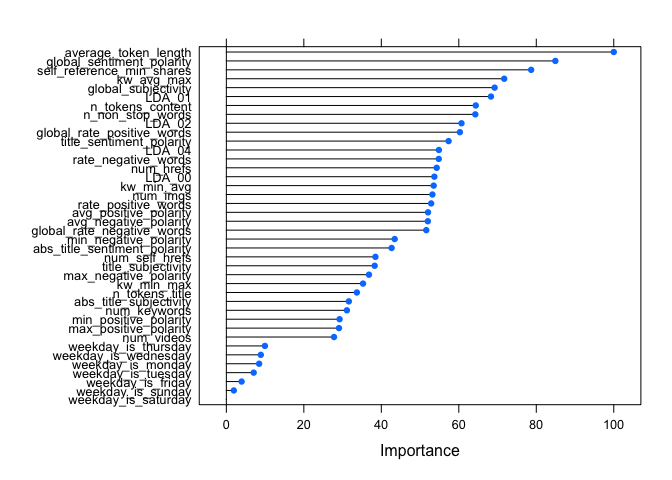

Online News Popularity Analysis
================
Matthieu Cartron and Sneha Karanjai
2022-12-08

- <a href="#introduction" id="toc-introduction">1 Introduction</a>
- <a href="#setup" id="toc-setup">2 Setup</a>
- <a href="#data-import" id="toc-data-import">3 Data Import</a>
- <a href="#exploratory-data-analysis"
  id="toc-exploratory-data-analysis">4 Exploratory Data Analysis</a>
  - <a href="#column-description" id="toc-column-description">4.1 Column
    Description</a>
  - <a href="#summary-statistics" id="toc-summary-statistics">4.2 Summary
    Statistics</a>
  - <a href="#target-variable-distribution"
    id="toc-target-variable-distribution">4.3 Target Variable
    Distribution</a>
  - <a href="#title-tokens-vs-shares" id="toc-title-tokens-vs-shares">4.4
    Title Tokens vs Shares</a>
  - <a href="#number-of-links-in-the-articles-vs-shares"
    id="toc-number-of-links-in-the-articles-vs-shares">4.5 Number of Links
    in the Articles vs Shares</a>
  - <a href="#number-of-images-vs-shares"
    id="toc-number-of-images-vs-shares">4.6 Number of Images vs Shares</a>
  - <a href="#number-of-videos-vs-shares"
    id="toc-number-of-videos-vs-shares">4.7 Number of Videos vs Shares</a>
  - <a href="#days-of-the-week-and-shares"
    id="toc-days-of-the-week-and-shares">4.8 Days of the Week and Shares</a>
  - <a href="#title-polarity-vs-shares"
    id="toc-title-polarity-vs-shares">4.9 Title Polarity vs Shares</a>
  - <a href="#global-polarity-vs-shares"
    id="toc-global-polarity-vs-shares">4.10 Global Polarity vs Shares</a>
  - <a href="#subjectivity-and-shares" id="toc-subjectivity-and-shares">4.11
    Subjectivity and Shares</a>
  - <a
    href="#how-does-the-rate-of-negative-words-in-an-article-affect-the-shares"
    id="toc-how-does-the-rate-of-negative-words-in-an-article-affect-the-shares">4.12
    How does the rate of negative words in an article affect the Shares?</a>
  - <a href="#correlation-analysis" id="toc-correlation-analysis">4.13
    Correlation Analysis</a>
- <a href="#data-splitting" id="toc-data-splitting">5 Data Splitting</a>
- <a href="#modeling" id="toc-modeling">6 Modeling</a>
  - <a href="#linear-regression" id="toc-linear-regression">6.1 Linear
    Regression</a>
    - <a href="#linear-regression-with-dimensionality-reduction"
      id="toc-linear-regression-with-dimensionality-reduction">6.1.1 Linear
      Regression with Dimensionality Reduction</a>
  - <a href="#random-forest" id="toc-random-forest">6.2 Random Forest</a>
  - <a href="#boosted-tree" id="toc-boosted-tree">6.3 Boosted Tree</a>
- <a href="#model-comparison" id="toc-model-comparison">7 Model
  Comparison</a>
  - <a href="#train-model-comparison" id="toc-train-model-comparison">7.1
    Train Model Comparison</a>
  - <a href="#test-model-comparison" id="toc-test-model-comparison">7.2 Test
    Model Comparison</a>
- <a href="#conclusion" id="toc-conclusion">8 Conclusion</a>

# 1 Introduction

The following analysis uses the “Online News Popularity” data set from
the UCI machine learning repository. It consists of a number variables
describing different features of articles, each of which belonging to
one of six “channels.” These channels are effectively genres, and are
the following:

- Lifestyle
- Entertainment
- Business
- Social Media
- World News

For this analysis, we are primarily concerned with the “shares”
variable, which simply describes the number of times an article has been
shared. We often hear that news travels more quickly depending on its
content, title, and maybe even the number of images it uses. In a
similar vein, we would like, for each of the different data channels, to
use certain variables describing the articles to predict the number of
times an article might be shared. But how do we know which variables to
choose?

We could use simple intuition to pick variables. For example, it makes
sense to think that articles with high sentiment polarity (positive or
negative) would tend to, on average, have more shares. We could go
through the variables and pick those that we think would have the
greatest impact on the number of shares. The issue, however, is that
they may change from one data channel to the next. Are lifestyle
articles and world news articles going to be affected by the same
variables? If we choose the same variables across all the different data
channels, then this is the assumption we will be making. To avoid making
this assumption, we will automate the process of variable selection by
deleting one variable of each of the pairs of collinear variables.

# 2 Setup

``` r
library(tidyverse)
library(caret)
library(brainGraph)
library(corrplot)
library(GGally)
```

# 3 Data Import

``` r
unzippedNewDataCSV <- unzip("OnlineNewsPopularity.zip")

newsDataName <- read_csv(unzippedNewDataCSV[1]) # This is the names file
newsData <- read_csv(unzippedNewDataCSV[2])

head(newsData)
```

    ## # A tibble: 6 × 61
    ##   url            timedelta n_tokens_title n_tokens_content n_unique_tokens n_non_stop_words n_non_stop_uniqu… num_hrefs
    ##   <chr>              <dbl>          <dbl>            <dbl>           <dbl>            <dbl>             <dbl>     <dbl>
    ## 1 http://mashab…       731             12              219           0.664             1.00             0.815         4
    ## 2 http://mashab…       731              9              255           0.605             1.00             0.792         3
    ## 3 http://mashab…       731              9              211           0.575             1.00             0.664         3
    ## 4 http://mashab…       731              9              531           0.504             1.00             0.666         9
    ## 5 http://mashab…       731             13             1072           0.416             1.00             0.541        19
    ## 6 http://mashab…       731             10              370           0.560             1.00             0.698         2
    ## # … with 53 more variables: num_self_hrefs <dbl>, num_imgs <dbl>, num_videos <dbl>, average_token_length <dbl>,
    ## #   num_keywords <dbl>, data_channel_is_lifestyle <dbl>, data_channel_is_entertainment <dbl>,
    ## #   data_channel_is_bus <dbl>, data_channel_is_socmed <dbl>, data_channel_is_tech <dbl>, data_channel_is_world <dbl>,
    ## #   kw_min_min <dbl>, kw_max_min <dbl>, kw_avg_min <dbl>, kw_min_max <dbl>, kw_max_max <dbl>, kw_avg_max <dbl>,
    ## #   kw_min_avg <dbl>, kw_max_avg <dbl>, kw_avg_avg <dbl>, self_reference_min_shares <dbl>,
    ## #   self_reference_max_shares <dbl>, self_reference_avg_sharess <dbl>, weekday_is_monday <dbl>,
    ## #   weekday_is_tuesday <dbl>, weekday_is_wednesday <dbl>, weekday_is_thursday <dbl>, weekday_is_friday <dbl>, …

We will subset the data according to the channel passed to analyze
articles in one data channel at a time. Additionally according to the
data report, `url` and `timedelta` are two non-predictive columns so we
will remove them.

``` r
subsettingData <- function(data, area){
  #getting the naming convention as per the dataframe
  subsetVar <- paste("data_channel_is_", area, sep = "")
  
  # filtering the data and removing the data_channel_is_ columns, url, and timedelta
  subsetData <- data %>% 
    filter(!!as.symbol(subsetVar)==1) %>% 
    select(-c(starts_with("data_channel_is_"), url, timedelta))
  
  return(list(subsetData, subsetVar))
}

subsettingDataReturn <- subsettingData(newsData, params$channel)
data <- subsettingDataReturn[[1]]
channel <- subsettingDataReturn[[2]]
```

# 4 Exploratory Data Analysis

## 4.1 Column Description

Let us take a look at the columns available.

``` r
colnames(data)
```

    ##  [1] "n_tokens_title"               "n_tokens_content"             "n_unique_tokens"             
    ##  [4] "n_non_stop_words"             "n_non_stop_unique_tokens"     "num_hrefs"                   
    ##  [7] "num_self_hrefs"               "num_imgs"                     "num_videos"                  
    ## [10] "average_token_length"         "num_keywords"                 "kw_min_min"                  
    ## [13] "kw_max_min"                   "kw_avg_min"                   "kw_min_max"                  
    ## [16] "kw_max_max"                   "kw_avg_max"                   "kw_min_avg"                  
    ## [19] "kw_max_avg"                   "kw_avg_avg"                   "self_reference_min_shares"   
    ## [22] "self_reference_max_shares"    "self_reference_avg_sharess"   "weekday_is_monday"           
    ## [25] "weekday_is_tuesday"           "weekday_is_wednesday"         "weekday_is_thursday"         
    ## [28] "weekday_is_friday"            "weekday_is_saturday"          "weekday_is_sunday"           
    ## [31] "is_weekend"                   "LDA_00"                       "LDA_01"                      
    ## [34] "LDA_02"                       "LDA_03"                       "LDA_04"                      
    ## [37] "global_subjectivity"          "global_sentiment_polarity"    "global_rate_positive_words"  
    ## [40] "global_rate_negative_words"   "rate_positive_words"          "rate_negative_words"         
    ## [43] "avg_positive_polarity"        "min_positive_polarity"        "max_positive_polarity"       
    ## [46] "avg_negative_polarity"        "min_negative_polarity"        "max_negative_polarity"       
    ## [49] "title_subjectivity"           "title_sentiment_polarity"     "abs_title_subjectivity"      
    ## [52] "abs_title_sentiment_polarity" "shares"

``` r
str(data)
```

    ## tibble [7,057 × 53] (S3: tbl_df/tbl/data.frame)
    ##  $ n_tokens_title              : num [1:7057] 12 9 14 12 11 12 5 11 10 10 ...
    ##  $ n_tokens_content            : num [1:7057] 219 531 194 161 454 177 356 281 909 413 ...
    ##  $ n_unique_tokens             : num [1:7057] 0.664 0.504 0.765 0.669 0.566 ...
    ##  $ n_non_stop_words            : num [1:7057] 1 1 1 1 1 ...
    ##  $ n_non_stop_unique_tokens    : num [1:7057] 0.815 0.666 0.84 0.752 0.755 ...
    ##  $ num_hrefs                   : num [1:7057] 4 9 4 5 5 4 3 5 3 6 ...
    ##  $ num_self_hrefs              : num [1:7057] 2 0 4 4 3 3 3 4 2 1 ...
    ##  $ num_imgs                    : num [1:7057] 1 1 0 0 1 1 12 1 1 13 ...
    ##  $ num_videos                  : num [1:7057] 0 0 1 6 0 0 1 0 1 0 ...
    ##  $ average_token_length        : num [1:7057] 4.68 4.4 4.52 4.45 4.89 ...
    ##  $ num_keywords                : num [1:7057] 5 7 6 10 6 9 10 4 5 6 ...
    ##  $ kw_min_min                  : num [1:7057] 0 0 0 0 0 0 0 217 217 217 ...
    ##  $ kw_max_min                  : num [1:7057] 0 0 0 0 0 0 0 593 593 598 ...
    ##  $ kw_avg_min                  : num [1:7057] 0 0 0 0 0 ...
    ##  $ kw_min_max                  : num [1:7057] 0 0 0 0 0 0 0 0 0 0 ...
    ##  $ kw_max_max                  : num [1:7057] 0 0 0 0 0 0 0 17100 17100 17100 ...
    ##  $ kw_avg_max                  : num [1:7057] 0 0 0 0 0 ...
    ##  $ kw_min_avg                  : num [1:7057] 0 0 0 0 0 0 0 0 0 0 ...
    ##  $ kw_max_avg                  : num [1:7057] 0 0 0 0 0 ...
    ##  $ kw_avg_avg                  : num [1:7057] 0 0 0 0 0 ...
    ##  $ self_reference_min_shares   : num [1:7057] 496 0 6300 638 0 1100 1700 951 20900 527 ...
    ##  $ self_reference_max_shares   : num [1:7057] 496 0 6300 29200 0 1500 2500 951 20900 527 ...
    ##  $ self_reference_avg_sharess  : num [1:7057] 496 0 6300 8261 0 ...
    ##  $ weekday_is_monday           : num [1:7057] 1 1 1 1 1 1 1 0 0 0 ...
    ##  $ weekday_is_tuesday          : num [1:7057] 0 0 0 0 0 0 0 1 1 0 ...
    ##  $ weekday_is_wednesday        : num [1:7057] 0 0 0 0 0 0 0 0 0 1 ...
    ##  $ weekday_is_thursday         : num [1:7057] 0 0 0 0 0 0 0 0 0 0 ...
    ##  $ weekday_is_friday           : num [1:7057] 0 0 0 0 0 0 0 0 0 0 ...
    ##  $ weekday_is_saturday         : num [1:7057] 0 0 0 0 0 0 0 0 0 0 ...
    ##  $ weekday_is_sunday           : num [1:7057] 0 0 0 0 0 0 0 0 0 0 ...
    ##  $ is_weekend                  : num [1:7057] 0 0 0 0 0 0 0 0 0 0 ...
    ##  $ LDA_00                      : num [1:7057] 0.5003 0.0286 0.0334 0.1258 0.2003 ...
    ##  $ LDA_01                      : num [1:7057] 0.3783 0.4193 0.0345 0.0203 0.3399 ...
    ##  $ LDA_02                      : num [1:7057] 0.04 0.4947 0.215 0.02 0.0333 ...
    ##  $ LDA_03                      : num [1:7057] 0.0413 0.0289 0.6837 0.8139 0.3931 ...
    ##  $ LDA_04                      : num [1:7057] 0.0401 0.0286 0.0333 0.02 0.0333 ...
    ##  $ global_subjectivity         : num [1:7057] 0.522 0.43 0.396 0.572 0.467 ...
    ##  $ global_sentiment_polarity   : num [1:7057] 0.0926 0.1007 0.3471 0.1662 0.1255 ...
    ##  $ global_rate_positive_words  : num [1:7057] 0.0457 0.0414 0.0567 0.0497 0.0441 ...
    ##  $ global_rate_negative_words  : num [1:7057] 0.0137 0.0207 0 0.0186 0.0132 ...
    ##  $ rate_positive_words         : num [1:7057] 0.769 0.667 1 0.727 0.769 ...
    ##  $ rate_negative_words         : num [1:7057] 0.231 0.333 0 0.273 0.231 ...
    ##  $ avg_positive_polarity       : num [1:7057] 0.379 0.386 0.545 0.427 0.363 ...
    ##  $ min_positive_polarity       : num [1:7057] 0.1 0.136 0.1 0.1 0.1 ...
    ##  $ max_positive_polarity       : num [1:7057] 0.7 0.8 1 0.85 1 1 1 0.5 1 0.8 ...
    ##  $ avg_negative_polarity       : num [1:7057] -0.35 -0.37 0 -0.364 -0.215 ...
    ##  $ min_negative_polarity       : num [1:7057] -0.6 -0.6 0 -0.8 -0.5 -0.2 -0.7 -0.5 -1 -0.7 ...
    ##  $ max_negative_polarity       : num [1:7057] -0.2 -0.167 0 -0.125 -0.1 ...
    ##  $ title_subjectivity          : num [1:7057] 0.5 0 0.4 0.583 0.427 ...
    ##  $ title_sentiment_polarity    : num [1:7057] -0.188 0 0.1 0.25 0.168 ...
    ##  $ abs_title_subjectivity      : num [1:7057] 0 0.5 0.1 0.0833 0.0727 ...
    ##  $ abs_title_sentiment_polarity: num [1:7057] 0.188 0 0.1 0.25 0.168 ...
    ##  $ shares                      : num [1:7057] 593 1200 2100 1200 4600 1200 631 1300 1700 455 ...

Whew! That is a long list of columns to analyze. Instead of analyzing
them all, let us think about our data. What might we expect to be
related to how many times an article is shared? We hear frequently about
how the dissemination of news and the content thereof are related in
some way. For our data channels, let’s pay close attention to the number
of shares (dissemination) and variables that we might be able to link to
it. Can we find any interesting relationships in the exploratory
analysis? And do these relationships change across the different
channels? Maybe the sharing of lifestyle articles is less correlated
with sentiment than, say, world news articles.

First, let’s take a look at the variable descriptions for some better
understanding. Here is a data description from the UCI Machine Learning
Repository:

- n_tokens_title: Number of words in the title
- n_tokens_content Number of words in the content
- n_unique_tokens: Rate of unique words in the content
- n_non_stop_unique_tokens: Rate of unique non-stop words in the content
- num_hrefs: Number of links
- num_self_hrefs: Number of links to other articles published by
  Mashable
- num_imgs: Number of images
- num_videos: Number of videos
- average_token_length: Average length of the words in the content
- num_keywords: Number of keywords in the metadata
- self_reference_min_shares: Min. shares of referenced articles in
  Mashable
- self_reference_max_shares: Max. shares of referenced articles in
  Mashable
- self_reference_avg_sharess: Avg. shares of referenced articles in
  Mashable
- global_subjectivity: Text subjectivity
- global_sentiment_polarity: Text sentiment polarity
- global_rate_positive_words: Rate of positive words in the content
- global_rate_negative_words: Rate of negative words in the content
- rate_positive_words: Rate of positive words among non-neutral tokens
- rate_negative_words: Rate of negative words among non-neutral tokens
- title_subjectivity: Title subjectivity
- title_sentiment_polarity: Title polarity
- abs_title_subjectivity: Absolute subjectivity level
- abs_title_sentiment_polarity: Absolute polarity level
- shares: Number of shares (target)

Below we run the five-number summary for each of the variables thus far
still included.

## 4.2 Summary Statistics

``` r
print(paste("******Summary Statistics of", channel, "******"))
```

    ## [1] "******Summary Statistics of data_channel_is_entertainment ******"

``` r
summary(data)
```

    ##  n_tokens_title n_tokens_content n_unique_tokens    n_non_stop_words   n_non_stop_unique_tokens   num_hrefs     
    ##  Min.   : 2     Min.   :   0.0   Min.   :  0.0000   Min.   :   0.000   Min.   :  0.0000         Min.   :  0.00  
    ##  1st Qu.:10     1st Qu.: 255.0   1st Qu.:  0.4701   1st Qu.:   1.000   1st Qu.:  0.6234         1st Qu.:  4.00  
    ##  Median :11     Median : 433.0   Median :  0.5421   Median :   1.000   Median :  0.6917         Median :  7.00  
    ##  Mean   :11     Mean   : 607.5   Mean   :  0.6316   Mean   :   1.119   Mean   :  0.7632         Mean   : 10.69  
    ##  3rd Qu.:12     3rd Qu.: 805.0   3rd Qu.:  0.6174   3rd Qu.:   1.000   3rd Qu.:  0.7597         3rd Qu.: 13.00  
    ##  Max.   :18     Max.   :6505.0   Max.   :701.0000   Max.   :1042.000   Max.   :650.0000         Max.   :304.00  
    ##  num_self_hrefs      num_imgs         num_videos     average_token_length  num_keywords      kw_min_min    
    ##  Min.   : 0.000   Min.   :  0.000   Min.   : 0.000   Min.   :0.000        Min.   : 2.000   Min.   : -1.00  
    ##  1st Qu.: 1.000   1st Qu.:  1.000   1st Qu.: 0.000   1st Qu.:4.426        1st Qu.: 5.000   1st Qu.: -1.00  
    ##  Median : 3.000   Median :  1.000   Median : 1.000   Median :4.583        Median : 7.000   Median : -1.00  
    ##  Mean   : 3.497   Mean   :  6.318   Mean   : 2.546   Mean   :4.477        Mean   : 6.925   Mean   : 20.93  
    ##  3rd Qu.: 5.000   3rd Qu.:  8.000   3rd Qu.: 1.000   3rd Qu.:4.751        3rd Qu.: 8.000   3rd Qu.:  4.00  
    ##  Max.   :40.000   Max.   :128.000   Max.   :74.000   Max.   :7.696        Max.   :10.000   Max.   :294.00  
    ##    kw_max_min       kw_avg_min        kw_min_max       kw_max_max       kw_avg_max       kw_min_avg     kw_max_avg    
    ##  Min.   :     0   Min.   :   -1.0   Min.   :     0   Min.   :     0   Min.   :     0   Min.   :   0   Min.   :     0  
    ##  1st Qu.:   419   1st Qu.:  124.8   1st Qu.:     0   1st Qu.:843300   1st Qu.:180200   1st Qu.:   0   1st Qu.:  3670  
    ##  Median :   603   Median :  209.8   Median :  1500   Median :843300   Median :232414   Median :1056   Median :  4456  
    ##  Mean   :  1056   Mean   :  286.4   Mean   : 13281   Mean   :766981   Mean   :243994   Mean   :1131   Mean   :  5637  
    ##  3rd Qu.:   924   3rd Qu.:  325.0   3rd Qu.: 11600   3rd Qu.:843300   3rd Qu.:303860   3rd Qu.:2072   3rd Qu.:  6026  
    ##  Max.   :138700   Max.   :34855.1   Max.   :210300   Max.   :843300   Max.   :670750   Max.   :3285   Max.   :138700  
    ##    kw_avg_avg    self_reference_min_shares self_reference_max_shares self_reference_avg_sharess weekday_is_monday
    ##  Min.   :    0   Min.   :     0            Min.   :     0            Min.   :     0             Min.   :0.0000   
    ##  1st Qu.: 2551   1st Qu.:   701            1st Qu.:  1200            1st Qu.:  1048             1st Qu.:0.0000   
    ##  Median : 2967   Median :  1100            Median :  2700            Median :  2035             Median :0.0000   
    ##  Mean   : 3156   Mean   :  2703            Mean   :  8929            Mean   :  5039             Mean   :0.1924   
    ##  3rd Qu.: 3553   3rd Qu.:  2000            3rd Qu.:  9200            3rd Qu.:  4870             3rd Qu.:0.0000   
    ##  Max.   :36023   Max.   :210300            Max.   :837700            Max.   :346100             Max.   :1.0000   
    ##  weekday_is_tuesday weekday_is_wednesday weekday_is_thursday weekday_is_friday weekday_is_saturday weekday_is_sunday
    ##  Min.   :0.0000     Min.   :0.0000       Min.   :0.0000      Min.   :0.0000    Min.   :0.00000     Min.   :0.00000  
    ##  1st Qu.:0.0000     1st Qu.:0.0000       1st Qu.:0.0000      1st Qu.:0.0000    1st Qu.:0.00000     1st Qu.:0.00000  
    ##  Median :0.0000     Median :0.0000       Median :0.0000      Median :0.0000    Median :0.00000     Median :0.00000  
    ##  Mean   :0.1821     Mean   :0.1835       Mean   :0.1744      Mean   :0.1377    Mean   :0.05385     Mean   :0.07595  
    ##  3rd Qu.:0.0000     3rd Qu.:0.0000       3rd Qu.:0.0000      3rd Qu.:0.0000    3rd Qu.:0.00000     3rd Qu.:0.00000  
    ##  Max.   :1.0000     Max.   :1.0000       Max.   :1.0000      Max.   :1.0000    Max.   :1.00000     Max.   :1.00000  
    ##    is_weekend         LDA_00            LDA_01            LDA_02            LDA_03            LDA_04       
    ##  Min.   :0.0000   Min.   :0.00000   Min.   :0.00000   Min.   :0.00000   Min.   :0.00000   Min.   :0.00000  
    ##  1st Qu.:0.0000   1st Qu.:0.02505   1st Qu.:0.04141   1st Qu.:0.02502   1st Qu.:0.03365   1st Qu.:0.02500  
    ##  Median :0.0000   Median :0.03333   Median :0.44165   Median :0.03333   Median :0.25099   Median :0.03333  
    ##  Mean   :0.1298   Mean   :0.06583   Mean   :0.42424   Mean   :0.09017   Mean   :0.35639   Mean   :0.06323  
    ##  3rd Qu.:0.0000   3rd Qu.:0.05000   3rd Qu.:0.72901   3rd Qu.:0.05015   3rd Qu.:0.69872   3rd Qu.:0.04031  
    ##  Max.   :1.0000   Max.   :0.79368   Max.   :0.92595   Max.   :0.78708   Max.   :0.92554   Max.   :0.74302  
    ##  global_subjectivity global_sentiment_polarity global_rate_positive_words global_rate_negative_words
    ##  Min.   :0.0000      Min.   :-0.37766          Min.   :0.00000            Min.   :0.00000           
    ##  1st Qu.:0.4120      1st Qu.: 0.04805          1st Qu.:0.02945            1st Qu.:0.01070           
    ##  Median :0.4632      Median : 0.11163          Median :0.04048            Median :0.01720           
    ##  Mean   :0.4520      Mean   : 0.11141          Mean   :0.04048            Mean   :0.01905           
    ##  3rd Qu.:0.5119      3rd Qu.: 0.17288          3rd Qu.:0.05134            3rd Qu.:0.02483           
    ##  Max.   :1.0000      Max.   : 0.72784          Max.   :0.15278            Max.   :0.09358           
    ##  rate_positive_words rate_negative_words avg_positive_polarity min_positive_polarity max_positive_polarity
    ##  Min.   :0.0000      Min.   :0.0000      Min.   :0.0000        Min.   :0.00000       Min.   :0.0000       
    ##  1st Qu.:0.5789      1st Qu.:0.2000      1st Qu.:0.3186        1st Qu.:0.05000       1st Qu.:0.6000       
    ##  Median :0.6875      Median :0.3000      Median :0.3721        Median :0.10000       Median :0.8500       
    ##  Mean   :0.6663      Mean   :0.3050      Mean   :0.3658        Mean   :0.09351       Mean   :0.7977       
    ##  3rd Qu.:0.7843      3rd Qu.:0.4038      3rd Qu.:0.4224        3rd Qu.:0.10000       3rd Qu.:1.0000       
    ##  Max.   :1.0000      Max.   :1.0000      Max.   :1.0000        Max.   :1.00000       Max.   :1.0000       
    ##  avg_negative_polarity min_negative_polarity max_negative_polarity title_subjectivity title_sentiment_polarity
    ##  Min.   :-1.0000       Min.   :-1.0000       Min.   :-1.0000       Min.   :0.0000     Min.   :-1.00000        
    ##  1st Qu.:-0.3697       1st Qu.:-0.8000       1st Qu.:-0.1250       1st Qu.:0.0000     1st Qu.: 0.00000        
    ##  Median :-0.3000       Median :-0.6000       Median :-0.1000       Median :0.3000     Median : 0.00000        
    ##  Mean   :-0.2941       Mean   :-0.5877       Mean   :-0.1106       Mean   :0.3158     Mean   : 0.06462        
    ##  3rd Qu.:-0.2209       3rd Qu.:-0.4000       3rd Qu.:-0.0500       3rd Qu.:0.5023     3rd Qu.: 0.16667        
    ##  Max.   : 0.0000       Max.   : 0.0000       Max.   : 0.0000       Max.   :1.0000     Max.   : 1.00000        
    ##  abs_title_subjectivity abs_title_sentiment_polarity     shares      
    ##  Min.   :0.000          Min.   :0.00000              Min.   :    47  
    ##  1st Qu.:0.125          1st Qu.:0.00000              1st Qu.:   833  
    ##  Median :0.400          Median :0.07143              Median :  1200  
    ##  Mean   :0.321          Mean   :0.17182              Mean   :  2970  
    ##  3rd Qu.:0.500          3rd Qu.:0.30000              3rd Qu.:  2100  
    ##  Max.   :0.500          Max.   :1.00000              Max.   :210300

## 4.3 Target Variable Distribution

Let’s take a look at the distribution of our target variable using a
histogram.

``` r
ggplot(data) +
  aes(x = shares) +
  geom_histogram(bins = 26L, fill = "#112446") +
  labs(title = "Distribution of Shares") +
  theme_gray()
```

<!-- -->

*What does the distribution show? Does the distribution follow a known
distribution? Is there skewness? What might these features tell us about
the number of shares? The number of shares is plotted along the x-axis,
with frequency (count) on the y-axis.*

## 4.4 Title Tokens vs Shares

Now let’s analyze the affect of the different variables on the shares.
Starting with the number of words in the title and how they affect the
shares.

``` r
data %>% 
  group_by(n_tokens_title) %>% 
  summarise(avgShares = mean(shares)) %>% 
  ggplot() +
  aes(x = avgShares, y = n_tokens_title) +
  geom_point(shape = "circle", size = 1.5, colour = "#112446") +
  labs(title = "Average Shares vs Title Tokens") +
  theme_gray()
```

<!-- --> *The
average number of shares is plotted on the x-axis while the numvber of
words in the article title is plotted on the y-axis. Can we see any
relationship between the two variables?*

## 4.5 Number of Links in the Articles vs Shares

``` r
data %>% 
  group_by(num_hrefs) %>% 
  summarise(avgShares = mean(shares)) %>% 
  ggplot() +
  aes(x = avgShares, y = num_hrefs) +
  geom_point(shape = "circle", size = 1.5, colour = "#112446") +
  labs(title = "Average Shares vs Number of Links") +
  theme_gray()
```

<!-- --> *The
average number of shares is plotted on the x-axis while the number of
hyperlinks is plotted on the y-axis. Like with the previous plot, we use
a scatter plot because we have two numeric variables, with the average
number of shares being continuous. Can we see any relationship between
the two variables?*

## 4.6 Number of Images vs Shares

``` r
data %>% 
  group_by(factor(num_imgs)) %>% 
  summarise(sumShares = sum(shares)) %>% 
  ggplot() +
  aes(x = `factor(num_imgs)`, y = sumShares) +
  geom_col(fill = "#112446") +
  labs(title = "Shares vs Images", x = "Number of Images", y = "Shares(Sum)") +
  theme_minimal()
```

<!-- --> *The
above bar plot demonstrates the relationship between the number of
images in an article (x-axis) and the sum of the shares the article
experienced. Can we see any patterns in the above visualization?*

## 4.7 Number of Videos vs Shares

``` r
data %>% 
  group_by(factor(num_videos)) %>% 
  summarise(sumShares = sum(shares)) %>% 
  ggplot() +
  aes(x = `factor(num_videos)`, y = sumShares) +
  geom_col(fill = "#112446") +
  labs(title = "Shares vs Videos", x = "Number of Videos", y = "Shares(Sum)") +
  theme_minimal()
```

<!-- -->

*In the above bar plot the number of videos featured in an article is
plotted against the summed shares per video number. Do we notice any
patterns? Can we make any comparisons between this plot (with videos) vs
the previous plot, which looks at the number of images in an article?*

## 4.8 Days of the Week and Shares

``` r
mon <- data %>% 
  select(starts_with("weekday_is_monday"), shares) %>% 
  group_by(weekday_is_monday) %>% 
  summarise(sumShares = sum(shares)) %>% 
  rename(day = weekday_is_monday) %>% 
  filter(day==1) 
mon$day[mon$day==1] <- "MON"

tue <- data %>% 
  select(starts_with("weekday_is_tuesday"), shares) %>% 
  group_by(weekday_is_tuesday) %>% 
  summarise(sumShares = sum(shares)) %>% 
  rename(day = weekday_is_tuesday) %>% 
  filter(day==1)
tue$day[tue$day==1] <- "TUE"


wed <- data %>% 
  select(starts_with("weekday_is_wednesday"), shares) %>% 
  group_by(weekday_is_wednesday) %>% 
  summarise(sumShares = sum(shares)) %>% 
  rename(day = weekday_is_wednesday) %>% 
  filter(day==1)
wed$day[wed$day==1] <- "WED"


thu <- data %>% 
  select(starts_with("weekday_is_thursday"), shares) %>% 
  group_by(weekday_is_thursday) %>% 
  summarise(sumShares = sum(shares)) %>% 
  rename(day = weekday_is_thursday) %>% 
  filter(day==1)
thu$day[thu$day==1] <- "THU"

fri <- data %>% 
  select(starts_with("weekday_is_friday"), shares) %>% 
  group_by(weekday_is_friday) %>% 
  summarise(sumShares = sum(shares)) %>% 
  rename(day = weekday_is_friday) %>% 
  filter(day==1)
fri$day[fri$day==1] <- "FRI"

sat <- data %>% 
  select(starts_with("weekday_is_saturday"), shares) %>% 
  group_by(weekday_is_saturday) %>% 
  summarise(sumShares = sum(shares)) %>% 
  rename(day = weekday_is_saturday) %>% 
  filter(day==1)
sat$day[sat$day==1] <- "SAT"

sun <- data %>% 
  select(starts_with("weekday_is_sunday"), shares) %>% 
  group_by(weekday_is_sunday) %>% 
  summarise(sumShares = sum(shares)) %>% 
  rename(day = weekday_is_sunday) %>% 
  filter(day==1)
sun$day[sun$day==1] <- "SUN"

mon %>% 
  bind_rows(tue, wed, thu, fri, sat, sun) %>% 
  ggplot() +
  aes(x = day, y = sumShares) +
  geom_col(fill = "#112446") +
  labs(title = "Most Shared Articles by the Day of the Week") +
  theme_gray()
```

<!-- -->

*The above bar plot looks at the sum of shares given for each day of the
week. Are there any patterns? Are there differences in the number of
shares between weekdays and the weekend? If so, what might cause this?
Are articles also most likely to be published on certain days of the
week, and thus more likely to be shared on those days? We can
speculate.*

*In the three scatter plots below, we take a magnifying glass to some of
the variables measuring features of article sentiment. We suspect there
might be some patterns below (not guaranteed!). Can we use this as a
starting point for investigating how article sentiment influences the
dissemination of information (if at all)?*

## 4.9 Title Polarity vs Shares

Polarity is a float which lies in the range of \[-1,1\] where 1 refers
to a positive statement and -1 refers to a negative statement. Does
title polarity affect the average number of shares?

``` r
data %>% 
  ggplot() +
  aes(x = title_sentiment_polarity, y = shares) +
  geom_point() +
  geom_jitter() +
  labs(title = "Shares vs Title Polarity", x = "Title Polarity", y = "Number of Shares") +
  theme_minimal()
```

<!-- -->

*The above scatter plot looks at title polarity (how negative or
positive an article title might be) and the number of shares for a given
article. Can we see any initial patterns worth exploring? *

## 4.10 Global Polarity vs Shares

``` r
data %>% 
  ggplot() +
  aes(x = global_sentiment_polarity, y = shares) +
  geom_point() +
  geom_jitter() +
  labs(title = "Shares vs Text Polarity", x = "Text Polarity", y = "Number of Shares") +
  theme_minimal()
```

<!-- -->

*The above scatter plot is similar to the previous scatter plot, though
this time we take a look at the text polarity (how positive or negative
the words of the article are) and plot it against the number of times a
given article is shared (y-axis). Again, do we notice any patterns?*

## 4.11 Subjectivity and Shares

Subjective sentences generally refer to personal opinion, emotion or
judgment whereas objective refers to factual information. Subjectivity
is a float which lies in the range of \[0,1\]. A value closer to 0 means
an opinion or an emotion and 1 means a fact. How does the text having a
factual tone or an author’s emotion/opinion affect the total shares?

``` r
ggplot(data) +
  aes(x = shares, y = global_subjectivity) +
  geom_point(shape = "circle", size = 1.5, colour = "#112446") +
  labs(title = "Shares vs Text Subjectivity", x = "Text Subjectivity", y = "Number of Shares") +
  theme_minimal()
```

<!-- -->

*In the above scatter plot, we plot the text subjectivity against the
number of times an article is shared (y-axis). Though subjectivity is
not sentiment, we might have reason to suspect that they could be
related–are subjective articles more mysterious, more enticing, more
prone to “clickbait”? Does this scatter plot seem to convey anything
like this?*

## 4.12 How does the rate of negative words in an article affect the Shares?

``` r
data %>% 
  group_by(rate_negative_words) %>% 
  summarise(avgShares = mean(shares)) %>% 
  ggplot() +
  aes(x = avgShares, y = rate_negative_words) +
  geom_point(shape = "circle", size = 1.5, colour = "#112446") +
  labs(title = "Average Shares vs Rate of Negative Words") +
  theme_gray()
```

<!-- -->

*Here we see how the rate of the usage of negative words throughout the
article tends to affect the shares. Does an article with higher number
of negative words tend to have lesser shares?*

## 4.13 Correlation Analysis

Now that we have completed analysis of how the shares changes with the
different variables, we do notice that there are way too many variables
in this dataset. Feeding all these variables into the training models
would mean “Garbage In and Garbage Out”. One of the easiest ways to
choose the variables to fit into the models is by checking the
correlation. Potential predictors with high correlation between each
other can prove problematic as they introduce multicollinearity into the
model. We can remove some of this redundancy from the outset. While
there are some models that thrive on correlated predictors. other models
may benefit from reducing the level of correlation between the
predictors.

Let us first understand the pair plots for all the variables explaining
keywords.

``` r
pairs(~ kw_min_min + kw_max_min + kw_min_max + kw_avg_max + kw_max_avg + kw_avg_min + kw_max_max + kw_min_avg + kw_avg_avg, data = data)
```

<!-- -->

``` r
cor(data[, c('kw_min_min', 'kw_max_min', 'kw_min_max', 'kw_avg_max', 'kw_max_avg', 'kw_avg_min', 'kw_max_max', 'kw_min_avg', 'kw_avg_avg')])
```

    ##              kw_min_min    kw_max_min  kw_min_max  kw_avg_max  kw_max_avg  kw_avg_min    kw_max_max  kw_min_avg
    ## kw_min_min  1.000000000  0.0033206659 -0.09651078 -0.53333851 -0.06510891  0.09364438 -0.8678597793 -0.14576066
    ## kw_max_min  0.003320666  1.0000000000 -0.06284273 -0.06227649  0.62450101  0.96239046  0.0009473859 -0.01405462
    ## kw_min_max -0.096510783 -0.0628427274  1.00000000  0.47708249  0.02635682 -0.08954830  0.1077061630  0.53182564
    ## kw_avg_max -0.533338512 -0.0622764883  0.47708249  1.00000000  0.09554950 -0.15577336  0.6046342264  0.43876955
    ## kw_max_avg -0.065108906  0.6245010123  0.02635682  0.09554950  1.00000000  0.60378237  0.0886704720  0.04891082
    ## kw_avg_min  0.093644384  0.9623904617 -0.08954830 -0.15577336  0.60378237  1.00000000 -0.0923769809 -0.04224350
    ## kw_max_max -0.867859779  0.0009473859  0.10770616  0.60463423  0.08867047 -0.09237698  1.0000000000  0.16361591
    ## kw_min_avg -0.145760657 -0.0140546216  0.53182564  0.43876955  0.04891082 -0.04224350  0.1636159107  1.00000000
    ## kw_avg_avg -0.205458984  0.4996746337  0.23833010  0.39296728  0.82162998  0.48289036  0.2465609773  0.42012724
    ##            kw_avg_avg
    ## kw_min_min -0.2054590
    ## kw_max_min  0.4996746
    ## kw_min_max  0.2383301
    ## kw_avg_max  0.3929673
    ## kw_max_avg  0.8216300
    ## kw_avg_min  0.4828904
    ## kw_max_max  0.2465610
    ## kw_min_avg  0.4201272
    ## kw_avg_avg  1.0000000

``` r
kwCorData <- as.data.frame(as.table(cor(data[, c('kw_min_min', 'kw_max_min', 'kw_min_max', 'kw_avg_max', 'kw_max_avg', 'kw_avg_min', 'kw_max_max', 'kw_min_avg', 'kw_avg_avg')])))

colRemove <- kwCorData %>% 
  filter(abs(Freq)>0.8 & Freq!=1 )

colRemove <- as.vector(colRemove$Var2)

data <- data %>% 
  select(-all_of(colRemove))
```

This removes all the highly correlated keyword variables that convey the
same information. Now we will similarly investigate the self-referenced
shares.

``` r
pairs(~ self_reference_avg_sharess + self_reference_max_shares + self_reference_min_shares, data = data)
```

<!-- -->

If we find that any of the self_reference shares variables have a
correlation of greater than 0.8 with one another, then we will eliminate
it from the analysis. Again, this is done to limit the multicollinearity
in the models we build below as well as reduce their dimension. We want
to simplify our models from the outset as much as possible without
losing predictors that will explain much of the variability in the
number of times an article is shared.

``` r
srCorData <- as.data.frame(as.table(cor(data[, c('self_reference_avg_sharess', 'self_reference_max_shares', 'self_reference_min_shares')])))

colRemove <- srCorData %>% 
  filter(abs(Freq)>0.8 & Freq!=1)

colRemove <- as.vector(colRemove$Var2)

data <- data %>% 
  select(-all_of(colRemove))
```

In this next step, we examine our remaining variables to see if any
share a correlation of 0.70 or higher. If so, we will remove it from the
data.

``` r
descrCor <- cor(data) 
highlyCorVar <- findCorrelation(descrCor, cutoff = .85)
data <- data[,-highlyCorVar]
```

Again, we do not want to remove both the highly correlated variables.
For example, if we were looking at the variables temperature in
Farenheit and temperature in Celcius in predicting the number of people
at a beach, both variable would be telling us the same thing, but we
would still want to keep one of them because of its probable importance
to the model. We will also remove `is_weekend` from our analysis as the
variables `weekday_is_sunday` and `weekday_is_saturday` capture the same
information.

``` r
data <- data %>% 
  select(-c("is_weekend"))
```

We are now down from 61 columns to 41 columns.

Let us finally do a correlation plot for all variables with threshold
greater than 0.55 for the the present dataframe.

``` r
cols <- names(data)

corrDf <- data.frame(t(combn(cols,2)), stringsAsFactors = F) %>%
  rowwise() %>%
  mutate(v = cor(data[,X1], data[,X2]))

corrDf <- corrDf %>% 
  filter(abs(v)>0.55) %>% 
  arrange(desc(v))
corrDf
```

    ## # A tibble: 11 × 3
    ## # Rowwise: 
    ##    X1                         X2                            v[,1]
    ##    <chr>                      <chr>                         <dbl>
    ##  1 global_rate_negative_words rate_negative_words           0.790
    ##  2 avg_negative_polarity      min_negative_polarity         0.737
    ##  3 global_sentiment_polarity  rate_positive_words           0.735
    ##  4 avg_positive_polarity      max_positive_polarity         0.724
    ##  5 title_subjectivity         abs_title_sentiment_polarity  0.682
    ##  6 average_token_length       global_subjectivity           0.632
    ##  7 average_token_length       rate_positive_words           0.589
    ##  8 global_rate_positive_words rate_positive_words           0.573
    ##  9 global_subjectivity        avg_positive_polarity         0.571
    ## 10 average_token_length       avg_positive_polarity         0.564
    ## 11 global_sentiment_polarity  rate_negative_words          -0.674

``` r
#turn corr back into matrix in order to plot with corrplot
correlationMat <- reshape2::acast(corrDf, X1~X2, value.var="v")
  
#plot correlations visually
corrplot(correlationMat, is.corr=FALSE, tl.col="black", na.label=" ")
```

<!-- -->

Now that we have a more concise data set, let’s zero in on the
relationship between our target variable, shares, and the remaining
variables. Below we extract the five variables that have the highest
correlation with the shares variable. This may be a valuable insight
prior to training our models.

``` r
sharesCor <- cor(data[ , colnames(data) != "shares"],  # Calculate correlations
                data$shares)

sharesCor <- data.frame(sharesCor)
sharesCor$names <- rownames(sharesCor)
rownames(sharesCor) <- NULL

sharesCor <- sharesCor %>% 
  rename(corrcoeff=sharesCor) %>% 
  arrange(desc(abs(corrcoeff))) %>% 
  head(6)

par(mfrow=c(2,3))
for (i in sharesCor$names) {
  plot(data$shares, data[[i]], ylab = i, main = paste("Shares vs", i))
}
```

<!-- -->

``` r
#for (i in sharesCor$names) {
 # ggpairs(data[[i]], ylab = i, main = paste("Shares vs", i))
#}
```

# 5 Data Splitting

Data splitting is an important aspect of data science, particularly for
creating predictive models based on data. This technique helps ensure
the creation of data models and processes that use data models – such as
machine learning – are accurate. In a basic two-part data split, the
training data set is used to train and fit models. Training sets are
commonly used to estimate different parameters or to compare different
model performance. The testing data set is used after the training is
done; we see if our trained models are effective in predicting future
values. We will use a 70-30 split on the dataset.

``` r
train_index <- createDataPartition(data$shares, p = 0.7, 
                                   list = FALSE)
train <- data[train_index, ]
test <- data[-train_index, ]
```

We will check the shape of the train and test set

``` r
print("The train set dimensions")
```

    ## [1] "The train set dimensions"

``` r
dim(train)
```

    ## [1] 4941   41

``` r
print("The test set dimensions")
```

    ## [1] "The test set dimensions"

``` r
dim(test)
```

    ## [1] 2116   41

# 6 Modeling

We will be comparing linear and ensemble techniques for predicting
shares. Each section below elucidates the model used and the reasoning
behind it.

## 6.1 Linear Regression

A simple linear regression refers to a linear equation that captures the
relationship between a response variable, $Y$, and a predictor variable
$X$. The relationship is modeled below:

$$Y = \beta_0 + \beta_1X_1 +\epsilon i$$

Where $\beta_0$ is the intercept and $\beta_1$ is the slope of the line.
This relationship can be extended to the case in which the response
variable is modeled as a function of more than one predictor variable.
This is the case of a multiple linear regression, which is as follows:

$$Y = \beta_0 + \beta_1X_1 + \beta_2X_2 + … + \beta_nX_n + \epsilon i$$

Where $\beta_0$ is the intercept and all $\beta$ are slope coefficients.
For both simple and multiple linear regression cases, the Method of
Least Squares is widely used in summarizing the data. The least squares
method minimizes values of $\beta_0$ and all $\beta_n$, seen below:

$$\sum_{i = 1}^{n} (yi - \beta_0 - \sum_{j = 1}^{k} \beta_j x_{ij}^2)$$

Since we are dealing with 41 variables, it is probably important to know
that we would need to employ a feature selection/dimension reduction
technique. Feature selection is the process of reducing the number of
input variables when developing a predictive model. It is desirable to
reduce the number of input variables to both reduce the computational
cost of modeling and, in some cases, to improve the performance of the
model. To prove this, we will first fit a full-model (with all the
available variables) with multiple linear regression.

``` r
trControl <- trainControl(method = "repeatedcv", number = 5, repeats = 5)

mlrWithoutVS <- train(shares ~ .,
                     data = train,
                     preProcess = c("center", "scale"),
                     method = "lm", 
                     trControl = trControl)

summary(mlrWithoutVS)
```

    ## 
    ## Call:
    ## lm(formula = .outcome ~ ., data = dat)
    ## 
    ## Residuals:
    ##    Min     1Q Median     3Q    Max 
    ## -11044  -2295  -1350   -235 185565 
    ## 
    ## Coefficients: (2 not defined because of singularities)
    ##                              Estimate Std. Error t value Pr(>|t|)    
    ## (Intercept)                  2995.199    105.168  28.480  < 2e-16 ***
    ## n_tokens_title                126.128    109.574   1.151 0.249760    
    ## n_tokens_content             -175.827    165.209  -1.064 0.287258    
    ## n_non_stop_words             -822.048    455.411  -1.805 0.071126 .  
    ## num_hrefs                     431.984    129.061   3.347 0.000823 ***
    ## num_self_hrefs               -288.482    122.220  -2.360 0.018296 *  
    ## num_imgs                      373.279    130.522   2.860 0.004256 ** 
    ## num_videos                     68.640    124.311   0.552 0.580861    
    ## average_token_length          557.131    348.486   1.599 0.109947    
    ## num_keywords                  322.624    121.130   2.663 0.007759 ** 
    ## kw_min_max                   -253.713    135.381  -1.874 0.060981 .  
    ## kw_avg_max                    277.502    135.431   2.049 0.040513 *  
    ## kw_min_avg                    360.731    132.283   2.727 0.006415 ** 
    ## self_reference_min_shares     556.069    106.439   5.224 1.82e-07 ***
    ## weekday_is_monday            -102.938    177.750  -0.579 0.562539    
    ## weekday_is_tuesday           -134.258    175.778  -0.764 0.445027    
    ## weekday_is_wednesday         -133.057    176.215  -0.755 0.450235    
    ## weekday_is_thursday          -203.897    174.865  -1.166 0.243662    
    ## weekday_is_friday            -134.287    162.330  -0.827 0.408136    
    ## weekday_is_saturday            -4.958    132.780  -0.037 0.970217    
    ## weekday_is_sunday                  NA         NA      NA       NA    
    ## LDA_00                       -270.617    108.196  -2.501 0.012411 *  
    ## LDA_01                         -4.872    117.477  -0.041 0.966919    
    ## LDA_02                       -308.099    109.836  -2.805 0.005050 ** 
    ## LDA_04                       -141.700    109.389  -1.295 0.195252    
    ## global_subjectivity           564.697    167.621   3.369 0.000761 ***
    ## global_sentiment_polarity     365.538    307.522   1.189 0.234633    
    ## global_rate_positive_words   -243.316    232.393  -1.047 0.295150    
    ## global_rate_negative_words    204.787    305.875   0.670 0.503200    
    ## rate_positive_words           173.372    397.768   0.436 0.662956    
    ## rate_negative_words                NA         NA      NA       NA    
    ## avg_positive_polarity         153.918    250.614   0.614 0.539136    
    ## min_positive_polarity         -13.361    138.863  -0.096 0.923352    
    ## max_positive_polarity        -247.995    192.665  -1.287 0.198090    
    ## avg_negative_polarity         216.355    270.294   0.800 0.423494    
    ## min_negative_polarity         -68.031    229.995  -0.296 0.767401    
    ## max_negative_polarity         -96.757    170.156  -0.569 0.569628    
    ## title_subjectivity           -115.027    155.368  -0.740 0.459122    
    ## title_sentiment_polarity     -196.012    116.600  -1.681 0.092815 .  
    ## abs_title_subjectivity          5.796    122.636   0.047 0.962305    
    ## abs_title_sentiment_polarity  374.509    154.309   2.427 0.015260 *  
    ## ---
    ## Signif. codes:  0 '***' 0.001 '**' 0.01 '*' 0.05 '.' 0.1 ' ' 1
    ## 
    ## Residual standard error: 7392 on 4902 degrees of freedom
    ## Multiple R-squared:  0.03077,    Adjusted R-squared:  0.02325 
    ## F-statistic: 4.095 on 38 and 4902 DF,  p-value: 7.359e-16

``` r
mlrWithoutVS$results
```

    ##   intercept   RMSE  Rsquared      MAE   RMSESD  RsquaredSD    MAESD
    ## 1      TRUE 7325.4 0.0165315 2983.257 1310.285 0.006570533 197.1874

As we can see, the Root Mean Square Error of the model is
`mlrWithoutVS$results$RMSE`. Now let us see how this changes with the
Principle Components Analysis below.

### 6.1.1 Linear Regression with Dimensionality Reduction

Principle Components Analysis (PCA) is a dimension-reduction technique
that can be extended to regression. In a PCA we find linear combinations
of the predictor variables that account for most of the variability in
the model. What this does is it reduces the number of variables $p$ into
$m$ principal components, allowing for a reduction in complexity all the
while retaining most of the variability of the $p$ variables. We extend
this to regression by treating our $m$ principle components as
predictors, though we cannot interpret them in the same way.

``` r
pcs <- prcomp(select(train, -c("shares")), scale = TRUE, center = TRUE)
summary(pcs)
```

    ## Importance of components:
    ##                           PC1     PC2     PC3     PC4     PC5     PC6    PC7     PC8     PC9    PC10    PC11    PC12
    ## Standard deviation     2.2707 1.92304 1.57168 1.50078 1.45804 1.20518 1.1781 1.12670 1.11196 1.10763 1.10338 1.08396
    ## Proportion of Variance 0.1289 0.09245 0.06175 0.05631 0.05315 0.03631 0.0347 0.03174 0.03091 0.03067 0.03044 0.02937
    ## Cumulative Proportion  0.1289 0.22135 0.28311 0.33941 0.39256 0.42887 0.4636 0.49531 0.52622 0.55689 0.58733 0.61670
    ##                           PC13    PC14    PC15    PC16    PC17    PC18    PC19    PC20    PC21    PC22    PC23    PC24
    ## Standard deviation     1.06827 1.03108 1.02772 1.01016 0.99512 0.99129 0.96965 0.95350 0.90087 0.84204 0.81083 0.79131
    ## Proportion of Variance 0.02853 0.02658 0.02641 0.02551 0.02476 0.02457 0.02351 0.02273 0.02029 0.01773 0.01644 0.01565
    ## Cumulative Proportion  0.64523 0.67181 0.69821 0.72372 0.74848 0.77305 0.79655 0.81928 0.83957 0.85730 0.87373 0.88939
    ##                           PC25    PC26   PC27    PC28    PC29    PC30   PC31    PC32   PC33    PC34    PC35    PC36
    ## Standard deviation     0.78572 0.73697 0.7129 0.68978 0.67440 0.65021 0.5830 0.56121 0.5175 0.44084 0.32037 0.27606
    ## Proportion of Variance 0.01543 0.01358 0.0127 0.01189 0.01137 0.01057 0.0085 0.00787 0.0067 0.00486 0.00257 0.00191
    ## Cumulative Proportion  0.90482 0.91840 0.9311 0.94300 0.95437 0.96494 0.9734 0.98131 0.9880 0.99286 0.99543 0.99733
    ##                          PC37    PC38      PC39      PC40
    ## Standard deviation     0.2368 0.22484 7.529e-09 1.008e-15
    ## Proportion of Variance 0.0014 0.00126 0.000e+00 0.000e+00
    ## Cumulative Proportion  0.9987 1.00000 1.000e+00 1.000e+00

How many principle components should we use? This is somewhat
subjective. Consider the plot below. How many principle components would
be required in order to retain say 80 or 90 percent of the variability
in the data? If we can effectively reduce the number of variables by way
of this method, then we may want to consider a regression of these
principle components, even if we lose some interpretability.

``` r
par(mfrow = c(1, 2))
plot(pcs$sdev^2/sum(pcs$sdev^2), xlab = "Principal Component", 
         ylab = "Proportion of Variance Explained", ylim = c(0, 1), type = 'b')
plot(cumsum(pcs$sdev^2/sum(pcs$sdev^2)), xlab = "Principal Component", 
ylab = "Cum. Prop of Variance Explained", ylim = c(0, 1), type = 'b')
```

<!-- -->

``` r
pcaVar <- as.vector(cumsum(pcs$sdev^2/sum(pcs$sdev^2)))
for (i in seq_along(pcaVar)) {
  if(pcaVar[i] > 0.9 & pcaVar[i] < 0.92){
    pcaIndex = i
  }
}

pc_train <- predict(pcs, train)
pc_train <- data.frame(pc_train)
pc_train <- pc_train %>% 
  select(all_of(c(1:pcaIndex))) %>% 
  mutate(shares = train$shares)
pc_test <- data.frame(predict(pcs, test))  %>% 
  mutate(shares = test$shares)
```

We will now fit a multiple linear regression using these principle
components.

``` r
mlrWitVS <- train(shares ~ .,
                  data = pc_train,
                  preProcess = c("center", "scale"),
                  method = "lm", 
                  trControl = trControl)

summary(mlrWitVS)
```

    ## 
    ## Call:
    ## lm(formula = .outcome ~ ., data = dat)
    ## 
    ## Residuals:
    ##    Min     1Q Median     3Q    Max 
    ## -10519  -2268  -1458   -350 187839 
    ## 
    ## Coefficients:
    ##             Estimate Std. Error t value Pr(>|t|)    
    ## (Intercept)  2995.20     105.42  28.412  < 2e-16 ***
    ## PC1           150.98     105.43   1.432  0.15219    
    ## PC2          -145.30     105.43  -1.378  0.16822    
    ## PC3          -100.46     105.43  -0.953  0.34072    
    ## PC4           220.12     105.43   2.088  0.03687 *  
    ## PC5           -85.50     105.43  -0.811  0.41745    
    ## PC6           553.86     105.43   5.253 1.56e-07 ***
    ## PC7            82.67     105.43   0.784  0.43302    
    ## PC8           -11.62     105.43  -0.110  0.91226    
    ## PC9          -129.18     105.43  -1.225  0.22054    
    ## PC10          -50.88     105.43  -0.483  0.62943    
    ## PC11          -17.60     105.43  -0.167  0.86739    
    ## PC12          -64.06     105.43  -0.608  0.54349    
    ## PC13         -122.42     105.43  -1.161  0.24565    
    ## PC14         -147.67     105.43  -1.401  0.16138    
    ## PC15           96.70     105.43   0.917  0.35909    
    ## PC16         -219.58     105.43  -2.083  0.03733 *  
    ## PC17         -613.47     105.43  -5.819 6.31e-09 ***
    ## PC18          -39.21     105.43  -0.372  0.70997    
    ## PC19         -462.67     105.43  -4.388 1.17e-05 ***
    ## PC20          -39.63     105.43  -0.376  0.70699    
    ## PC21          250.97     105.43   2.380  0.01733 *  
    ## PC22          -79.24     105.43  -0.752  0.45232    
    ## PC23           62.48     105.43   0.593  0.55344    
    ## PC24         -297.85     105.43  -2.825  0.00475 ** 
    ## PC25          164.62     105.43   1.561  0.11849    
    ## PC26           57.44     105.43   0.545  0.58590    
    ## ---
    ## Signif. codes:  0 '***' 0.001 '**' 0.01 '*' 0.05 '.' 0.1 ' ' 1
    ## 
    ## Residual standard error: 7410 on 4914 degrees of freedom
    ## Multiple R-squared:  0.02372,    Adjusted R-squared:  0.01856 
    ## F-statistic: 4.593 on 26 and 4914 DF,  p-value: 9.9e-14

``` r
mlrWitVS$results
```

    ##   intercept     RMSE   Rsquared     MAE   RMSESD  RsquaredSD    MAESD
    ## 1      TRUE 7315.664 0.01667918 2963.43 1340.935 0.009442791 182.7183

Now that we have a Multiple Linear Regression with PCA, let us see how a
Lasso Regression on the original dataset competes in terms of variable
selection.

``` r
tuneGrid <- expand.grid(
  .fraction = seq(0, 1, by = 0.1)
)

lassoModel <- train(
  shares ~ .,
  data = train,
  method = 'lasso',
  preProcess = c("center", "scale"),
  trControl = trControl,
  tuneGrid = tuneGrid
)
```

``` r
lassoModel$results
```

    ##    fraction         RMSE   Rsquared          MAE       RMSESD  RsquaredSD        MAESD
    ## 1       0.0 7.388453e+03        NaN     2992.785 1.191304e+03          NA 1.363416e+02
    ## 2       0.1 1.325384e+07 0.01169862  9107729.263 6.623293e+07 0.007686601 4.552385e+07
    ## 3       0.2 2.650075e+07 0.01370984 18212631.996 1.324675e+08 0.007101114 9.104839e+07
    ## 4       0.3 3.974765e+07 0.01490268 27317535.735 1.987020e+08 0.006562792 1.365729e+08
    ## 5       0.4 5.239463e+07 0.01541453 36010102.858 2.619369e+08 0.006342147 1.800358e+08
    ## 6       0.5 6.494876e+07 0.01582222 44638851.627 3.247076e+08 0.006214265 2.231795e+08
    ## 7       0.6 7.750289e+07 0.01591983 53267602.432 3.874782e+08 0.006229816 2.663232e+08
    ## 8       0.7 9.005703e+07 0.01592055 61896353.436 4.502489e+08 0.006265681 3.094670e+08
    ## 9       0.8 1.026112e+08 0.01586305 70525104.507 5.130195e+08 0.006245888 3.526107e+08
    ## 10      0.9 1.151653e+08 0.01574930 79153855.680 5.757902e+08 0.006244480 3.957544e+08
    ## 11      1.0 1.277194e+08 0.01564444 87782606.593 6.385609e+08 0.006261156 4.388982e+08

## 6.2 Random Forest

The random forest model refers to an ensemble method of either
classification or regression. In this case, we are predicting a
continuous response variable, and are thus using the latter case. The
random forest creates numerous trees from bootstrap samples of the data.
Bootstrap samples are simply samples taken from the data and are of the
same size (sample $n$ equals bootstrap $m$), meaning that an observation
from the sample data could be used twice in the bootstrap sample, for
example. A tree is fit to each bootstrap sample, and for each fit a
random subset (generally $m = p/3$ predictors) of predictors is chosen.
This is done with the tuning parameter mtry.

Generally speaking, random forests predict more accurately because the
results of the fitted trees are averaged across all trees. This
averaging reduces variance.

``` r
tuneGrid = expand.grid(mtry = 1:3)

rfModel <- train(shares ~ .,
                  data = train,
                  method = "rf", 
                  trControl = trControl,
                  tuneGrid = tuneGrid)
```

Looking at the Variable Importance Plot :

``` r
plot(varImp(rfModel))
```

<!-- -->

``` r
rfModel$results
```

    ##   mtry     RMSE   Rsquared      MAE   RMSESD  RsquaredSD    MAESD
    ## 1    1 7226.220 0.02064283 2984.316 1685.701 0.007595092 211.4531
    ## 2    2 7237.819 0.02177423 3056.898 1655.511 0.007760390 214.6692
    ## 3    3 7261.282 0.02100029 3097.948 1639.434 0.007779224 208.6750

## 6.3 Boosted Tree

Boosted tree models, like the random forest, are an ensemble tree-based
method that can be used for classification or regression. Again, in our
case, we are predicting a continuous response and are using regression.

Unlike the random forest, in the boosted tree method, trees are grown
sequentially, and for each tree the residuals are treated as the
response. This is exactly true for the first tree. Updated predictions
can be modeled by the following:

$$\hat{y} = \hat{y}(x) + \lambda \hat{y}^b(x)$$

Below we fit our boosted tree model to the training data set.

``` r
tuneGrid = expand.grid(n.trees = seq(5, 30, 5), interaction.depth = seq(1,10,1), shrinkage = 0.1, n.minobsinnode = 20)

# fit the model
boostingModel <- train(shares ~ .,
                  data = train,
                  method = "gbm", 
                  trControl = trControl,
                  tuneGrid = tuneGrid,
                  verbose = FALSE)
```

# 7 Model Comparison

## 7.1 Train Model Comparison

Now although using the accuracy on the testing data is the gold standard
for model comparison, it can be imperative to check the train model
accuracy to see how the models have fit the dataset. If there is a huge
difference in train accuracies then we know that a certain model does
not fit the data well. Here is a summarisation of the models with their
hyperparameters and model metrics.

``` r
trainModelComparison <- mlrWithoutVS$results[which.min(mlrWithoutVS$results$RMSE),] %>% 
  bind_rows(mlrWitVS$results[which.min(mlrWitVS$results$RMSE),],
            lassoModel$results[which.min(lassoModel$results$RMSE),], 
            rfModel$results[which.min(mlrWithoutVS$results$RMSE),],
            boostingModel$results[which.min(boostingModel$results$RMSE),]) %>% 
  mutate(Model = c("MLR", "MLR with PCA", "Lasso", "Random Forest", "Boosted Tree with PCA")) %>% 
  select(Model, everything())
trainModelComparison
```

    ##                   Model intercept     RMSE   Rsquared      MAE   RMSESD  RsquaredSD    MAESD fraction mtry shrinkage
    ## 1                   MLR      TRUE 7325.400 0.01653150 2983.257 1310.285 0.006570533 197.1874       NA   NA        NA
    ## 2          MLR with PCA      TRUE 7315.664 0.01667918 2963.430 1340.935 0.009442791 182.7183       NA   NA        NA
    ## 3                 Lasso        NA 7388.453        NaN 2992.785 1191.304          NA 136.3416        0   NA        NA
    ## 4         Random Forest        NA 7226.220 0.02064283 2984.316 1685.701 0.007595092 211.4531       NA    1        NA
    ## 5 Boosted Tree with PCA        NA 7288.104 0.01590822 2968.279 1485.919 0.012194250 184.4745       NA   NA       0.1
    ##   interaction.depth n.minobsinnode n.trees
    ## 1                NA             NA      NA
    ## 2                NA             NA      NA
    ## 3                NA             NA      NA
    ## 4                NA             NA      NA
    ## 5                 7             20      10

We see that the model with the lowest RMSE value is Random Forest with
an RMSE value of 7226.22. The model that performs the poorest Lasso with
an RMSE value of 7388.45 which means that the model was incapable of
fitting the data well.

## 7.2 Test Model Comparison

Now that we have created our trained models (models fit to the training
data) we should now see how accurately they predict future values. Once
we have evaluated each of the models, we should be able to compare them
to see which is best at making predictions on future data. We can do
this by comparing the predicted values of the tested with the actual
test set values.

Withe function `postResample()` we can find our RMSE on the test data
set and compare it across models.

``` r
predLinearTest <- predict(mlrWithoutVS, test)
testMLR<- postResample(pred = predLinearTest, obs = test$shares)
```

``` r
predPCAtest <- predict(mlrWitVS, pc_test)
testPCA <- postResample(pred = predPCAtest, obs = pc_test$shares)
```

``` r
predLassoTest <- predict(lassoModel, test)
testLasso <- postResample(pred = predLassoTest, test$shares)
```

``` r
predRandomForest <- predict(rfModel, test)
testRandomForest <- postResample(pred = predRandomForest, obs = test$shares)
```

``` r
predBoosting <- predict(boostingModel, test)
testBoosting <- postResample(pred = predBoosting, obs = test$shares)
```

In comparing the above models, we should be looking at which among the
models best minimizes the RMSE, as the model with the lowest RMSE will,
on average, make the most accurate predictions.

``` r
testModelComparison <- testMLR %>% 
  bind_rows(testPCA, testLasso, testRandomForest, testBoosting) %>% 
  mutate(Model = c("MLR", "MLR with PCA", "Lasso", "Random Forest", "Boosted Tree with PCA")) %>% 
  select(Model, everything())
testModelComparison
```

    ## # A tibble: 5 × 4
    ##   Model                    RMSE   Rsquared   MAE
    ##   <chr>                   <dbl>      <dbl> <dbl>
    ## 1 MLR                   116633.  0.0000443 5428.
    ## 2 MLR with PCA            9681.  0.000285  2967.
    ## 3 Lasso                   8677. NA         2908.
    ## 4 Random Forest           8654.  0.00703   2905.
    ## 5 Boosted Tree with PCA   8654.  0.00605   2866.

We see that the model with the lowest RMSE value is Random Forest with
an RMSE value of 8653.99. The model that performs the poorest MLR with
an RMSE value of 1.1663312^{5}.

# 8 Conclusion

Here’s is general observation on the modelling with data with high
dimension : When there are large number of features with less
data-sets(with low noise), linear regressions may outperform Decision
trees/random forests. There is no thumb rule on which model will perform
the best on what kind of dataset. If you are dealing with a dataset with
high dimensionality then your first approach must be to decrease this
dimensionality before fitting the models. Both LASSO and PCA are
dimensionality reduction techniques. Both methods can reduce the
dimensionality of a dataset but follow different styles. LASSO, as a
feature selection method, focuses on deletion of irrelevant or redundant
features. PCA, as a dimension reduction method, combines the features
into a smaller number of aggregated components (a.k.a., the new
features).
