Online News Popularity Analysis
================
Matthieu Cartron and Sneha Karanjai
2022-11-17

- <a href="#introduction" id="toc-introduction">1 Introduction</a>
- <a href="#setup" id="toc-setup">2 Setup</a>
- <a href="#data-import" id="toc-data-import">3 Data Import</a>
- <a href="#exploratory-data-analysis"
  id="toc-exploratory-data-analysis">4 Exploratory Data Analysis</a>
  - <a href="#column-description" id="toc-column-description">4.1 Column
    Description</a>
  - <a href="#summary-statistics" id="toc-summary-statistics">4.2 Summary
    Statistics</a>
  - <a href="#target-variable-distribution"
    id="toc-target-variable-distribution">4.3 Target Variable
    Distribution</a>
  - <a href="#title-tokens-vs-shares" id="toc-title-tokens-vs-shares">4.4
    Title Tokens vs Shares</a>
  - <a href="#number-of-links-in-the-articles-vs-shares"
    id="toc-number-of-links-in-the-articles-vs-shares">4.5 Number of Links
    in the Articles vs Shares</a>
  - <a href="#number-of-images-vs-shares"
    id="toc-number-of-images-vs-shares">4.6 Number of Images vs Shares</a>
  - <a href="#number-of-videos-vs-shares"
    id="toc-number-of-videos-vs-shares">4.7 Number of Videos vs Shares</a>
  - <a href="#days-of-the-week-and-shares"
    id="toc-days-of-the-week-and-shares">4.8 Days of the Week and Shares</a>
  - <a href="#title-polarity-vs-shares"
    id="toc-title-polarity-vs-shares">4.9 Title Polarity vs Shares</a>
  - <a href="#global-polarity-vs-shares"
    id="toc-global-polarity-vs-shares">4.10 Global Polarity vs Shares</a>
  - <a href="#subjectivity-and-shares" id="toc-subjectivity-and-shares">4.11
    Subjectivity and Shares</a>
  - <a
    href="#how-does-the-rate-of-negative-words-in-an-article-affect-the-shares"
    id="toc-how-does-the-rate-of-negative-words-in-an-article-affect-the-shares">4.12
    How does the rate of negative words in an article affect the Shares?</a>
  - <a href="#correlation-analysis" id="toc-correlation-analysis">4.13
    Correlation Analysis</a>
- <a href="#data-splitting" id="toc-data-splitting">5 Data Splitting</a>
- <a href="#modeling" id="toc-modeling">6 Modeling</a>
  - <a href="#linear-regression" id="toc-linear-regression">6.1 Linear
    Regression</a>
    - <a href="#linear-regression-with-dimensionality-reduction"
      id="toc-linear-regression-with-dimensionality-reduction">6.1.1 Linear
      Regression with Dimensionality Reduction</a>
  - <a href="#random-forest" id="toc-random-forest">6.2 Random Forest</a>
  - <a href="#boosted-tree" id="toc-boosted-tree">6.3 Boosted Tree</a>
- <a href="#model-comparison" id="toc-model-comparison">7 Model
  Comparison</a>
  - <a href="#train-model-comparison" id="toc-train-model-comparison">7.1
    Train Model Comparison</a>
  - <a href="#test-model-comparison" id="toc-test-model-comparison">7.2 Test
    Model Comparison</a>
- <a href="#conclusion" id="toc-conclusion">8 Conclusion</a>

# 1 Introduction

The following analysis uses the “Online News Popularity” data set from
the UCI machine learning repository. It consists of a number variables
describing different features of articles, each of which belonging to
one of six “channels.” These channels are effectively genres, and are
the following:

- Lifestyle
- Entertainment
- Business
- Social Media
- World News

For this analysis, we are primarily concerned with the “shares”
variable, which simply describes the number of times an article has been
shared. We often hear that news travels more quickly depending on its
content, title, and maybe even the number of images it uses. In a
similar vein, we would like, for each of the different data channels, to
use certain variables describing the articles to predict the number of
times an article might be shared. But how do we know which variables to
choose?

We could use simple intuition to pick variables. For example, it makes
sense to think that articles with high sentiment polarity (positive or
negative) would tend to, on average, have more shares. We could go
through the variables and pick those that we think would have the
greatest impact on the number of shares. The issue, however, is that
they may change from one data channel to the next. Are lifestyle
articles and world news articles going to be affected by the same
variables? If we choose the same variables across all the different data
channels, then this is the assumption we will be making. To avoid making
this assumption, we will automate the process of variable selection by
deleting one variable of each of the pairs of collinear variables.

# 2 Setup

``` r
library(tidyverse)
library(caret)
library(brainGraph)
library(corrplot)
library(GGally)
```

# 3 Data Import

``` r
unzippedNewDataCSV <- unzip("OnlineNewsPopularity.zip")

newsDataName <- read_csv(unzippedNewDataCSV[1]) # This is the names file
newsData <- read_csv(unzippedNewDataCSV[2])

head(newsData)
```

    ## # A tibble: 6 × 61
    ##   url           timedelta n_tokens_title n_tokens_content n_unique_tokens n_non_stop_words n_non_stop_uniqu… num_hrefs
    ##   <chr>             <dbl>          <dbl>            <dbl>           <dbl>            <dbl>             <dbl>     <dbl>
    ## 1 http://masha…       731             12              219           0.664             1.00             0.815         4
    ## 2 http://masha…       731              9              255           0.605             1.00             0.792         3
    ## 3 http://masha…       731              9              211           0.575             1.00             0.664         3
    ## 4 http://masha…       731              9              531           0.504             1.00             0.666         9
    ## 5 http://masha…       731             13             1072           0.416             1.00             0.541        19
    ## 6 http://masha…       731             10              370           0.560             1.00             0.698         2
    ## # … with 53 more variables: num_self_hrefs <dbl>, num_imgs <dbl>, num_videos <dbl>, average_token_length <dbl>,
    ## #   num_keywords <dbl>, data_channel_is_lifestyle <dbl>, data_channel_is_entertainment <dbl>,
    ## #   data_channel_is_bus <dbl>, data_channel_is_socmed <dbl>, data_channel_is_tech <dbl>, data_channel_is_world <dbl>,
    ## #   kw_min_min <dbl>, kw_max_min <dbl>, kw_avg_min <dbl>, kw_min_max <dbl>, kw_max_max <dbl>, kw_avg_max <dbl>,
    ## #   kw_min_avg <dbl>, kw_max_avg <dbl>, kw_avg_avg <dbl>, self_reference_min_shares <dbl>,
    ## #   self_reference_max_shares <dbl>, self_reference_avg_sharess <dbl>, weekday_is_monday <dbl>,
    ## #   weekday_is_tuesday <dbl>, weekday_is_wednesday <dbl>, weekday_is_thursday <dbl>, weekday_is_friday <dbl>, …

We will subset the data according to the channel passed to analyze
articles in one data channel at a time. Additionally according to the
data report, `url` and `timedelta` are two non-predictive columns so we
will remove them.

``` r
subsettingData <- function(data, area){
  #getting the naming convention as per the dataframe
  key <- ifelse(tolower(area)=="lifestyle", "lifestyle",
                ifelse(tolower(area)=="entertainment", "entertainment",
                       ifelse(tolower(area)=="business", "bus",
                              ifelse(tolower(area)=="socialmedia", "socmed",
                                     ifelse(tolower(area)=="technology", "tech",
                                            ifelse(tolower(area)=="world", "world", "NA"))))))
  subsetVar <- paste("data_channel_is_", key, sep = "")
  
  # filtering the data and removing the data_channel_is_ columns, url, and timedelta
  subsetData <- data %>% 
    filter(!!as.symbol(subsetVar)==1) %>% 
    select(-c(starts_with("data_channel_is_"), url, timedelta))
  
  return(list(subsetData, subsetVar))
}

subsettingDataReturn <- subsettingData(newsData, "lifestyle")
data <- subsettingDataReturn[[1]]
channel <- subsettingDataReturn[[2]]
```

# 4 Exploratory Data Analysis

## 4.1 Column Description

Let us take a look at the columns available.

``` r
colnames(data)
```

    ##  [1] "n_tokens_title"               "n_tokens_content"             "n_unique_tokens"             
    ##  [4] "n_non_stop_words"             "n_non_stop_unique_tokens"     "num_hrefs"                   
    ##  [7] "num_self_hrefs"               "num_imgs"                     "num_videos"                  
    ## [10] "average_token_length"         "num_keywords"                 "kw_min_min"                  
    ## [13] "kw_max_min"                   "kw_avg_min"                   "kw_min_max"                  
    ## [16] "kw_max_max"                   "kw_avg_max"                   "kw_min_avg"                  
    ## [19] "kw_max_avg"                   "kw_avg_avg"                   "self_reference_min_shares"   
    ## [22] "self_reference_max_shares"    "self_reference_avg_sharess"   "weekday_is_monday"           
    ## [25] "weekday_is_tuesday"           "weekday_is_wednesday"         "weekday_is_thursday"         
    ## [28] "weekday_is_friday"            "weekday_is_saturday"          "weekday_is_sunday"           
    ## [31] "is_weekend"                   "LDA_00"                       "LDA_01"                      
    ## [34] "LDA_02"                       "LDA_03"                       "LDA_04"                      
    ## [37] "global_subjectivity"          "global_sentiment_polarity"    "global_rate_positive_words"  
    ## [40] "global_rate_negative_words"   "rate_positive_words"          "rate_negative_words"         
    ## [43] "avg_positive_polarity"        "min_positive_polarity"        "max_positive_polarity"       
    ## [46] "avg_negative_polarity"        "min_negative_polarity"        "max_negative_polarity"       
    ## [49] "title_subjectivity"           "title_sentiment_polarity"     "abs_title_subjectivity"      
    ## [52] "abs_title_sentiment_polarity" "shares"

``` r
str(data)
```

    ## tibble [2,099 × 53] (S3: tbl_df/tbl/data.frame)
    ##  $ n_tokens_title              : num [1:2099] 8 10 11 10 8 11 10 6 12 11 ...
    ##  $ n_tokens_content            : num [1:2099] 960 187 103 243 204 315 1190 374 499 223 ...
    ##  $ n_unique_tokens             : num [1:2099] 0.418 0.667 0.689 0.619 0.586 ...
    ##  $ n_non_stop_words            : num [1:2099] 1 1 1 1 1 ...
    ##  $ n_non_stop_unique_tokens    : num [1:2099] 0.55 0.8 0.806 0.824 0.698 ...
    ##  $ num_hrefs                   : num [1:2099] 21 7 3 1 7 4 25 7 14 5 ...
    ##  $ num_self_hrefs              : num [1:2099] 20 0 1 1 2 4 24 0 1 3 ...
    ##  $ num_imgs                    : num [1:2099] 20 1 1 0 1 1 20 1 1 0 ...
    ##  $ num_videos                  : num [1:2099] 0 0 0 0 0 0 0 0 0 0 ...
    ##  $ average_token_length        : num [1:2099] 4.65 4.66 4.84 4.38 4.67 ...
    ##  $ num_keywords                : num [1:2099] 10 7 6 10 8 10 8 8 10 6 ...
    ##  $ kw_min_min                  : num [1:2099] 0 0 0 0 0 0 0 0 217 217 ...
    ##  $ kw_max_min                  : num [1:2099] 0 0 0 0 0 0 0 0 1500 1900 ...
    ##  $ kw_avg_min                  : num [1:2099] 0 0 0 0 0 ...
    ##  $ kw_min_max                  : num [1:2099] 0 0 0 0 0 0 0 0 0 0 ...
    ##  $ kw_max_max                  : num [1:2099] 0 0 0 0 0 0 0 0 17100 17100 ...
    ##  $ kw_avg_max                  : num [1:2099] 0 0 0 0 0 ...
    ##  $ kw_min_avg                  : num [1:2099] 0 0 0 0 0 0 0 0 0 0 ...
    ##  $ kw_max_avg                  : num [1:2099] 0 0 0 0 0 ...
    ##  $ kw_avg_avg                  : num [1:2099] 0 0 0 0 0 ...
    ##  $ self_reference_min_shares   : num [1:2099] 545 0 5000 0 0 6200 545 0 1300 6700 ...
    ##  $ self_reference_max_shares   : num [1:2099] 16000 0 5000 0 0 6200 16000 0 1300 16700 ...
    ##  $ self_reference_avg_sharess  : num [1:2099] 3151 0 5000 0 0 ...
    ##  $ weekday_is_monday           : num [1:2099] 1 1 1 1 1 1 1 1 0 0 ...
    ##  $ weekday_is_tuesday          : num [1:2099] 0 0 0 0 0 0 0 0 1 0 ...
    ##  $ weekday_is_wednesday        : num [1:2099] 0 0 0 0 0 0 0 0 0 1 ...
    ##  $ weekday_is_thursday         : num [1:2099] 0 0 0 0 0 0 0 0 0 0 ...
    ##  $ weekday_is_friday           : num [1:2099] 0 0 0 0 0 0 0 0 0 0 ...
    ##  $ weekday_is_saturday         : num [1:2099] 0 0 0 0 0 0 0 0 0 0 ...
    ##  $ weekday_is_sunday           : num [1:2099] 0 0 0 0 0 0 0 0 0 0 ...
    ##  $ is_weekend                  : num [1:2099] 0 0 0 0 0 0 0 0 0 0 ...
    ##  $ LDA_00                      : num [1:2099] 0.0201 0.0286 0.4374 0.02 0.2115 ...
    ##  $ LDA_01                      : num [1:2099] 0.1147 0.0286 0.2004 0.02 0.0255 ...
    ##  $ LDA_02                      : num [1:2099] 0.02 0.0286 0.0335 0.02 0.0251 ...
    ##  $ LDA_03                      : num [1:2099] 0.02 0.0287 0.0334 0.02 0.0251 ...
    ##  $ LDA_04                      : num [1:2099] 0.825 0.885 0.295 0.92 0.713 ...
    ##  $ global_subjectivity         : num [1:2099] 0.514 0.477 0.424 0.518 0.652 ...
    ##  $ global_sentiment_polarity   : num [1:2099] 0.268 0.15 0.118 0.156 0.317 ...
    ##  $ global_rate_positive_words  : num [1:2099] 0.0802 0.0267 0.0291 0.0494 0.0735 ...
    ##  $ global_rate_negative_words  : num [1:2099] 0.01667 0.0107 0.00971 0.02058 0.0049 ...
    ##  $ rate_positive_words         : num [1:2099] 0.828 0.714 0.75 0.706 0.938 ...
    ##  $ rate_negative_words         : num [1:2099] 0.172 0.2857 0.25 0.2941 0.0625 ...
    ##  $ avg_positive_polarity       : num [1:2099] 0.402 0.435 0.278 0.333 0.422 ...
    ##  $ min_positive_polarity       : num [1:2099] 0.1 0.2 0.0333 0.1364 0.1 ...
    ##  $ max_positive_polarity       : num [1:2099] 1 0.7 0.5 0.6 1 0.5 1 0.8 0.5 0.5 ...
    ##  $ avg_negative_polarity       : num [1:2099] -0.224 -0.263 -0.125 -0.177 -0.4 ...
    ##  $ min_negative_polarity       : num [1:2099] -0.5 -0.4 -0.125 -0.312 -0.4 ...
    ##  $ max_negative_polarity       : num [1:2099] -0.05 -0.125 -0.125 -0.125 -0.4 -0.125 -0.05 -0.05 -0.1 -0.1 ...
    ##  $ title_subjectivity          : num [1:2099] 0 0 0.857 0 0 ...
    ##  $ title_sentiment_polarity    : num [1:2099] 0 0 -0.714 0 0 ...
    ##  $ abs_title_subjectivity      : num [1:2099] 0.5 0.5 0.357 0.5 0.5 ...
    ##  $ abs_title_sentiment_polarity: num [1:2099] 0 0 0.714 0 0 ...
    ##  $ shares                      : num [1:2099] 556 1900 5700 462 3600 343 507 552 1200 1900 ...

Whew! That is a long list of columns to analyze. Instead of analyzing
them all, let us think about our data. What might we expect to be
related to how many times an article is shared? We hear frequently about
how the dissemination of news and the content thereof are related in
some way. For our data channels, let’s pay close attention to the number
of shares (dissemination) and variables that we might be able to link to
it. Can we find any interesting relationships in the exploratory
analysis? And do these relationships change across the different
channels? Maybe the sharing of lifestyle articles is less correlated
with sentiment than, say, world news articles.

First, let’s take a look at the variable descriptions for some better
understanding. Here is a data description from the UCI Machine Learning
Repository:

- n_tokens_title: Number of words in the title
- n_tokens_content Number of words in the content
- n_unique_tokens: Rate of unique words in the content
- n_non_stop_unique_tokens: Rate of unique non-stop words in the content
- num_hrefs: Number of links
- num_self_hrefs: Number of links to other articles published by
  Mashable
- num_imgs: Number of images
- num_videos: Number of videos
- average_token_length: Average length of the words in the content
- num_keywords: Number of keywords in the metadata
- self_reference_min_shares: Min. shares of referenced articles in
  Mashable
- self_reference_max_shares: Max. shares of referenced articles in
  Mashable
- self_reference_avg_sharess: Avg. shares of referenced articles in
  Mashable
- global_subjectivity: Text subjectivity
- global_sentiment_polarity: Text sentiment polarity
- global_rate_positive_words: Rate of positive words in the content
- global_rate_negative_words: Rate of negative words in the content
- rate_positive_words: Rate of positive words among non-neutral tokens
- rate_negative_words: Rate of negative words among non-neutral tokens
- title_subjectivity: Title subjectivity
- title_sentiment_polarity: Title polarity
- abs_title_subjectivity: Absolute subjectivity level
- abs_title_sentiment_polarity: Absolute polarity level
- shares: Number of shares (target)

Below we run the five-number summary for each of the variables thus far
still included.

## 4.2 Summary Statistics

``` r
print(paste("******Summary Statistics of", channel, "******"))
```

    ## [1] "******Summary Statistics of data_channel_is_lifestyle ******"

``` r
summary(data)
```

    ##  n_tokens_title   n_tokens_content n_unique_tokens  n_non_stop_words n_non_stop_unique_tokens   num_hrefs     
    ##  Min.   : 3.000   Min.   :   0.0   Min.   :0.0000   Min.   :0.0000   Min.   :0.0000           Min.   :  0.00  
    ##  1st Qu.: 8.000   1st Qu.: 308.5   1st Qu.:0.4629   1st Qu.:1.0000   1st Qu.:0.6275           1st Qu.:  6.00  
    ##  Median :10.000   Median : 502.0   Median :0.5197   Median :1.0000   Median :0.6841           Median : 10.00  
    ##  Mean   : 9.766   Mean   : 621.3   Mean   :0.5236   Mean   :0.9895   Mean   :0.6834           Mean   : 13.42  
    ##  3rd Qu.:11.000   3rd Qu.: 795.0   3rd Qu.:0.5906   3rd Qu.:1.0000   3rd Qu.:0.7524           3rd Qu.: 18.00  
    ##  Max.   :18.000   Max.   :8474.0   Max.   :0.8681   Max.   :1.0000   Max.   :1.0000           Max.   :145.00  
    ##  num_self_hrefs      num_imgs         num_videos     average_token_length  num_keywords     kw_min_min    
    ##  Min.   : 0.000   Min.   :  0.000   Min.   : 0.000   Min.   :0.000        Min.   : 3.00   Min.   : -1.00  
    ##  1st Qu.: 1.000   1st Qu.:  1.000   1st Qu.: 0.000   1st Qu.:4.445        1st Qu.: 7.00   1st Qu.: -1.00  
    ##  Median : 2.000   Median :  1.000   Median : 0.000   Median :4.621        Median : 8.00   Median :  4.00  
    ##  Mean   : 2.516   Mean   :  4.905   Mean   : 0.475   Mean   :4.588        Mean   : 8.23   Mean   : 40.59  
    ##  3rd Qu.: 3.000   3rd Qu.:  8.000   3rd Qu.: 0.000   3rd Qu.:4.794        3rd Qu.:10.00   3rd Qu.:  4.00  
    ##  Max.   :40.000   Max.   :111.000   Max.   :50.000   Max.   :5.947        Max.   :10.00   Max.   :377.00  
    ##    kw_max_min        kw_avg_min        kw_min_max       kw_max_max       kw_avg_max       kw_min_avg  
    ##  Min.   :    0.0   Min.   :   -1.0   Min.   :     0   Min.   :     0   Min.   :     0   Min.   :   0  
    ##  1st Qu.:  502.5   1st Qu.:  185.2   1st Qu.:     0   1st Qu.:690400   1st Qu.:118992   1st Qu.:   0  
    ##  Median :  816.0   Median :  301.2   Median :     0   Median :843300   Median :182100   Median :   0  
    ##  Mean   : 1609.1   Mean   :  410.5   Mean   :  7288   Mean   :704125   Mean   :183808   Mean   :1069  
    ##  3rd Qu.: 1300.0   3rd Qu.:  447.4   3rd Qu.:  6400   3rd Qu.:843300   3rd Qu.:249900   3rd Qu.:2285  
    ##  Max.   :98700.0   Max.   :14187.8   Max.   :208300   Max.   :843300   Max.   :538744   Max.   :3610  
    ##    kw_max_avg      kw_avg_avg    self_reference_min_shares self_reference_max_shares self_reference_avg_sharess
    ##  Min.   :    0   Min.   :    0   Min.   :     0            Min.   :     0            Min.   :     0.0          
    ##  1st Qu.: 4071   1st Qu.: 2644   1st Qu.:   562            1st Qu.:   887            1st Qu.:   880.5          
    ##  Median : 5051   Median : 3239   Median :  1600            Median :  2700            Median :  2400.0          
    ##  Mean   : 6668   Mean   : 3419   Mean   :  4570            Mean   :  8075            Mean   :  6020.5          
    ##  3rd Qu.: 7226   3rd Qu.: 3945   3rd Qu.:  3700            3rd Qu.:  7100            3rd Qu.:  5500.0          
    ##  Max.   :98700   Max.   :20378   Max.   :144900            Max.   :690400            Max.   :401450.0          
    ##  weekday_is_monday weekday_is_tuesday weekday_is_wednesday weekday_is_thursday weekday_is_friday weekday_is_saturday
    ##  Min.   :0.0000    Min.   :0.0000     Min.   :0.0000       Min.   :0.0000      Min.   :0.0000    Min.   :0.00000    
    ##  1st Qu.:0.0000    1st Qu.:0.0000     1st Qu.:0.0000       1st Qu.:0.0000      1st Qu.:0.0000    1st Qu.:0.00000    
    ##  Median :0.0000    Median :0.0000     Median :0.0000       Median :0.0000      Median :0.0000    Median :0.00000    
    ##  Mean   :0.1534    Mean   :0.1591     Mean   :0.1848       Mean   :0.1706      Mean   :0.1453    Mean   :0.08671    
    ##  3rd Qu.:0.0000    3rd Qu.:0.0000     3rd Qu.:0.0000       3rd Qu.:0.0000      3rd Qu.:0.0000    3rd Qu.:0.00000    
    ##  Max.   :1.0000    Max.   :1.0000     Max.   :1.0000       Max.   :1.0000      Max.   :1.0000    Max.   :1.00000    
    ##  weekday_is_sunday   is_weekend         LDA_00            LDA_01            LDA_02            LDA_03       
    ##  Min.   :0.0       Min.   :0.0000   Min.   :0.01818   Min.   :0.01819   Min.   :0.01819   Min.   :0.01820  
    ##  1st Qu.:0.0       1st Qu.:0.0000   1st Qu.:0.02252   1st Qu.:0.02222   1st Qu.:0.02222   1st Qu.:0.02246  
    ##  Median :0.0       Median :0.0000   Median :0.02913   Median :0.02508   Median :0.02534   Median :0.02916  
    ##  Mean   :0.1       Mean   :0.1868   Mean   :0.17709   Mean   :0.06577   Mean   :0.07772   Mean   :0.14495  
    ##  3rd Qu.:0.0       3rd Qu.:0.0000   3rd Qu.:0.24962   3rd Qu.:0.04001   3rd Qu.:0.06675   3rd Qu.:0.20618  
    ##  Max.   :1.0       Max.   :1.0000   Max.   :0.91980   Max.   :0.68825   Max.   :0.67623   Max.   :0.91892  
    ##      LDA_04        global_subjectivity global_sentiment_polarity global_rate_positive_words
    ##  Min.   :0.02014   Min.   :0.0000      Min.   :-0.3727           Min.   :0.00000           
    ##  1st Qu.:0.32231   1st Qu.:0.4246      1st Qu.: 0.1001           1st Qu.:0.03469           
    ##  Median :0.57519   Median :0.4768      Median : 0.1493           Median :0.04377           
    ##  Mean   :0.53447   Mean   :0.4732      Mean   : 0.1516           Mean   :0.04435           
    ##  3rd Qu.:0.79962   3rd Qu.:0.5254      3rd Qu.: 0.2050           3rd Qu.:0.05333           
    ##  Max.   :0.92707   Max.   :0.8667      Max.   : 0.5800           Max.   :0.12139           
    ##  global_rate_negative_words rate_positive_words rate_negative_words avg_positive_polarity min_positive_polarity
    ##  Min.   :0.00000            Min.   :0.0000      Min.   :0.0000      Min.   :0.0000        Min.   :0.00000      
    ##  1st Qu.:0.01023            1st Qu.:0.6625      1st Qu.:0.1837      1st Qu.:0.3360        1st Qu.:0.05000      
    ##  Median :0.01538            Median :0.7377      Median :0.2581      Median :0.3847        Median :0.10000      
    ##  Mean   :0.01633            Mean   :0.7226      Mean   :0.2669      Mean   :0.3829        Mean   :0.09482      
    ##  3rd Qu.:0.02106            3rd Qu.:0.8125      3rd Qu.:0.3333      3rd Qu.:0.4341        3rd Qu.:0.10000      
    ##  Max.   :0.06180            Max.   :1.0000      Max.   :1.0000      Max.   :0.7553        Max.   :0.50000      
    ##  max_positive_polarity avg_negative_polarity min_negative_polarity max_negative_polarity title_subjectivity
    ##  Min.   :0.0000        Min.   :-1.0000       Min.   :-1.0000       Min.   :-1.0000       Min.   :0.0000    
    ##  1st Qu.:0.7000        1st Qu.:-0.3206       1st Qu.:-0.7000       1st Qu.:-0.1250       1st Qu.:0.0000    
    ##  Median :0.9000        Median :-0.2571       Median :-0.5000       Median :-0.1000       Median :0.1000    
    ##  Mean   :0.8276        Mean   :-0.2631       Mean   :-0.5513       Mean   :-0.1033       Mean   :0.2861    
    ##  3rd Qu.:1.0000        3rd Qu.:-0.2000       3rd Qu.:-0.4000       3rd Qu.:-0.0500       3rd Qu.:0.5000    
    ##  Max.   :1.0000        Max.   : 0.0000       Max.   : 0.0000       Max.   : 0.0000       Max.   :1.0000    
    ##  title_sentiment_polarity abs_title_subjectivity abs_title_sentiment_polarity     shares      
    ##  Min.   :-1.0000          Min.   :0.0000         Min.   :0.0000               Min.   :    28  
    ##  1st Qu.: 0.0000          1st Qu.:0.1721         1st Qu.:0.0000               1st Qu.:  1100  
    ##  Median : 0.0000          Median :0.5000         Median :0.0000               Median :  1700  
    ##  Mean   : 0.1091          Mean   :0.3473         Mean   :0.1733               Mean   :  3682  
    ##  3rd Qu.: 0.2143          3rd Qu.:0.5000         3rd Qu.:0.2979               3rd Qu.:  3250  
    ##  Max.   : 1.0000          Max.   :0.5000         Max.   :1.0000               Max.   :208300

## 4.3 Target Variable Distribution

Let’s take a look at the distribution of our target variable using a
histogram.

``` r
ggplot(data) +
  aes(x = shares) +
  geom_histogram(bins = 26L, fill = "#112446") +
  labs(title = "Distribution of Shares") +
  theme_gray()
```

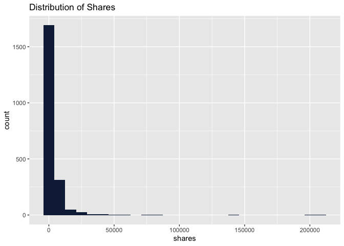<!-- -->

*What does the distribution show? Does the distribution follow a known
distribution? Is there skewness? What might these features tell us about
the number of shares? The number of shares is plotted along the x-axis,
with frequency (count) on the y-axis.*

## 4.4 Title Tokens vs Shares

Now let’s analyze the affect of the different variables on the shares.
Starting with the number of words in the title and how they affect the
shares.

``` r
data %>% 
  group_by(n_tokens_title) %>% 
  summarise(avgShares = mean(shares)) %>% 
  ggplot() +
  aes(x = avgShares, y = n_tokens_title) +
  geom_point(shape = "circle", size = 1.5, colour = "#112446") +
  labs(title = "Average Shares vs Title Tokens") +
  theme_gray()
```

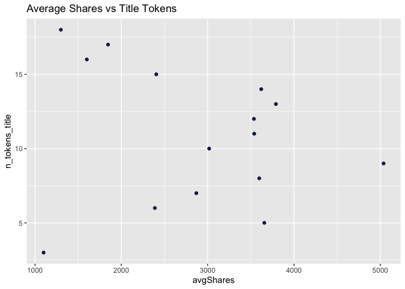<!-- --> *The
average number of shares is plotted on the x-axis while the numvber of
words in the article title is plotted on the y-axis. Can we see any
relationship between the two variables?*

## 4.5 Number of Links in the Articles vs Shares

``` r
data %>% 
  group_by(num_hrefs) %>% 
  summarise(avgShares = mean(shares)) %>% 
  ggplot() +
  aes(x = avgShares, y = num_hrefs) +
  geom_point(shape = "circle", size = 1.5, colour = "#112446") +
  labs(title = "Average Shares vs Number of Links") +
  theme_gray()
```

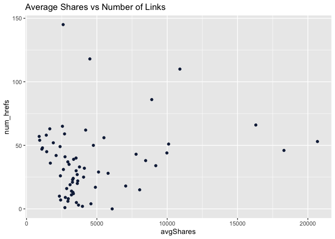<!-- --> *The
average number of shares is plotted on the x-axis while the number of
hyperlinks is plotted on the y-axis. Like with the previous plot, we use
a scatter plot because we have two numeric variables, with the average
number of shares being continuous. Can we see any relationship between
the two variables?*

## 4.6 Number of Images vs Shares

``` r
data %>% 
  group_by(factor(num_imgs)) %>% 
  summarise(sumShares = sum(shares)) %>% 
  ggplot() +
  aes(x = `factor(num_imgs)`, y = sumShares) +
  geom_col(fill = "#112446") +
  labs(title = "Shares vs Images", x = "Number of Images", y = "Shares(Sum)") +
  theme_minimal()
```

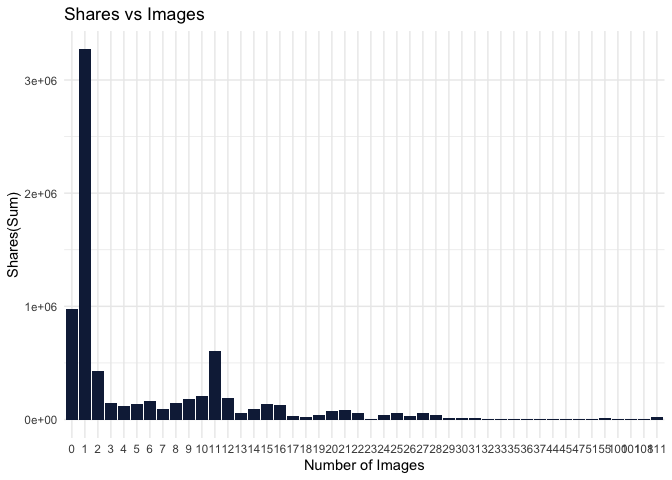<!-- --> *The
above bar plot demonstrates the relationship between the number of
images in an article (x-axis) and the sum of the shares the article
experienced. Can we see any patterns in the above visualization?*

## 4.7 Number of Videos vs Shares

``` r
data %>% 
  group_by(factor(num_videos)) %>% 
  summarise(sumShares = sum(shares)) %>% 
  ggplot() +
  aes(x = `factor(num_videos)`, y = sumShares) +
  geom_col(fill = "#112446") +
  labs(title = "Shares vs Videos", x = "Number of Videos", y = "Shares(Sum)") +
  theme_minimal()
```

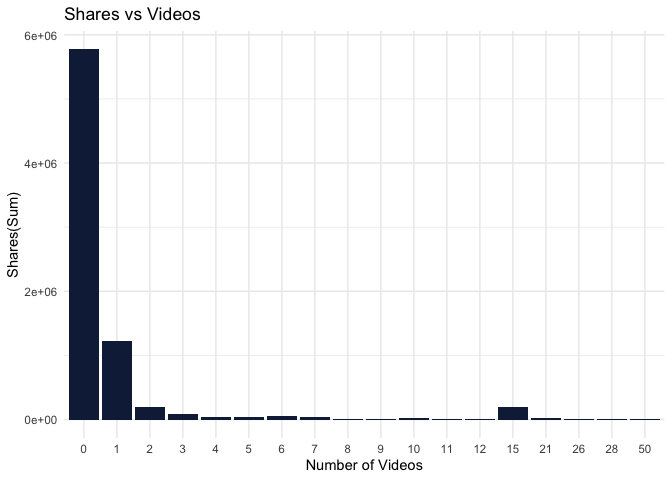<!-- -->

*In the above bar plot the number of videos featured in an article is
plotted against the summed shares per video number. Do we notice any
patterns? Can we make any comparisons between this plot (with videos) vs
the previous plot, which looks at the number of images in an article?*

## 4.8 Days of the Week and Shares

``` r
mon <- data %>% 
  select(starts_with("weekday_is_monday"), shares) %>% 
  group_by(weekday_is_monday) %>% 
  summarise(sumShares = sum(shares)) %>% 
  rename(day = weekday_is_monday) %>% 
  filter(day==1) 
mon$day[mon$day==1] <- "MON"

tue <- data %>% 
  select(starts_with("weekday_is_tuesday"), shares) %>% 
  group_by(weekday_is_tuesday) %>% 
  summarise(sumShares = sum(shares)) %>% 
  rename(day = weekday_is_tuesday) %>% 
  filter(day==1)
tue$day[tue$day==1] <- "TUE"


wed <- data %>% 
  select(starts_with("weekday_is_wednesday"), shares) %>% 
  group_by(weekday_is_wednesday) %>% 
  summarise(sumShares = sum(shares)) %>% 
  rename(day = weekday_is_wednesday) %>% 
  filter(day==1)
wed$day[wed$day==1] <- "WED"


thu <- data %>% 
  select(starts_with("weekday_is_thursday"), shares) %>% 
  group_by(weekday_is_thursday) %>% 
  summarise(sumShares = sum(shares)) %>% 
  rename(day = weekday_is_thursday) %>% 
  filter(day==1)
thu$day[thu$day==1] <- "THU"

fri <- data %>% 
  select(starts_with("weekday_is_friday"), shares) %>% 
  group_by(weekday_is_friday) %>% 
  summarise(sumShares = sum(shares)) %>% 
  rename(day = weekday_is_friday) %>% 
  filter(day==1)
fri$day[fri$day==1] <- "FRI"

sat <- data %>% 
  select(starts_with("weekday_is_saturday"), shares) %>% 
  group_by(weekday_is_saturday) %>% 
  summarise(sumShares = sum(shares)) %>% 
  rename(day = weekday_is_saturday) %>% 
  filter(day==1)
sat$day[sat$day==1] <- "SAT"

sun <- data %>% 
  select(starts_with("weekday_is_sunday"), shares) %>% 
  group_by(weekday_is_sunday) %>% 
  summarise(sumShares = sum(shares)) %>% 
  rename(day = weekday_is_sunday) %>% 
  filter(day==1)
sun$day[sun$day==1] <- "SUN"

mon %>% 
  bind_rows(tue, wed, thu, fri, sat, sun) %>% 
  ggplot() +
  aes(x = day, y = sumShares) +
  geom_col(fill = "#112446") +
  labs(title = "Most Shared Articles by the Day of the Week") +
  theme_gray()
```

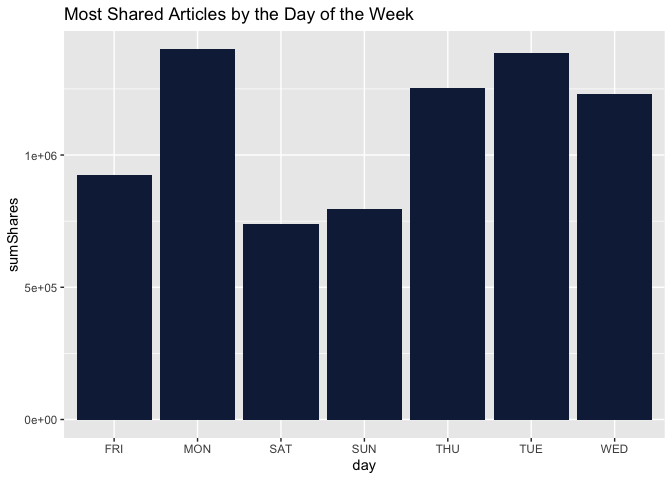<!-- -->

*The above bar plot looks at the sum of shares given for each day of the
week. Are there any patterns? Are there differences in the number of
shares between weekdays and the weekend? If so, what might cause this?
Are articles also most likely to be published on certain days of the
week, and thus more likely to be shared on those days? We can
speculate.*

*In the three scatter plots below, we take a magnifying glass to some of
the variables measuring features of article sentiment. We suspect there
might be some patterns below (not guaranteed!). Can we use this as a
starting point for investigating how article sentiment influences the
dissemination of information (if at all)?*

## 4.9 Title Polarity vs Shares

Polarity is a float which lies in the range of \[-1,1\] where 1 refers
to a positive statement and -1 refers to a negative statement. Does
title polarity affect the average number of shares?

``` r
data %>% 
  ggplot() +
  aes(x = title_sentiment_polarity, y = shares) +
  geom_point() +
  geom_jitter() +
  labs(title = "Shares vs Title Polarity", x = "Title Polarity", y = "Number of Shares") +
  theme_minimal()
```

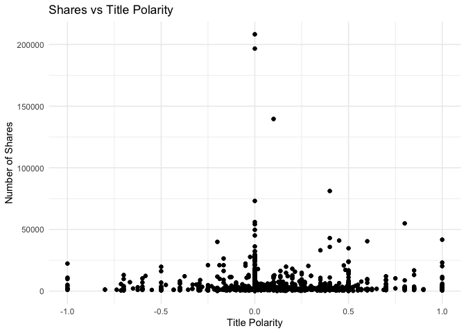<!-- -->

*The above scatter plot looks at title polarity (how negative or
positive an article title might be) and the number of shares for a given
article. Can we see any initial patterns worth exploring? *

## 4.10 Global Polarity vs Shares

``` r
data %>% 
  ggplot() +
  aes(x = global_sentiment_polarity, y = shares) +
  geom_point() +
  geom_jitter() +
  labs(title = "Shares vs Text Polarity", x = "Text Polarity", y = "Number of Shares") +
  theme_minimal()
```

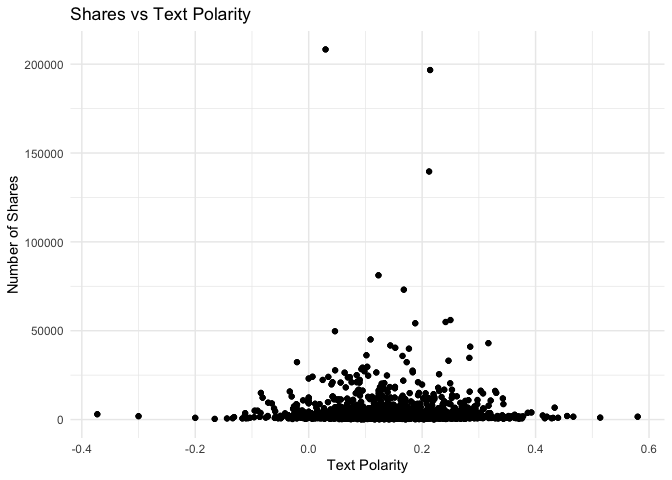<!-- -->

*The above scatter plot is similar to the previous scatter plot, though
this time we take a look at the text polarity (how positive or negative
the words of the article are) and plot it against the number of times a
given article is shared (y-axis). Again, do we notice any patterns?*

## 4.11 Subjectivity and Shares

Subjective sentences generally refer to personal opinion, emotion or
judgment whereas objective refers to factual information. Subjectivity
is a float which lies in the range of \[0,1\]. A value closer to 0 means
an opinion or an emotion and 1 means a fact. How does the text having a
factual tone or an author’s emotion/opinion affect the total shares?

``` r
ggplot(data) +
  aes(x = shares, y = global_subjectivity) +
  geom_point(shape = "circle", size = 1.5, colour = "#112446") +
  labs(title = "Shares vs Text Subjectivity", x = "Text Subjectivity", y = "Number of Shares") +
  theme_minimal()
```

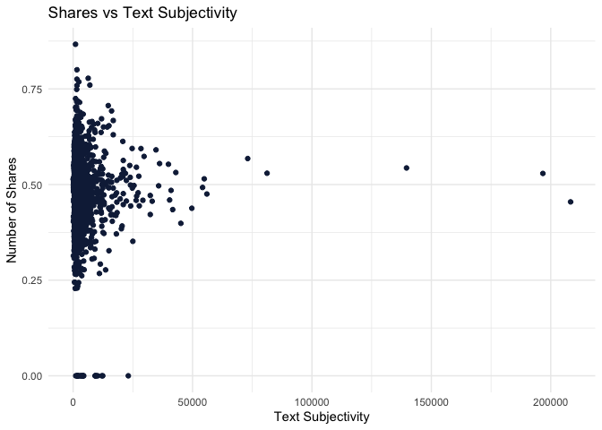<!-- -->

*In the above scatter plot, we plot the text subjectivity against the
number of times an article is shared (y-axis). Though subjectivity is
not sentiment, we might have reason to suspect that they could be
related–are subjective articles more mysterious, more enticing, more
prone to “clickbait”? Does this scatter plot seem to convey anything
like this?*

## 4.12 How does the rate of negative words in an article affect the Shares?

``` r
data %>% 
  group_by(rate_negative_words) %>% 
  summarise(avgShares = mean(shares)) %>% 
  ggplot() +
  aes(x = avgShares, y = rate_negative_words) +
  geom_point(shape = "circle", size = 1.5, colour = "#112446") +
  labs(title = "Average Shares vs Rate of Negative Words") +
  theme_gray()
```

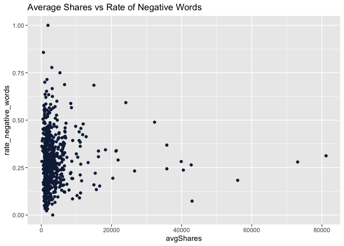<!-- -->

*Here we see how the rate of the usage of negative words throughout the
article tends to affect the shares. Does an article with higher number
of negative words tend to have lesser shares?*

## 4.13 Correlation Analysis

Now that we have completed analysis of how the shares changes with the
different variables, we do notice that there are way too many variables
in this dataset. Feeding all these variables into the training models
would mean “Garbage In and Garbage Out”. One of the easiest ways to
choose the variables to fit into the models is by checking the
correlation. Potential predictors with high correlation between each
other can prove problematic as they introduce multicollinearity into the
model. We can remove some of this redundancy from the outset. While
there are some models that thrive on correlated predictors. other models
may benefit from reducing the level of correlation between the
predictors.

Let us first understand the pair plots for all the variables explaining
keywords.

``` r
pairs(~ kw_min_min + kw_max_min + kw_min_max + kw_avg_max + kw_max_avg + kw_avg_min + kw_max_max + kw_min_avg + kw_avg_avg, data = data)
```

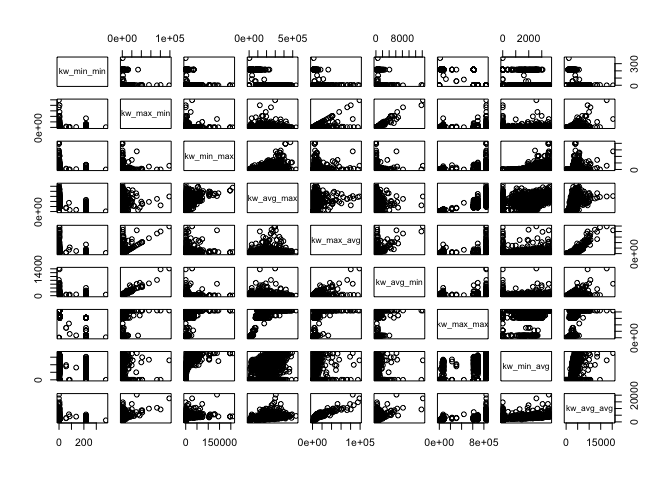<!-- -->

``` r
cor(data[, c('kw_min_min', 'kw_max_min', 'kw_min_max', 'kw_avg_max', 'kw_max_avg', 'kw_avg_min', 'kw_max_max', 'kw_min_avg', 'kw_avg_avg')])
```

    ##             kw_min_min  kw_max_min  kw_min_max  kw_avg_max kw_max_avg  kw_avg_min  kw_max_max  kw_min_avg kw_avg_avg
    ## kw_min_min  1.00000000 -0.01431468 -0.15122928 -0.66967092 -0.1582650  0.09338721 -0.85636959 -0.21719894 -0.3573182
    ## kw_max_min -0.01431468  1.00000000 -0.01050683 -0.02417485  0.5877070  0.95657406  0.01359425  0.01323894  0.4169394
    ## kw_min_max -0.15122928 -0.01050683  1.00000000  0.38650712  0.1162611 -0.05058690  0.16661113  0.60947396  0.3607224
    ## kw_avg_max -0.66967092 -0.02417485  0.38650712  1.00000000  0.1932035 -0.15864836  0.75010983  0.42057783  0.5092148
    ## kw_max_avg -0.15826502  0.58770701  0.11626107  0.19320348  1.0000000  0.54678251  0.17026438  0.11982700  0.8184230
    ## kw_avg_min  0.09338721  0.95657406 -0.05058690 -0.15864836  0.5467825  1.00000000 -0.09884731 -0.03655004  0.3528374
    ## kw_max_max -0.85636959  0.01359425  0.16661113  0.75010983  0.1702644 -0.09884731  1.00000000  0.25139447  0.4078612
    ## kw_min_avg -0.21719894  0.01323894  0.60947396  0.42057783  0.1198270 -0.03655004  0.25139447  1.00000000  0.4948336
    ## kw_avg_avg -0.35731816  0.41693940  0.36072242  0.50921476  0.8184230  0.35283735  0.40786116  0.49483356  1.0000000

``` r
kwCorData <- as.data.frame(as.table(cor(data[, c('kw_min_min', 'kw_max_min', 'kw_min_max', 'kw_avg_max', 'kw_max_avg', 'kw_avg_min', 'kw_max_max', 'kw_min_avg', 'kw_avg_avg')])))

colRemove <- kwCorData %>% 
  filter(abs(Freq)>0.8 & Freq!=1 )

colRemove <- as.vector(colRemove$Var2)

data <- data %>% 
  select(-all_of(colRemove))
```

This removes all the highly correlated keyword variables that convey the
same information. Now we will similarly investigate the self-referenced
shares.

``` r
pairs(~ self_reference_avg_sharess + self_reference_max_shares + self_reference_min_shares, data = data)
```

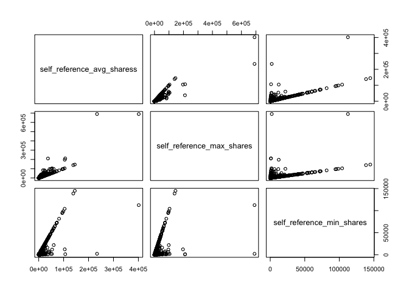<!-- -->

If we find that any of the self_reference shares variables have a
correlation of greater than 0.8 with one another, then we will eliminate
it from the analysis. Again, this is done to limit the multicollinearity
in the models we build below as well as reduce their dimension. We want
to simplify our models from the outset as much as possible without
losing predictors that will explain much of the variability in the
number of times an article is shared.

``` r
srCorData <- as.data.frame(as.table(cor(data[, c('self_reference_avg_sharess', 'self_reference_max_shares', 'self_reference_min_shares')])))

colRemove <- srCorData %>% 
  filter(abs(Freq)>0.8 & Freq!=1)

colRemove <- as.vector(colRemove$Var2)

data <- data %>% 
  select(-all_of(colRemove))
```

In this next step, we examine our remaining variables to see if any
share a correlation of 0.70 or higher. If so, we will remove it from the
data.

``` r
descrCor <- cor(data) 
highlyCorVar <- findCorrelation(descrCor, cutoff = .85)
data <- data[,-highlyCorVar]
```

Again, we do not want to remove both the highly correlated variables.
For example, if we were looking at the variables temperature in
Farenheit and temperature in Celcius in predicting the number of people
at a beach, both variable would be telling us the same thing, but we
would still want to keep one of them because of its probable importance
to the model. We will also remove `is_weekend` from our analysis as the
variables `weekday_is_sunday` and `weekday_is_saturday` capture the same
information.

``` r
data <- data %>% 
  select(-c("is_weekend"))
```

We are now down from 61 columns to 42 columns.

Let us finally do a correlation plot for all variables with threshold
greater than 0.55 for the the present dataframe.

``` r
cols <- names(data)

corrDf <- data.frame(t(combn(cols,2)), stringsAsFactors = F) %>%
  rowwise() %>%
  mutate(v = cor(data[,X1], data[,X2]))

corrDf <- corrDf %>% 
  filter(abs(v)>0.55) %>% 
  arrange(desc(v))
corrDf
```

    ## # A tibble: 17 × 3
    ## # Rowwise: 
    ##    X1                         X2                            v[,1]
    ##    <chr>                      <chr>                         <dbl>
    ##  1 global_rate_negative_words rate_negative_words           0.816
    ##  2 global_sentiment_polarity  rate_positive_words           0.717
    ##  3 title_subjectivity         abs_title_sentiment_polarity  0.695
    ##  4 avg_negative_polarity      min_negative_polarity         0.689
    ##  5 avg_positive_polarity      max_positive_polarity         0.620
    ##  6 kw_min_max                 kw_min_avg                    0.609
    ##  7 title_sentiment_polarity   abs_title_sentiment_polarity  0.595
    ##  8 global_subjectivity        avg_positive_polarity         0.583
    ##  9 global_sentiment_polarity  global_rate_positive_words    0.578
    ## 10 global_rate_positive_words rate_positive_words           0.565
    ## 11 avg_negative_polarity      max_negative_polarity         0.559
    ## 12 global_sentiment_polarity  avg_positive_polarity         0.551
    ## 13 n_tokens_content           n_unique_tokens              -0.552
    ## 14 global_rate_negative_words rate_positive_words          -0.586
    ## 15 global_sentiment_polarity  rate_negative_words          -0.674
    ## 16 LDA_00                     LDA_04                       -0.692
    ## 17 rate_positive_words        rate_negative_words          -0.731

``` r
#turn corr back into matrix in order to plot with corrplot
correlationMat <- reshape2::acast(corrDf, X1~X2, value.var="v")
  
#plot correlations visually
corrplot(correlationMat, is.corr=FALSE, tl.col="black", na.label=" ")
```

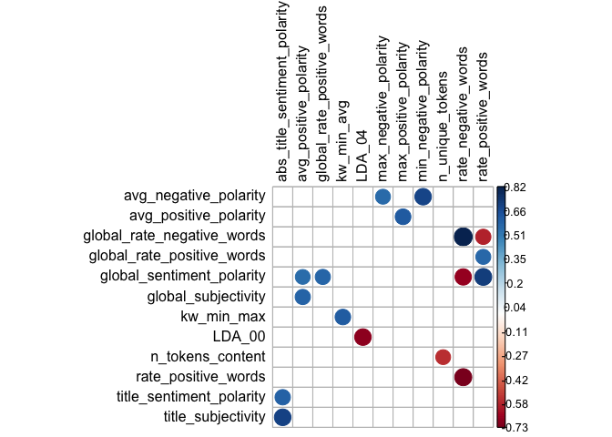<!-- -->

Now that we have a more concise data set, let’s zero in on the
relationship between our target variable, shares, and the remaining
variables. Below we extract the five variables that have the highest
correlation with the shares variable. This may be a valuable insight
prior to training our models.

``` r
sharesCor <- cor(data[ , colnames(data) != "shares"],  # Calculate correlations
                data$shares)

sharesCor <- data.frame(sharesCor)
sharesCor$names <- rownames(sharesCor)
rownames(sharesCor) <- NULL

sharesCor <- sharesCor %>% 
  rename(corrcoeff=sharesCor) %>% 
  arrange(desc(abs(corrcoeff))) %>% 
  head(6)

par(mfrow=c(2,3))
for (i in sharesCor$names) {
  plot(data$shares, data[[i]], ylab = i, main = paste("Shares vs", i))
}
```

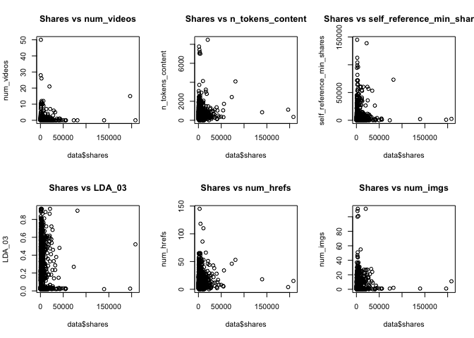<!-- -->

``` r
#for (i in sharesCor$names) {
 # ggpairs(data[[i]], ylab = i, main = paste("Shares vs", i))
#}
```

# 5 Data Splitting

Data splitting is an important aspect of data science, particularly for
creating predictive models based on data. This technique helps ensure
the creation of data models and processes that use data models – such as
machine learning – are accurate. In a basic two-part data split, the
training data set is used to train and fit models. Training sets are
commonly used to estimate different parameters or to compare different
model performance. The testing data set is used after the training is
done; we see if our trained models are effective in predicting future
values. We will use a 70-30 split on the dataset.

``` r
train_index <- createDataPartition(data$shares, p = 0.7, 
                                   list = FALSE)
train <- data[train_index, ]
test <- data[-train_index, ]
```

We will check the shape of the train and test set

``` r
print("The train set dimensions")
```

    ## [1] "The train set dimensions"

``` r
dim(train)
```

    ## [1] 1472   42

``` r
print("The test set dimensions")
```

    ## [1] "The test set dimensions"

``` r
dim(test)
```

    ## [1] 627  42

# 6 Modeling

We will be comparing linear and ensemble techniques for predicting
shares. Each section below elucidates the model used and the reasoning
behind it.

## 6.1 Linear Regression

A simple linear regression refers to a linear equation that captures the
relationship between a response variable, $Y$, and a predictor variable
$X$. The relationship is modeled below:

$$Y = \beta_0 + \beta_1X_1 +\epsilon i$$

Where $\beta_0$ is the intercept and $\beta_1$ is the slope of the line.
This relationship can be extended to the case in which the response
variable is modeled as a function of more than one predictor variable.
This is the case of a multiple linear regression, which is as follows:

$$Y = \beta_0 + \beta_1X_1 + \beta_2X_2 + … + \beta_nX_n + \epsilon i$$

Where $\beta_0$ is the intercept and all $\beta$ are slope coefficients.
For both simple and multiple linear regression cases, the Method of
Least Squares is widely used in summarizing the data. The least squares
method minimizes values of $\beta_0$ and all $\beta_n$, seen below:

$$\sum_{i = 1}^{n} (yi - \beta_0 - \sum_{j = 1}^{k} \beta_j x_{ij}^2)$$

Since we are dealing with 42 variables, it is probably important to know
that we would need to employ a feature selection/dimension reduction
technique. Feature selection is the process of reducing the number of
input variables when developing a predictive model. It is desirable to
reduce the number of input variables to both reduce the computational
cost of modeling and, in some cases, to improve the performance of the
model. To prove this, we will first fit a full-model (with all the
available variables) with multiple linear regression.

``` r
trControl <- trainControl(method = "repeatedcv", number = 5, repeats = 5)

mlrWithoutVS <- train(shares ~ .,
                     data = train,
                     preProcess = c("center", "scale"),
                     method = "lm", 
                     trControl = trControl)

summary(mlrWithoutVS)
```

    ## 
    ## Call:
    ## lm(formula = .outcome ~ ., data = dat)
    ## 
    ## Residuals:
    ##    Min     1Q Median     3Q    Max 
    ## -15977  -2633  -1314    237 200266 
    ## 
    ## Coefficients: (2 not defined because of singularities)
    ##                               Estimate Std. Error t value Pr(>|t|)    
    ## (Intercept)                  3601.4654   207.7788  17.333  < 2e-16 ***
    ## n_tokens_title                 -3.8687   218.3482  -0.018 0.985866    
    ## n_tokens_content             1258.5518   340.3708   3.698 0.000226 ***
    ## n_unique_tokens               984.1874   395.0254   2.491 0.012835 *  
    ## num_hrefs                     624.9125   269.2421   2.321 0.020426 *  
    ## num_self_hrefs               -186.3989   229.9511  -0.811 0.417729    
    ## num_imgs                     -399.7138   303.4977  -1.317 0.188041    
    ## num_videos                    -54.2556   216.0007  -0.251 0.801709    
    ## average_token_length         -252.4290   467.9655  -0.539 0.589682    
    ## num_keywords                  155.5609   238.3230   0.653 0.514034    
    ## kw_min_max                    246.2940   276.0764   0.892 0.372477    
    ## kw_avg_max                     -0.6746   266.1794  -0.003 0.997978    
    ## kw_min_avg                   -473.2368   281.0162  -1.684 0.092396 .  
    ## self_reference_min_shares     784.5835   212.0933   3.699 0.000224 ***
    ## weekday_is_monday             -80.5117   316.9993  -0.254 0.799547    
    ## weekday_is_tuesday            524.0627   319.5248   1.640 0.101197    
    ## weekday_is_wednesday         -120.9117   329.7196  -0.367 0.713889    
    ## weekday_is_thursday           102.2098   324.4791   0.315 0.752810    
    ## weekday_is_friday            -251.9812   313.4512  -0.804 0.421592    
    ## weekday_is_saturday            87.0921   277.0634   0.314 0.753309    
    ## weekday_is_sunday                   NA         NA      NA       NA    
    ## LDA_00                        136.9815   222.5948   0.615 0.538398    
    ## LDA_01                        -67.1728   216.1154  -0.311 0.755983    
    ## LDA_02                       -171.2891   229.5708  -0.746 0.455713    
    ## LDA_03                        479.5143   270.8682   1.770 0.076892 .  
    ## LDA_04                              NA         NA      NA       NA    
    ## global_subjectivity           -55.3079   318.6646  -0.174 0.862235    
    ## global_sentiment_polarity    -442.5143   584.6060  -0.757 0.449208    
    ## global_rate_positive_words    430.4823   466.2149   0.923 0.355977    
    ## global_rate_negative_words   -395.0472   639.2929  -0.618 0.536711    
    ## rate_positive_words          -811.6217   819.6120  -0.990 0.322219    
    ## rate_negative_words          -513.7654   865.2730  -0.594 0.552766    
    ## avg_positive_polarity         396.1905   461.9127   0.858 0.391192    
    ## min_positive_polarity         215.8342   277.8153   0.777 0.437347    
    ## max_positive_polarity        -504.6458   345.1824  -1.462 0.143969    
    ## avg_negative_polarity         209.2434   518.6121   0.403 0.686664    
    ## min_negative_polarity        -529.2023   440.4434  -1.202 0.229748    
    ## max_negative_polarity          85.5739   357.1227   0.240 0.810659    
    ## title_subjectivity            286.4716   314.2946   0.911 0.362199    
    ## title_sentiment_polarity       81.8722   273.6520   0.299 0.764843    
    ## abs_title_subjectivity        252.4502   253.0166   0.998 0.318564    
    ## abs_title_sentiment_polarity -165.9810   346.7451  -0.479 0.632237    
    ## ---
    ## Signif. codes:  0 '***' 0.001 '**' 0.01 '*' 0.05 '.' 0.1 ' ' 1
    ## 
    ## Residual standard error: 7972 on 1432 degrees of freedom
    ## Multiple R-squared:  0.04572,    Adjusted R-squared:  0.01973 
    ## F-statistic: 1.759 on 39 and 1432 DF,  p-value: 0.002824

``` r
mlrWithoutVS$results
```

    ##   intercept     RMSE    Rsquared      MAE   RMSESD RsquaredSD    MAESD
    ## 1      TRUE 7589.021 0.009898765 3403.445 3088.816 0.01324441 298.1051

As we can see, the Root Mean Square Error of the model is
`mlrWithoutVS$results$RMSE`. Now let us see how this changes with the
Principle Components Analysis below.

### 6.1.1 Linear Regression with Dimensionality Reduction

Principle Components Analysis (PCA) is a dimension-reduction technique
that can be extended to regression. In a PCA we find linear combinations
of the predictor variables that account for most of the variability in
the model. What this does is it reduces the number of variables $p$ into
$m$ principal components, allowing for a reduction in complexity all the
while retaining most of the variability of the $p$ variables. We extend
this to regression by treating our $m$ principle components as
predictors, though we cannot interpret them in the same way.

``` r
pcs <- prcomp(train, scale = TRUE, center = TRUE)
summary(pcs)
```

    ## Importance of components:
    ##                          PC1     PC2     PC3    PC4     PC5     PC6     PC7     PC8     PC9   PC10    PC11    PC12
    ## Standard deviation     2.090 1.88305 1.71435 1.5621 1.46720 1.35512 1.28179 1.25753 1.12692 1.1151 1.10501 1.09877
    ## Proportion of Variance 0.104 0.08443 0.06998 0.0581 0.05125 0.04372 0.03912 0.03765 0.03024 0.0296 0.02907 0.02875
    ## Cumulative Proportion  0.104 0.18841 0.25838 0.3165 0.36774 0.41146 0.45058 0.48823 0.51847 0.5481 0.57714 0.60589
    ##                           PC13    PC14    PC15    PC16    PC17    PC18    PC19    PC20    PC21    PC22    PC23
    ## Standard deviation     1.07135 1.05162 1.04828 1.03867 1.01305 0.99101 0.96810 0.95339 0.93364 0.89723 0.84876
    ## Proportion of Variance 0.02733 0.02633 0.02616 0.02569 0.02444 0.02338 0.02231 0.02164 0.02075 0.01917 0.01715
    ## Cumulative Proportion  0.63322 0.65955 0.68571 0.71140 0.73583 0.75922 0.78153 0.80317 0.82393 0.84309 0.86025
    ##                           PC24    PC25    PC26    PC27    PC28    PC29    PC30    PC31    PC32    PC33    PC34
    ## Standard deviation     0.83020 0.80239 0.78229 0.73836 0.71189 0.69174 0.66207 0.63451 0.59677 0.55346 0.48414
    ## Proportion of Variance 0.01641 0.01533 0.01457 0.01298 0.01207 0.01139 0.01044 0.00959 0.00848 0.00729 0.00558
    ## Cumulative Proportion  0.87666 0.89199 0.90656 0.91954 0.93160 0.94300 0.95343 0.96302 0.97150 0.97879 0.98437
    ##                           PC35    PC36    PC37    PC38    PC39   PC40      PC41      PC42
    ## Standard deviation     0.46360 0.42029 0.31808 0.27785 0.23010 0.1829 9.287e-13 1.094e-15
    ## Proportion of Variance 0.00512 0.00421 0.00241 0.00184 0.00126 0.0008 0.000e+00 0.000e+00
    ## Cumulative Proportion  0.98949 0.99370 0.99610 0.99794 0.99920 1.0000 1.000e+00 1.000e+00

How many principle components should we use? This is somewhat
subjective. Consider the plot below. How many principle components would
be required in order to retain say 80 or 90 percent of the variability
in the data? If we can effectively reduce the number of variables by way
of this method, then we may want to consider a regression of these
principle components, even if we lose some interpretability.

``` r
par(mfrow = c(1, 2))
plot(pcs$sdev^2/sum(pcs$sdev^2), xlab = "Principal Component", 
         ylab = "Proportion of Variance Explained", ylim = c(0, 1), type = 'b')
plot(cumsum(pcs$sdev^2/sum(pcs$sdev^2)), xlab = "Principal Component", 
ylab = "Cum. Prop of Variance Explained", ylim = c(0, 1), type = 'b')
```

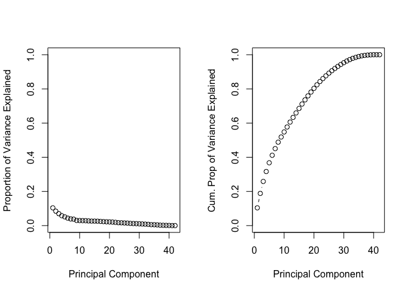<!-- -->

``` r
pcaVar <- as.vector(cumsum(pcs$sdev^2/sum(pcs$sdev^2)))
for (i in seq_along(pcaVar)) {
  if(pcaVar[i] > 0.9 & pcaVar[i] < 0.92){
    pcaIndex = i
  }
}

pc_train <- predict(pcs, train)
pc_train <- data.frame(pc_train)
pc_train <- pc_train %>% 
  select(all_of(c(1:pcaIndex))) %>% 
  mutate(shares = train$shares)
pc_test <- data.frame(predict(pcs, test))  %>% 
  mutate(shares = test$shares)
```

We will now fit a multiple linear regression using these principle
components.

``` r
mlrWitVS <- train(shares ~ .,
                  data = pc_train,
                  preProcess = c("center", "scale"),
                  method = "lm", 
                  trControl = trControl)

summary(mlrWitVS)
```

    ## 
    ## Call:
    ## lm(formula = .outcome ~ ., data = dat)
    ## 
    ## Residuals:
    ##      Min       1Q   Median       3Q      Max 
    ## -3036.75  -312.50    17.99   349.00  1949.59 
    ## 
    ## Coefficients:
    ##             Estimate Std. Error  t value Pr(>|t|)    
    ## (Intercept)  3601.47      14.43  249.522  < 2e-16 ***
    ## PC1           329.39      14.44   22.813  < 2e-16 ***
    ## PC2           880.21      14.44   60.963  < 2e-16 ***
    ## PC3          -150.59      14.44  -10.430  < 2e-16 ***
    ## PC4          -117.87      14.44   -8.164 7.01e-16 ***
    ## PC5           112.50      14.44    7.792 1.25e-14 ***
    ## PC6           170.97      14.44   11.841  < 2e-16 ***
    ## PC7           -23.08      14.44   -1.599 0.110075    
    ## PC8         -1184.31      14.44  -82.025  < 2e-16 ***
    ## PC9          1328.91      14.44   92.040  < 2e-16 ***
    ## PC10        -2128.00      14.44 -147.385  < 2e-16 ***
    ## PC11         -990.46      14.44  -68.599  < 2e-16 ***
    ## PC12         2033.14      14.44  140.815  < 2e-16 ***
    ## PC13        -1053.62      14.44  -72.973  < 2e-16 ***
    ## PC14          197.29      14.44   13.664  < 2e-16 ***
    ## PC15        -1078.49      14.44  -74.696  < 2e-16 ***
    ## PC16        -3767.29      14.44 -260.922  < 2e-16 ***
    ## PC17          179.33      14.44   12.421  < 2e-16 ***
    ## PC18         2466.93      14.44  170.859  < 2e-16 ***
    ## PC19         2354.37      14.44  163.063  < 2e-16 ***
    ## PC20          394.41      14.44   27.317  < 2e-16 ***
    ## PC21         4620.60      14.44  320.022  < 2e-16 ***
    ## PC22          -12.69      14.44   -0.879 0.379612    
    ## PC23          699.18      14.44   48.425  < 2e-16 ***
    ## PC24          688.78      14.44   47.705  < 2e-16 ***
    ## PC25           89.08      14.44    6.170 8.86e-10 ***
    ## PC26           50.16      14.44    3.474 0.000528 ***
    ## PC27         -329.66      14.44  -22.832  < 2e-16 ***
    ## ---
    ## Signif. codes:  0 '***' 0.001 '**' 0.01 '*' 0.05 '.' 0.1 ' ' 1
    ## 
    ## Residual standard error: 553.8 on 1444 degrees of freedom
    ## Multiple R-squared:  0.9954, Adjusted R-squared:  0.9953 
    ## F-statistic: 1.146e+04 on 27 and 1444 DF,  p-value: < 2.2e-16

``` r
mlrWitVS$results
```

    ##   intercept     RMSE  Rsquared      MAE   RMSESD  RsquaredSD    MAESD
    ## 1      TRUE 573.0504 0.9912099 427.4621 35.71159 0.005121389 19.76441

Now that we have a Multiple Linear Regression with PCA, let us see how a
Lasso Regression on the original dataset competes in terms of variable
selection.

``` r
tuneGrid <- expand.grid(
  .fraction = seq(0, 1, by = 0.1)
)

lassoModel <- train(
  shares ~ .,
  data = train,
  method = 'lasso',
  preProcess = c("center", "scale"),
  trControl = trControl,
  tuneGrid = tuneGrid
)
```

``` r
lassoModel$results
```

    ##    fraction     RMSE    Rsquared      MAE   RMSESD RsquaredSD    MAESD
    ## 1       0.0 7393.438         NaN 3204.397 3267.175         NA 339.8922
    ## 2       0.1 7405.702 0.011694932 3232.753 3235.961 0.01337736 351.4241
    ## 3       0.2 7424.897 0.010754179 3246.918 3220.863 0.01274709 352.3166
    ## 4       0.3 7442.781 0.010454635 3268.083 3207.096 0.01315063 344.6610
    ## 5       0.4 7456.591 0.010763443 3287.492 3196.090 0.01383538 342.1692
    ## 6       0.5 7472.134 0.010823293 3308.660 3185.296 0.01415924 337.6921
    ## 7       0.6 7489.391 0.010629213 3331.029 3174.714 0.01414556 332.1802
    ## 8       0.7 7504.233 0.010342630 3347.899 3167.305 0.01393998 328.9584
    ## 9       0.8 7518.001 0.010028996 3362.302 3161.137 0.01370590 326.1784
    ## 10      0.9 7529.843 0.009817169 3375.431 3156.580 0.01359654 323.7452
    ## 11      1.0 7542.093 0.009550579 3389.453 3152.126 0.01324844 320.8278

## 6.2 Random Forest

The random forest model refers to an ensemble method of either
classification or regression. In this case, we are predicting a
continuous response variable, and are thus using the latter case. The
random forest creates numerous trees from bootstrap samples of the data.
Bootstrap samples are simply samples taken from the data and are of the
same size (sample $n$ equals bootstrap $m$), meaning that an observation
from the sample data could be used twice in the bootstrap sample, for
example. A tree is fit to each bootstrap sample, and for each fit a
random subset (generally $m = p/3$ predictors) of predictors is chosen.
This is done with the tuning parameter mtry.

Generally speaking, random forests predict more accurately because the
results of the fitted trees are averaged across all trees. This
averaging reduces variance.

``` r
tuneGrid = expand.grid(mtry = 1:3)

rfModel <- train(shares ~ .,
                  data = train,
                  method = "rf", 
                  trControl = trControl,
                  tuneGrid = tuneGrid)
```

Looking at the Variable Importance Plot :

``` r
plot(varImp(rfModel))
```

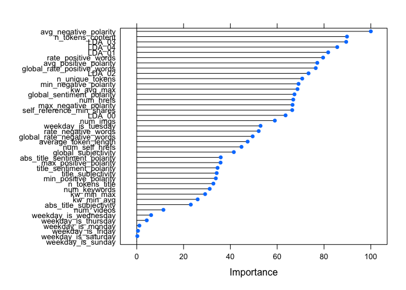<!-- -->

``` r
rfModel$results
```

    ##   mtry     RMSE    Rsquared      MAE   RMSESD RsquaredSD    MAESD
    ## 1    1 7482.894 0.009453313 3272.496 3060.961 0.01414715 274.1399
    ## 2    2 7527.246 0.010450304 3359.915 3048.485 0.01423058 264.8811
    ## 3    3 7549.951 0.012386210 3398.129 3041.917 0.01579826 265.6463

## 6.3 Boosted Tree

Boosted tree models, like the random forest, are an ensemble tree-based
method that can be used for classification or regression. Again, in our
case, we are predicting a continuous response and are using regression.

Unlike the random forest, in the boosted tree method, trees are grown
sequentially, and for each tree the residuals are treated as the
response. This is exactly true for the first tree. Updated predictions
can be modeled by the following:

$$\hat{y} = \hat{y}(x) + \lambda \hat{y}^b(x)$$

Below we fit our boosted tree model to the training data set.

``` r
tuneGrid = expand.grid(n.trees = seq(5, 30, 5), interaction.depth = seq(1,10,1), shrinkage = 0.1, n.minobsinnode = 20)

# fit the model
boostingModel <- train(shares ~ .,
                  data = train,
                  method = "gbm", 
                  trControl = trControl,
                  tuneGrid = tuneGrid,
                  verbose = FALSE)
```

# 7 Model Comparison

## 7.1 Train Model Comparison

Now although using the accuracy on the testing data is the gold standard
for model comparison, it can be imperative to check the train model
accuracy to see how the models have fit the dataset. If there is a huge
difference in train accuracies then we know that a certain model does
not fit the data well. Here is a summarisation of the models with their
hyperparameters and model metrics.

``` r
trainModelComparison <- mlrWithoutVS$results[which.min(mlrWithoutVS$results$RMSE),] %>% 
  bind_rows(mlrWitVS$results[which.min(mlrWitVS$results$RMSE),],
            lassoModel$results[which.min(lassoModel$results$RMSE),], 
            rfModel$results[which.min(mlrWithoutVS$results$RMSE),],
            boostingModel$results[which.min(boostingModel$results$RMSE),]) %>% 
  mutate(Model = c("MLR", "MLR with PCA", "Lasso", "Random Forest", "Boosted Tree with PCA")) %>% 
  select(Model, everything())
trainModelComparison
```

    ##                   Model intercept      RMSE    Rsquared       MAE     RMSESD  RsquaredSD     MAESD fraction mtry
    ## 1                   MLR      TRUE 7589.0213 0.009898765 3403.4454 3088.81634 0.013244412 298.10505       NA   NA
    ## 2          MLR with PCA      TRUE  573.0504 0.991209936  427.4621   35.71159 0.005121389  19.76441       NA   NA
    ## 3                 Lasso        NA 7393.4380         NaN 3204.3970 3267.17538          NA 339.89215        0   NA
    ## 4         Random Forest        NA 7482.8943 0.009453313 3272.4959 3060.96099 0.014147155 274.13986       NA    1
    ## 5 Boosted Tree with PCA        NA 7417.1296 0.009046818 3197.8418 3190.53996 0.012149041 319.36292       NA   NA
    ##   shrinkage interaction.depth n.minobsinnode n.trees
    ## 1        NA                NA             NA      NA
    ## 2        NA                NA             NA      NA
    ## 3        NA                NA             NA      NA
    ## 4        NA                NA             NA      NA
    ## 5       0.1                 1             20      10

We see that the model with the lowest RMSE value is MLR with PCA with an
RMSE value of 573.05. The model that performs the poorest MLR with an
RMSE value of 7589.02 which means that the model was incapable of
fitting the data well.

## 7.2 Test Model Comparison

Now that we have created our trained models (models fit to the training
data) we should now see how accurately they predict future values. Once
we have evaluated each of the models, we should be able to compare them
to see which is best at making predictions on future data. We can do
this by comparing the predicted values of the tested with the actual
test set values.

Withe function `postResample()` we can find our RMSE on the test data
set and compare it across models.

``` r
predLinearTest <- predict(mlrWithoutVS, test)
testMLR<- postResample(pred = predLinearTest, obs = test$shares)
```

``` r
predPCAtest <- predict(mlrWitVS, pc_test)
testPCA <- postResample(pred = predPCAtest, obs = pc_test$shares)
```

``` r
predLassoTest <- predict(lassoModel, test)
testLasso <- postResample(pred = predLassoTest, test$shares)
```

``` r
predRandomForest <- predict(rfModel, test)
testRandomForest <- postResample(pred = predRandomForest, obs = test$shares)
```

``` r
predBoosting <- predict(boostingModel, test)
testBoosting <- postResample(pred = predBoosting, obs = test$shares)
```

In comparing the above models, we should be looking at which among the
models best minimizes the RMSE, as the model with the lowest RMSE will,
on average, make the most accurate predictions.

``` r
testModelComparison <- testMLR %>% 
  bind_rows(testPCA, testLasso, testRandomForest, testBoosting) %>% 
  mutate(Model = c("MLR", "MLR with PCA", "Lasso", "Random Forest", "Boosted Tree with PCA")) %>% 
  select(Model, everything())
testModelComparison
```

    ## # A tibble: 5 × 4
    ##   Model                   RMSE  Rsquared   MAE
    ##   <chr>                  <dbl>     <dbl> <dbl>
    ## 1 MLR                   10669.  0.000435 3467.
    ## 2 MLR with PCA            551.  0.997     411.
    ## 3 Lasso                 10587. NA        3450.
    ## 4 Random Forest         10541.  0.00831  3432.
    ## 5 Boosted Tree with PCA 10572.  0.00344  3364.

We see that the model with the lowest RMSE value is MLR with PCA with an
RMSE value of 550.73. The model that performs the poorest MLR with an
RMSE value of 1.066856^{4}.

# 8 Conclusion

Here’s is general observation on the modelling with data with high
dimension : When there are large number of features with less
data-sets(with low noise), linear regressions may outperform Decision
trees/random forests. There is no thumb rule on which model will perform
the best on what kind of dataset. If you are dealing with a dataset with
high dimensionality then your first approach must be to decrease this
dimensionality before fitting the models. Both LASSO and PCA are
dimensionality reduction techniques. Both methods can reduce the
dimensionality of a dataset but follow different styles. LASSO, as a
feature selection method, focuses on deletion of irrelevant or redundant
features. PCA, as a dimension reduction method, combines the features
into a smaller number of aggregated components (a.k.a., the new
features).
