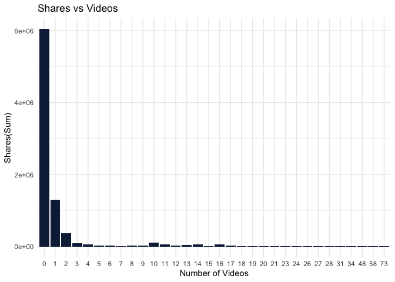
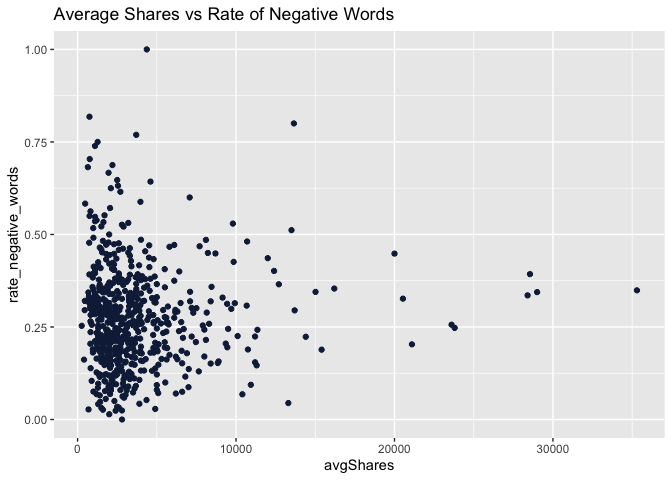
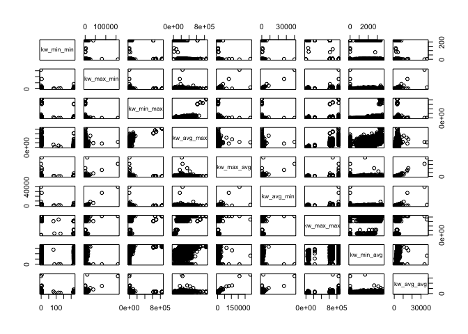
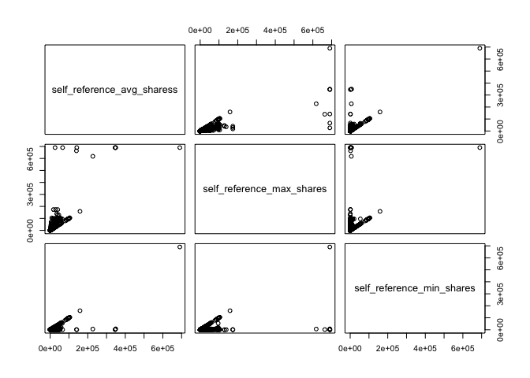
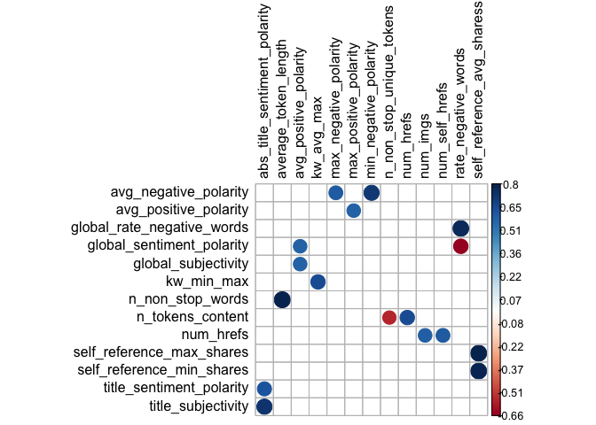
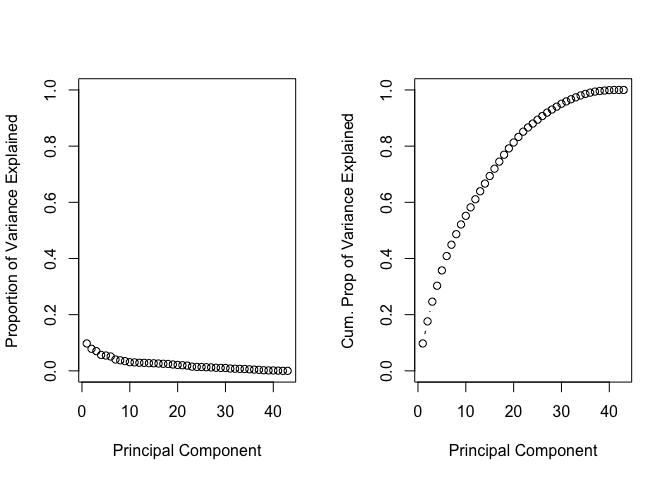

Online News Popularity Analysis
================
Matthieu Cartron and Sneha Karanjai
2022-12-08

- <a href="#introduction" id="toc-introduction">1 Introduction</a>
- <a href="#setup" id="toc-setup">2 Setup</a>
- <a href="#data-import" id="toc-data-import">3 Data Import</a>
- <a href="#exploratory-data-analysis"
  id="toc-exploratory-data-analysis">4 Exploratory Data Analysis</a>
  - <a href="#column-description" id="toc-column-description">4.1 Column
    Description</a>
  - <a href="#summary-statistics" id="toc-summary-statistics">4.2 Summary
    Statistics</a>
  - <a href="#target-variable-distribution"
    id="toc-target-variable-distribution">4.3 Target Variable
    Distribution</a>
  - <a href="#title-tokens-vs-shares" id="toc-title-tokens-vs-shares">4.4
    Title Tokens vs Shares</a>
  - <a href="#number-of-links-in-the-articles-vs-shares"
    id="toc-number-of-links-in-the-articles-vs-shares">4.5 Number of Links
    in the Articles vs Shares</a>
  - <a href="#number-of-images-vs-shares"
    id="toc-number-of-images-vs-shares">4.6 Number of Images vs Shares</a>
  - <a href="#number-of-videos-vs-shares"
    id="toc-number-of-videos-vs-shares">4.7 Number of Videos vs Shares</a>
  - <a href="#days-of-the-week-and-shares"
    id="toc-days-of-the-week-and-shares">4.8 Days of the Week and Shares</a>
  - <a href="#title-polarity-vs-shares"
    id="toc-title-polarity-vs-shares">4.9 Title Polarity vs Shares</a>
  - <a href="#global-polarity-vs-shares"
    id="toc-global-polarity-vs-shares">4.10 Global Polarity vs Shares</a>
  - <a href="#subjectivity-and-shares" id="toc-subjectivity-and-shares">4.11
    Subjectivity and Shares</a>
  - <a
    href="#how-does-the-rate-of-negative-words-in-an-article-affect-the-shares"
    id="toc-how-does-the-rate-of-negative-words-in-an-article-affect-the-shares">4.12
    How does the rate of negative words in an article affect the Shares?</a>
  - <a href="#correlation-analysis" id="toc-correlation-analysis">4.13
    Correlation Analysis</a>
- <a href="#data-splitting" id="toc-data-splitting">5 Data Splitting</a>
- <a href="#modeling" id="toc-modeling">6 Modeling</a>
  - <a href="#linear-regression" id="toc-linear-regression">6.1 Linear
    Regression</a>
    - <a href="#linear-regression-with-dimensionality-reduction"
      id="toc-linear-regression-with-dimensionality-reduction">6.1.1 Linear
      Regression with Dimensionality Reduction</a>
  - <a href="#random-forest" id="toc-random-forest">6.2 Random Forest</a>
  - <a href="#boosted-tree" id="toc-boosted-tree">6.3 Boosted Tree</a>
- <a href="#model-comparison" id="toc-model-comparison">7 Model
  Comparison</a>
  - <a href="#train-model-comparison" id="toc-train-model-comparison">7.1
    Train Model Comparison</a>
  - <a href="#test-model-comparison" id="toc-test-model-comparison">7.2 Test
    Model Comparison</a>
- <a href="#conclusion" id="toc-conclusion">8 Conclusion</a>

# 1 Introduction

The following analysis uses the “Online News Popularity” data set from
the UCI machine learning repository. It consists of a number variables
describing different features of articles, each of which belonging to
one of six “channels.” These channels are effectively genres, and are
the following:

- Lifestyle
- Entertainment
- Business
- Social Media
- World News

For this analysis, we are primarily concerned with the “shares”
variable, which simply describes the number of times an article has been
shared. We often hear that news travels more quickly depending on its
content, title, and maybe even the number of images it uses. In a
similar vein, we would like, for each of the different data channels, to
use certain variables describing the articles to predict the number of
times an article might be shared. But how do we know which variables to
choose?

We could use simple intuition to pick variables. For example, it makes
sense to think that articles with high sentiment polarity (positive or
negative) would tend to, on average, have more shares. We could go
through the variables and pick those that we think would have the
greatest impact on the number of shares. The issue, however, is that
they may change from one data channel to the next. Are lifestyle
articles and world news articles going to be affected by the same
variables? If we choose the same variables across all the different data
channels, then this is the assumption we will be making. To avoid making
this assumption, we will automate the process of variable selection by
deleting one variable of each of the pairs of collinear variables.

# 2 Setup

``` r
library(tidyverse)
library(caret)
library(brainGraph)
library(corrplot)
library(GGally)
```

# 3 Data Import

``` r
unzippedNewDataCSV <- unzip("OnlineNewsPopularity.zip")

newsDataName <- read_csv(unzippedNewDataCSV[1]) # This is the names file
newsData <- read_csv(unzippedNewDataCSV[2])

head(newsData)
```

    ## # A tibble: 6 × 61
    ##   url            timedelta n_tokens_title n_tokens_content n_unique_tokens n_non_stop_words n_non_stop_uniqu… num_hrefs
    ##   <chr>              <dbl>          <dbl>            <dbl>           <dbl>            <dbl>             <dbl>     <dbl>
    ## 1 http://mashab…       731             12              219           0.664             1.00             0.815         4
    ## 2 http://mashab…       731              9              255           0.605             1.00             0.792         3
    ## 3 http://mashab…       731              9              211           0.575             1.00             0.664         3
    ## 4 http://mashab…       731              9              531           0.504             1.00             0.666         9
    ## 5 http://mashab…       731             13             1072           0.416             1.00             0.541        19
    ## 6 http://mashab…       731             10              370           0.560             1.00             0.698         2
    ## # … with 53 more variables: num_self_hrefs <dbl>, num_imgs <dbl>, num_videos <dbl>, average_token_length <dbl>,
    ## #   num_keywords <dbl>, data_channel_is_lifestyle <dbl>, data_channel_is_entertainment <dbl>,
    ## #   data_channel_is_bus <dbl>, data_channel_is_socmed <dbl>, data_channel_is_tech <dbl>, data_channel_is_world <dbl>,
    ## #   kw_min_min <dbl>, kw_max_min <dbl>, kw_avg_min <dbl>, kw_min_max <dbl>, kw_max_max <dbl>, kw_avg_max <dbl>,
    ## #   kw_min_avg <dbl>, kw_max_avg <dbl>, kw_avg_avg <dbl>, self_reference_min_shares <dbl>,
    ## #   self_reference_max_shares <dbl>, self_reference_avg_sharess <dbl>, weekday_is_monday <dbl>,
    ## #   weekday_is_tuesday <dbl>, weekday_is_wednesday <dbl>, weekday_is_thursday <dbl>, weekday_is_friday <dbl>, …

We will subset the data according to the channel passed to analyze
articles in one data channel at a time. Additionally according to the
data report, `url` and `timedelta` are two non-predictive columns so we
will remove them.

``` r
subsettingData <- function(data, area){
  #getting the naming convention as per the dataframe
  subsetVar <- paste("data_channel_is_", area, sep = "")
  
  # filtering the data and removing the data_channel_is_ columns, url, and timedelta
  subsetData <- data %>% 
    filter(!!as.symbol(subsetVar)==1) %>% 
    select(-c(starts_with("data_channel_is_"), url, timedelta))
  
  return(list(subsetData, subsetVar))
}

subsettingDataReturn <- subsettingData(newsData, params$channel)
data <- subsettingDataReturn[[1]]
channel <- subsettingDataReturn[[2]]
```

# 4 Exploratory Data Analysis

## 4.1 Column Description

Let us take a look at the columns available.

``` r
colnames(data)
```

    ##  [1] "n_tokens_title"               "n_tokens_content"             "n_unique_tokens"             
    ##  [4] "n_non_stop_words"             "n_non_stop_unique_tokens"     "num_hrefs"                   
    ##  [7] "num_self_hrefs"               "num_imgs"                     "num_videos"                  
    ## [10] "average_token_length"         "num_keywords"                 "kw_min_min"                  
    ## [13] "kw_max_min"                   "kw_avg_min"                   "kw_min_max"                  
    ## [16] "kw_max_max"                   "kw_avg_max"                   "kw_min_avg"                  
    ## [19] "kw_max_avg"                   "kw_avg_avg"                   "self_reference_min_shares"   
    ## [22] "self_reference_max_shares"    "self_reference_avg_sharess"   "weekday_is_monday"           
    ## [25] "weekday_is_tuesday"           "weekday_is_wednesday"         "weekday_is_thursday"         
    ## [28] "weekday_is_friday"            "weekday_is_saturday"          "weekday_is_sunday"           
    ## [31] "is_weekend"                   "LDA_00"                       "LDA_01"                      
    ## [34] "LDA_02"                       "LDA_03"                       "LDA_04"                      
    ## [37] "global_subjectivity"          "global_sentiment_polarity"    "global_rate_positive_words"  
    ## [40] "global_rate_negative_words"   "rate_positive_words"          "rate_negative_words"         
    ## [43] "avg_positive_polarity"        "min_positive_polarity"        "max_positive_polarity"       
    ## [46] "avg_negative_polarity"        "min_negative_polarity"        "max_negative_polarity"       
    ## [49] "title_subjectivity"           "title_sentiment_polarity"     "abs_title_subjectivity"      
    ## [52] "abs_title_sentiment_polarity" "shares"

``` r
str(data)
```

    ## tibble [2,323 × 53] (S3: tbl_df/tbl/data.frame)
    ##  $ n_tokens_title              : num [1:2323] 8 8 9 10 9 9 10 7 8 6 ...
    ##  $ n_tokens_content            : num [1:2323] 257 218 1226 1121 168 ...
    ##  $ n_unique_tokens             : num [1:2323] 0.568 0.663 0.41 0.451 0.778 ...
    ##  $ n_non_stop_words            : num [1:2323] 1 1 1 1 1 ...
    ##  $ n_non_stop_unique_tokens    : num [1:2323] 0.671 0.688 0.617 0.629 0.865 ...
    ##  $ num_hrefs                   : num [1:2323] 9 14 10 15 6 3 19 11 4 24 ...
    ##  $ num_self_hrefs              : num [1:2323] 7 3 10 11 4 2 10 1 4 6 ...
    ##  $ num_imgs                    : num [1:2323] 0 11 1 1 11 1 8 1 1 1 ...
    ##  $ num_videos                  : num [1:2323] 1 0 1 0 0 0 0 0 0 0 ...
    ##  $ average_token_length        : num [1:2323] 4.64 4.44 4.39 4.79 4.68 ...
    ##  $ num_keywords                : num [1:2323] 9 10 7 6 9 6 6 7 4 8 ...
    ##  $ kw_min_min                  : num [1:2323] 0 0 0 0 217 217 217 217 217 217 ...
    ##  $ kw_max_min                  : num [1:2323] 0 0 0 0 690 690 690 4800 1900 737 ...
    ##  $ kw_avg_min                  : num [1:2323] 0 0 0 0 572 ...
    ##  $ kw_min_max                  : num [1:2323] 0 0 0 0 0 0 0 0 0 0 ...
    ##  $ kw_max_max                  : num [1:2323] 0 0 0 0 17100 17100 17100 28000 28000 28000 ...
    ##  $ kw_avg_max                  : num [1:2323] 0 0 0 0 3110 ...
    ##  $ kw_min_avg                  : num [1:2323] 0 0 0 0 0 0 0 0 0 0 ...
    ##  $ kw_max_avg                  : num [1:2323] 0 0 0 0 2322 ...
    ##  $ kw_avg_avg                  : num [1:2323] 0 0 0 0 832 ...
    ##  $ self_reference_min_shares   : num [1:2323] 1300 3900 992 757 6600 1800 1200 3500 4500 1600 ...
    ##  $ self_reference_max_shares   : num [1:2323] 2500 3900 4700 5400 6600 1800 3500 3500 15300 1600 ...
    ##  $ self_reference_avg_sharess  : num [1:2323] 1775 3900 2858 2796 6600 ...
    ##  $ weekday_is_monday           : num [1:2323] 1 1 1 1 0 0 0 0 0 0 ...
    ##  $ weekday_is_tuesday          : num [1:2323] 0 0 0 0 0 0 0 0 0 0 ...
    ##  $ weekday_is_wednesday        : num [1:2323] 0 0 0 0 1 1 1 0 0 0 ...
    ##  $ weekday_is_thursday         : num [1:2323] 0 0 0 0 0 0 0 1 0 0 ...
    ##  $ weekday_is_friday           : num [1:2323] 0 0 0 0 0 0 0 0 1 1 ...
    ##  $ weekday_is_saturday         : num [1:2323] 0 0 0 0 0 0 0 0 0 0 ...
    ##  $ weekday_is_sunday           : num [1:2323] 0 0 0 0 0 0 0 0 0 0 ...
    ##  $ is_weekend                  : num [1:2323] 0 0 0 0 0 0 0 0 0 0 ...
    ##  $ LDA_00                      : num [1:2323] 0.4392 0.1993 0.0298 0.0355 0.0231 ...
    ##  $ LDA_01                      : num [1:2323] 0.0225 0.2477 0.1939 0.0338 0.0223 ...
    ##  $ LDA_02                      : num [1:2323] 0.0224 0.0201 0.0288 0.0336 0.0224 ...
    ##  $ LDA_03                      : num [1:2323] 0.0233 0.5127 0.7181 0.863 0.9096 ...
    ##  $ LDA_04                      : num [1:2323] 0.4926 0.0202 0.0293 0.0341 0.0226 ...
    ##  $ global_subjectivity         : num [1:2323] 0.4 0.522 0.408 0.497 0.638 ...
    ##  $ global_sentiment_polarity   : num [1:2323] 0.00741 0.29912 0.10661 0.15961 0.08798 ...
    ##  $ global_rate_positive_words  : num [1:2323] 0.0311 0.055 0.0228 0.0562 0.0714 ...
    ##  $ global_rate_negative_words  : num [1:2323] 0.0272 0.0183 0.0114 0.0134 0.0476 ...
    ##  $ rate_positive_words         : num [1:2323] 0.533 0.75 0.667 0.808 0.6 ...
    ##  $ rate_negative_words         : num [1:2323] 0.467 0.25 0.333 0.192 0.4 ...
    ##  $ avg_positive_polarity       : num [1:2323] 0.36 0.536 0.395 0.372 0.492 ...
    ##  $ min_positive_polarity       : num [1:2323] 0.0333 0.1 0.0625 0.0333 0.1 ...
    ##  $ max_positive_polarity       : num [1:2323] 0.6 1 1 1 1 0.35 1 1 0.55 0.8 ...
    ##  $ avg_negative_polarity       : num [1:2323] -0.393 -0.237 -0.258 -0.317 -0.502 ...
    ##  $ min_negative_polarity       : num [1:2323] -0.5 -0.25 -1 -0.8 -1 0 -0.6 -1 -0.7 -0.5 ...
    ##  $ max_negative_polarity       : num [1:2323] -0.125 -0.2 -0.1 -0.15 -0.15 0 -0.05 -0.05 -0.125 -0.05 ...
    ##  $ title_subjectivity          : num [1:2323] 0.667 0.5 0 0 1 ...
    ##  $ title_sentiment_polarity    : num [1:2323] -0.5 0.5 0 0 -1 ...
    ##  $ abs_title_subjectivity      : num [1:2323] 0.167 0 0.5 0.5 0.5 ...
    ##  $ abs_title_sentiment_polarity: num [1:2323] 0.5 0.5 0 0 1 ...
    ##  $ shares                      : num [1:2323] 2600 690 4800 851 4800 9200 1600 775 18200 1600 ...

Whew! That is a long list of columns to analyze. Instead of analyzing
them all, let us think about our data. What might we expect to be
related to how many times an article is shared? We hear frequently about
how the dissemination of news and the content thereof are related in
some way. For our data channels, let’s pay close attention to the number
of shares (dissemination) and variables that we might be able to link to
it. Can we find any interesting relationships in the exploratory
analysis? And do these relationships change across the different
channels? Maybe the sharing of lifestyle articles is less correlated
with sentiment than, say, world news articles.

First, let’s take a look at the variable descriptions for some better
understanding. Here is a data description from the UCI Machine Learning
Repository:

- n_tokens_title: Number of words in the title
- n_tokens_content Number of words in the content
- n_unique_tokens: Rate of unique words in the content
- n_non_stop_unique_tokens: Rate of unique non-stop words in the content
- num_hrefs: Number of links
- num_self_hrefs: Number of links to other articles published by
  Mashable
- num_imgs: Number of images
- num_videos: Number of videos
- average_token_length: Average length of the words in the content
- num_keywords: Number of keywords in the metadata
- self_reference_min_shares: Min. shares of referenced articles in
  Mashable
- self_reference_max_shares: Max. shares of referenced articles in
  Mashable
- self_reference_avg_sharess: Avg. shares of referenced articles in
  Mashable
- global_subjectivity: Text subjectivity
- global_sentiment_polarity: Text sentiment polarity
- global_rate_positive_words: Rate of positive words in the content
- global_rate_negative_words: Rate of negative words in the content
- rate_positive_words: Rate of positive words among non-neutral tokens
- rate_negative_words: Rate of negative words among non-neutral tokens
- title_subjectivity: Title subjectivity
- title_sentiment_polarity: Title polarity
- abs_title_subjectivity: Absolute subjectivity level
- abs_title_sentiment_polarity: Absolute polarity level
- shares: Number of shares (target)

Below we run the five-number summary for each of the variables thus far
still included.

## 4.2 Summary Statistics

``` r
print(paste("******Summary Statistics of", channel, "******"))
```

    ## [1] "******Summary Statistics of data_channel_is_socmed ******"

``` r
summary(data)
```

    ##  n_tokens_title   n_tokens_content n_unique_tokens  n_non_stop_words n_non_stop_unique_tokens   num_hrefs     
    ##  Min.   : 4.000   Min.   :   0.0   Min.   :0.0000   Min.   :0.0000   Min.   :0.0000           Min.   :  0.00  
    ##  1st Qu.: 8.000   1st Qu.: 253.0   1st Qu.:0.4640   1st Qu.:1.0000   1st Qu.:0.6170           1st Qu.:  5.00  
    ##  Median : 9.000   Median : 434.0   Median :0.5345   Median :1.0000   Median :0.6839           Median :  8.00  
    ##  Mean   : 9.633   Mean   : 609.6   Mean   :0.5349   Mean   :0.9948   Mean   :0.6823           Mean   : 13.18  
    ##  3rd Qu.:11.000   3rd Qu.: 761.5   3rd Qu.:0.6068   3rd Qu.:1.0000   3rd Qu.:0.7553           3rd Qu.: 15.00  
    ##  Max.   :18.000   Max.   :4878.0   Max.   :0.9714   Max.   :1.0000   Max.   :1.0000           Max.   :171.00  
    ##  num_self_hrefs      num_imgs       num_videos     average_token_length  num_keywords      kw_min_min    
    ##  Min.   : 0.000   Min.   : 0.00   Min.   : 0.000   Min.   :0.000        Min.   : 1.000   Min.   : -1.00  
    ##  1st Qu.: 2.000   1st Qu.: 1.00   1st Qu.: 0.000   1st Qu.:4.490        1st Qu.: 5.000   1st Qu.: -1.00  
    ##  Median : 3.000   Median : 1.00   Median : 0.000   Median :4.652        Median : 7.000   Median :  4.00  
    ##  Mean   : 4.717   Mean   : 4.29   Mean   : 1.118   Mean   :4.633        Mean   : 6.552   Mean   : 37.33  
    ##  3rd Qu.: 5.000   3rd Qu.: 3.00   3rd Qu.: 1.000   3rd Qu.:4.805        3rd Qu.: 8.000   3rd Qu.:  4.00  
    ##  Max.   :74.000   Max.   :62.00   Max.   :73.000   Max.   :5.774        Max.   :10.000   Max.   :217.00  
    ##    kw_max_min       kw_avg_min        kw_min_max       kw_max_max       kw_avg_max       kw_min_avg     kw_max_avg    
    ##  Min.   :     0   Min.   :   -1.0   Min.   :     0   Min.   :     0   Min.   :     0   Min.   :   0   Min.   :     0  
    ##  1st Qu.:   428   1st Qu.:  175.6   1st Qu.:     0   1st Qu.:690400   1st Qu.:143453   1st Qu.:   0   1st Qu.:  3863  
    ##  Median :   679   Median :  300.0   Median :  2100   Median :843300   Median :198817   Median :1379   Median :  4377  
    ##  Mean   :  1194   Mean   :  386.9   Mean   : 27432   Mean   :718438   Mean   :226497   Mean   :1319   Mean   :  5411  
    ##  3rd Qu.:  1100   3rd Qu.:  425.0   3rd Qu.:  9900   3rd Qu.:843300   3rd Qu.:286881   3rd Qu.:2500   3rd Qu.:  5435  
    ##  Max.   :158900   Max.   :39979.0   Max.   :843300   Max.   :843300   Max.   :843300   Max.   :3607   Max.   :237967  
    ##    kw_avg_avg    self_reference_min_shares self_reference_max_shares self_reference_avg_sharess weekday_is_monday
    ##  Min.   :    0   Min.   :     0            Min.   :     0            Min.   :     0             Min.   :0.0000   
    ##  1st Qu.: 2656   1st Qu.:   750            1st Qu.:  1600            1st Qu.:  1450             1st Qu.:0.0000   
    ##  Median : 3168   Median :  1600            Median :  4200            Median :  3300             Median :0.0000   
    ##  Mean   : 3224   Mean   :  5304            Mean   : 15744            Mean   :  8748             Mean   :0.1451   
    ##  3rd Qu.: 3619   3rd Qu.:  3400            3rd Qu.: 12700            3rd Qu.:  7374             3rd Qu.:0.0000   
    ##  Max.   :36717   Max.   :690400            Max.   :690400            Max.   :690400             Max.   :1.0000   
    ##  weekday_is_tuesday weekday_is_wednesday weekday_is_thursday weekday_is_friday weekday_is_saturday weekday_is_sunday
    ##  Min.   :0.0000     Min.   :0.0000       Min.   :0.0000      Min.   :0.0000    Min.   :0.00000     Min.   :0.00000  
    ##  1st Qu.:0.0000     1st Qu.:0.0000       1st Qu.:0.0000      1st Qu.:0.0000    1st Qu.:0.00000     1st Qu.:0.00000  
    ##  Median :0.0000     Median :0.0000       Median :0.0000      Median :0.0000    Median :0.00000     Median :0.00000  
    ##  Mean   :0.1972     Mean   :0.1791       Mean   :0.1993      Mean   :0.1429    Mean   :0.07749     Mean   :0.05898  
    ##  3rd Qu.:0.0000     3rd Qu.:0.0000       3rd Qu.:0.0000      3rd Qu.:0.0000    3rd Qu.:0.00000     3rd Qu.:0.00000  
    ##  Max.   :1.0000     Max.   :1.0000       Max.   :1.0000      Max.   :1.0000    Max.   :1.00000     Max.   :1.00000  
    ##    is_weekend         LDA_00            LDA_01            LDA_02            LDA_03            LDA_04       
    ##  Min.   :0.0000   Min.   :0.01818   Min.   :0.01818   Min.   :0.01818   Min.   :0.01843   Min.   :0.01818  
    ##  1st Qu.:0.0000   1st Qu.:0.13310   1st Qu.:0.02511   1st Qu.:0.02883   1st Qu.:0.02873   1st Qu.:0.02910  
    ##  Median :0.0000   Median :0.37760   Median :0.03338   Median :0.05058   Median :0.04053   Median :0.05000  
    ##  Mean   :0.1365   Mean   :0.39082   Mean   :0.07997   Mean   :0.19531   Mean   :0.17876   Mean   :0.15514  
    ##  3rd Qu.:0.0000   3rd Qu.:0.61143   3rd Qu.:0.05007   3rd Qu.:0.29191   3rd Qu.:0.26215   3rd Qu.:0.23061  
    ##  Max.   :1.0000   Max.   :0.92699   Max.   :0.91103   Max.   :0.91962   Max.   :0.91904   Max.   :0.91961  
    ##  global_subjectivity global_sentiment_polarity global_rate_positive_words global_rate_negative_words
    ##  Min.   :0.0000      Min.   :-0.37500          Min.   :0.00000            Min.   :0.000000          
    ##  1st Qu.:0.4069      1st Qu.: 0.08891          1st Qu.:0.03537            1st Qu.:0.009217          
    ##  Median :0.4606      Median : 0.14206          Median :0.04579            Median :0.014493          
    ##  Mean   :0.4593      Mean   : 0.14535          Mean   :0.04668            Mean   :0.015755          
    ##  3rd Qu.:0.5161      3rd Qu.: 0.19567          3rd Qu.:0.05658            3rd Qu.:0.020779          
    ##  Max.   :0.9222      Max.   : 0.65500          Max.   :0.15549            Max.   :0.139831          
    ##  rate_positive_words rate_negative_words avg_positive_polarity min_positive_polarity max_positive_polarity
    ##  Min.   :0.0000      Min.   :0.0000      Min.   :0.0000        Min.   :0.00000       Min.   :0.0000       
    ##  1st Qu.:0.6667      1st Qu.:0.1667      1st Qu.:0.3033        1st Qu.:0.03333       1st Qu.:0.6000       
    ##  Median :0.7500      Median :0.2469      Median :0.3582        Median :0.05000       Median :0.8000       
    ##  Mean   :0.7441      Mean   :0.2503      Mean   :0.3580        Mean   :0.07817       Mean   :0.7835       
    ##  3rd Qu.:0.8333      3rd Qu.:0.3289      3rd Qu.:0.4150        3rd Qu.:0.10000       3rd Qu.:1.0000       
    ##  Max.   :1.0000      Max.   :1.0000      Max.   :0.8333        Max.   :0.60000       Max.   :1.0000       
    ##  avg_negative_polarity min_negative_polarity max_negative_polarity title_subjectivity title_sentiment_polarity
    ##  Min.   :-1.0000       Min.   :-1.0000       Min.   :-1.0000       Min.   :0.00000    Min.   :-1.00000        
    ##  1st Qu.:-0.3167       1st Qu.:-0.8000       1st Qu.:-0.1250       1st Qu.:0.00000    1st Qu.: 0.00000        
    ##  Median :-0.2485       Median :-0.5000       Median :-0.1000       Median :0.06667    Median : 0.00000        
    ##  Mean   :-0.2574       Mean   :-0.5213       Mean   :-0.1118       Mean   :0.26053    Mean   : 0.09742        
    ##  3rd Qu.:-0.1822       3rd Qu.:-0.3000       3rd Qu.:-0.0500       3rd Qu.:0.46905    3rd Qu.: 0.15000        
    ##  Max.   : 0.0000       Max.   : 0.0000       Max.   : 0.0000       Max.   :1.00000    Max.   : 1.00000        
    ##  abs_title_subjectivity abs_title_sentiment_polarity     shares      
    ##  Min.   :0.0000         Min.   :0.0000               Min.   :     5  
    ##  1st Qu.:0.1875         1st Qu.:0.0000               1st Qu.:  1400  
    ##  Median :0.5000         Median :0.0000               Median :  2100  
    ##  Mean   :0.3507         Mean   :0.1532               Mean   :  3629  
    ##  3rd Qu.:0.5000         3rd Qu.:0.2225               3rd Qu.:  3800  
    ##  Max.   :0.5000         Max.   :1.0000               Max.   :122800

## 4.3 Target Variable Distribution

Let’s take a look at the distribution of our target variable using a
histogram.

``` r
ggplot(data) +
  aes(x = shares) +
  geom_histogram(bins = 26L, fill = "#112446") +
  labs(title = "Distribution of Shares") +
  theme_gray()
```

<!-- -->

*What does the distribution show? Does the distribution follow a known
distribution? Is there skewness? What might these features tell us about
the number of shares? The number of shares is plotted along the x-axis,
with frequency (count) on the y-axis.*

## 4.4 Title Tokens vs Shares

Now let’s analyze the affect of the different variables on the shares.
Starting with the number of words in the title and how they affect the
shares.

``` r
data %>% 
  group_by(n_tokens_title) %>% 
  summarise(avgShares = mean(shares)) %>% 
  ggplot() +
  aes(x = avgShares, y = n_tokens_title) +
  geom_point(shape = "circle", size = 1.5, colour = "#112446") +
  labs(title = "Average Shares vs Title Tokens") +
  theme_gray()
```

<!-- --> *The average
number of shares is plotted on the x-axis while the numvber of words in
the article title is plotted on the y-axis. Can we see any relationship
between the two variables?*

## 4.5 Number of Links in the Articles vs Shares

``` r
data %>% 
  group_by(num_hrefs) %>% 
  summarise(avgShares = mean(shares)) %>% 
  ggplot() +
  aes(x = avgShares, y = num_hrefs) +
  geom_point(shape = "circle", size = 1.5, colour = "#112446") +
  labs(title = "Average Shares vs Number of Links") +
  theme_gray()
```

<!-- --> *The average
number of shares is plotted on the x-axis while the number of hyperlinks
is plotted on the y-axis. Like with the previous plot, we use a scatter
plot because we have two numeric variables, with the average number of
shares being continuous. Can we see any relationship between the two
variables?*

## 4.6 Number of Images vs Shares

``` r
data %>% 
  group_by(factor(num_imgs)) %>% 
  summarise(sumShares = sum(shares)) %>% 
  ggplot() +
  aes(x = `factor(num_imgs)`, y = sumShares) +
  geom_col(fill = "#112446") +
  labs(title = "Shares vs Images", x = "Number of Images", y = "Shares(Sum)") +
  theme_minimal()
```

<!-- --> *The above
bar plot demonstrates the relationship between the number of images in
an article (x-axis) and the sum of the shares the article experienced.
Can we see any patterns in the above visualization?*

## 4.7 Number of Videos vs Shares

``` r
data %>% 
  group_by(factor(num_videos)) %>% 
  summarise(sumShares = sum(shares)) %>% 
  ggplot() +
  aes(x = `factor(num_videos)`, y = sumShares) +
  geom_col(fill = "#112446") +
  labs(title = "Shares vs Videos", x = "Number of Videos", y = "Shares(Sum)") +
  theme_minimal()
```

<!-- -->

*In the above bar plot the number of videos featured in an article is
plotted against the summed shares per video number. Do we notice any
patterns? Can we make any comparisons between this plot (with videos) vs
the previous plot, which looks at the number of images in an article?*

## 4.8 Days of the Week and Shares

``` r
mon <- data %>% 
  select(starts_with("weekday_is_monday"), shares) %>% 
  group_by(weekday_is_monday) %>% 
  summarise(sumShares = sum(shares)) %>% 
  rename(day = weekday_is_monday) %>% 
  filter(day==1) 
mon$day[mon$day==1] <- "MON"

tue <- data %>% 
  select(starts_with("weekday_is_tuesday"), shares) %>% 
  group_by(weekday_is_tuesday) %>% 
  summarise(sumShares = sum(shares)) %>% 
  rename(day = weekday_is_tuesday) %>% 
  filter(day==1)
tue$day[tue$day==1] <- "TUE"


wed <- data %>% 
  select(starts_with("weekday_is_wednesday"), shares) %>% 
  group_by(weekday_is_wednesday) %>% 
  summarise(sumShares = sum(shares)) %>% 
  rename(day = weekday_is_wednesday) %>% 
  filter(day==1)
wed$day[wed$day==1] <- "WED"


thu <- data %>% 
  select(starts_with("weekday_is_thursday"), shares) %>% 
  group_by(weekday_is_thursday) %>% 
  summarise(sumShares = sum(shares)) %>% 
  rename(day = weekday_is_thursday) %>% 
  filter(day==1)
thu$day[thu$day==1] <- "THU"

fri <- data %>% 
  select(starts_with("weekday_is_friday"), shares) %>% 
  group_by(weekday_is_friday) %>% 
  summarise(sumShares = sum(shares)) %>% 
  rename(day = weekday_is_friday) %>% 
  filter(day==1)
fri$day[fri$day==1] <- "FRI"

sat <- data %>% 
  select(starts_with("weekday_is_saturday"), shares) %>% 
  group_by(weekday_is_saturday) %>% 
  summarise(sumShares = sum(shares)) %>% 
  rename(day = weekday_is_saturday) %>% 
  filter(day==1)
sat$day[sat$day==1] <- "SAT"

sun <- data %>% 
  select(starts_with("weekday_is_sunday"), shares) %>% 
  group_by(weekday_is_sunday) %>% 
  summarise(sumShares = sum(shares)) %>% 
  rename(day = weekday_is_sunday) %>% 
  filter(day==1)
sun$day[sun$day==1] <- "SUN"

mon %>% 
  bind_rows(tue, wed, thu, fri, sat, sun) %>% 
  ggplot() +
  aes(x = day, y = sumShares) +
  geom_col(fill = "#112446") +
  labs(title = "Most Shared Articles by the Day of the Week") +
  theme_gray()
```

<!-- -->

*The above bar plot looks at the sum of shares given for each day of the
week. Are there any patterns? Are there differences in the number of
shares between weekdays and the weekend? If so, what might cause this?
Are articles also most likely to be published on certain days of the
week, and thus more likely to be shared on those days? We can
speculate.*

*In the three scatter plots below, we take a magnifying glass to some of
the variables measuring features of article sentiment. We suspect there
might be some patterns below (not guaranteed!). Can we use this as a
starting point for investigating how article sentiment influences the
dissemination of information (if at all)?*

## 4.9 Title Polarity vs Shares

Polarity is a float which lies in the range of \[-1,1\] where 1 refers
to a positive statement and -1 refers to a negative statement. Does
title polarity affect the average number of shares?

``` r
data %>% 
  ggplot() +
  aes(x = title_sentiment_polarity, y = shares) +
  geom_point() +
  geom_jitter() +
  labs(title = "Shares vs Title Polarity", x = "Title Polarity", y = "Number of Shares") +
  theme_minimal()
```

<!-- -->

*The above scatter plot looks at title polarity (how negative or
positive an article title might be) and the number of shares for a given
article. Can we see any initial patterns worth exploring? *

## 4.10 Global Polarity vs Shares

``` r
data %>% 
  ggplot() +
  aes(x = global_sentiment_polarity, y = shares) +
  geom_point() +
  geom_jitter() +
  labs(title = "Shares vs Text Polarity", x = "Text Polarity", y = "Number of Shares") +
  theme_minimal()
```

<!-- -->

*The above scatter plot is similar to the previous scatter plot, though
this time we take a look at the text polarity (how positive or negative
the words of the article are) and plot it against the number of times a
given article is shared (y-axis). Again, do we notice any patterns?*

## 4.11 Subjectivity and Shares

Subjective sentences generally refer to personal opinion, emotion or
judgment whereas objective refers to factual information. Subjectivity
is a float which lies in the range of \[0,1\]. A value closer to 0 means
an opinion or an emotion and 1 means a fact. How does the text having a
factual tone or an author’s emotion/opinion affect the total shares?

``` r
ggplot(data) +
  aes(x = shares, y = global_subjectivity) +
  geom_point(shape = "circle", size = 1.5, colour = "#112446") +
  labs(title = "Shares vs Text Subjectivity", x = "Text Subjectivity", y = "Number of Shares") +
  theme_minimal()
```

<!-- -->

*In the above scatter plot, we plot the text subjectivity against the
number of times an article is shared (y-axis). Though subjectivity is
not sentiment, we might have reason to suspect that they could be
related–are subjective articles more mysterious, more enticing, more
prone to “clickbait”? Does this scatter plot seem to convey anything
like this?*

## 4.12 How does the rate of negative words in an article affect the Shares?

``` r
data %>% 
  group_by(rate_negative_words) %>% 
  summarise(avgShares = mean(shares)) %>% 
  ggplot() +
  aes(x = avgShares, y = rate_negative_words) +
  geom_point(shape = "circle", size = 1.5, colour = "#112446") +
  labs(title = "Average Shares vs Rate of Negative Words") +
  theme_gray()
```

<!-- -->

*Here we see how the rate of the usage of negative words throughout the
article tends to affect the shares. Does an article with higher number
of negative words tend to have lesser shares?*

## 4.13 Correlation Analysis

Now that we have completed analysis of how the shares changes with the
different variables, we do notice that there are way too many variables
in this dataset. Feeding all these variables into the training models
would mean “Garbage In and Garbage Out”. One of the easiest ways to
choose the variables to fit into the models is by checking the
correlation. Potential predictors with high correlation between each
other can prove problematic as they introduce multicollinearity into the
model. We can remove some of this redundancy from the outset. While
there are some models that thrive on correlated predictors. other models
may benefit from reducing the level of correlation between the
predictors.

Let us first understand the pair plots for all the variables explaining
keywords.

``` r
pairs(~ kw_min_min + kw_max_min + kw_min_max + kw_avg_max + kw_max_avg + kw_avg_min + kw_max_max + kw_min_avg + kw_avg_avg, data = data)
```

<!-- -->

``` r
cor(data[, c('kw_min_min', 'kw_max_min', 'kw_min_max', 'kw_avg_max', 'kw_max_avg', 'kw_avg_min', 'kw_max_max', 'kw_min_avg', 'kw_avg_avg')])
```

    ##              kw_min_min   kw_max_min  kw_min_max  kw_avg_max  kw_max_avg  kw_avg_min  kw_max_max  kw_min_avg
    ## kw_min_min  1.000000000  0.006056131 -0.06980270 -0.48061124 -0.04807848  0.06087334 -0.85115778 -0.12852546
    ## kw_max_min  0.006056131  1.000000000 -0.05487237 -0.06520841  0.57332023  0.97623816 -0.00209123 -0.04274646
    ## kw_min_max -0.069802700 -0.054872369  1.00000000  0.65472380 -0.04191484 -0.06594061  0.07653118  0.35508517
    ## kw_avg_max -0.480611243 -0.065208413  0.65472380  1.00000000  0.01558737 -0.10619218  0.53991837  0.44198460
    ## kw_max_avg -0.048078481  0.573320231 -0.04191484  0.01558737  1.00000000  0.55160071  0.05370625  0.01003208
    ## kw_avg_min  0.060873336  0.976238164 -0.06594061 -0.10619218  0.55160071  1.00000000 -0.06115906 -0.05924710
    ## kw_max_max -0.851157777 -0.002091230  0.07653118  0.53991837  0.05370625 -0.06115906  1.00000000  0.13735040
    ## kw_min_avg -0.128525460 -0.042746463  0.35508517  0.44198460  0.01003208 -0.05924710  0.13735040  1.00000000
    ## kw_avg_avg -0.156212454  0.563998047  0.06534230  0.23146963  0.87952199  0.53213289  0.17923411  0.35053913
    ##            kw_avg_avg
    ## kw_min_min -0.1562125
    ## kw_max_min  0.5639980
    ## kw_min_max  0.0653423
    ## kw_avg_max  0.2314696
    ## kw_max_avg  0.8795220
    ## kw_avg_min  0.5321329
    ## kw_max_max  0.1792341
    ## kw_min_avg  0.3505391
    ## kw_avg_avg  1.0000000

``` r
kwCorData <- as.data.frame(as.table(cor(data[, c('kw_min_min', 'kw_max_min', 'kw_min_max', 'kw_avg_max', 'kw_max_avg', 'kw_avg_min', 'kw_max_max', 'kw_min_avg', 'kw_avg_avg')])))

colRemove <- kwCorData %>% 
  filter(abs(Freq)>0.8 & Freq!=1 )

colRemove <- as.vector(colRemove$Var2)

data <- data %>% 
  select(-all_of(colRemove))
```

This removes all the highly correlated keyword variables that convey the
same information. Now we will similarly investigate the self-referenced
shares.

``` r
pairs(~ self_reference_avg_sharess + self_reference_max_shares + self_reference_min_shares, data = data)
```

<!-- -->

If we find that any of the self_reference shares variables have a
correlation of greater than 0.8 with one another, then we will eliminate
it from the analysis. Again, this is done to limit the multicollinearity
in the models we build below as well as reduce their dimension. We want
to simplify our models from the outset as much as possible without
losing predictors that will explain much of the variability in the
number of times an article is shared.

``` r
srCorData <- as.data.frame(as.table(cor(data[, c('self_reference_avg_sharess', 'self_reference_max_shares', 'self_reference_min_shares')])))

colRemove <- srCorData %>% 
  filter(abs(Freq)>0.8 & Freq!=1)

colRemove <- as.vector(colRemove$Var2)

data <- data %>% 
  select(-all_of(colRemove))
```

In this next step, we examine our remaining variables to see if any
share a correlation of 0.70 or higher. If so, we will remove it from the
data.

``` r
descrCor <- cor(data) 
highlyCorVar <- findCorrelation(descrCor, cutoff = .85)
data <- data[,-highlyCorVar]
```

Again, we do not want to remove both the highly correlated variables.
For example, if we were looking at the variables temperature in
Farenheit and temperature in Celcius in predicting the number of people
at a beach, both variable would be telling us the same thing, but we
would still want to keep one of them because of its probable importance
to the model. We will also remove `is_weekend` from our analysis as the
variables `weekday_is_sunday` and `weekday_is_saturday` capture the same
information.

``` r
data <- data %>% 
  select(-c("is_weekend"))
```

We are now down from 61 columns to 44 columns.

Let us finally do a correlation plot for all variables with threshold
greater than 0.55 for the the present dataframe.

``` r
cols <- names(data)

corrDf <- data.frame(t(combn(cols,2)), stringsAsFactors = F) %>%
  rowwise() %>%
  mutate(v = cor(data[,X1], data[,X2]))

corrDf <- corrDf %>% 
  filter(abs(v)>0.55) %>% 
  arrange(desc(v))
corrDf
```

    ## # A tibble: 17 × 3
    ## # Rowwise: 
    ##    X1                         X2                            v[,1]
    ##    <chr>                      <chr>                         <dbl>
    ##  1 n_non_stop_words           average_token_length          0.801
    ##  2 self_reference_max_shares  self_reference_avg_sharess    0.795
    ##  3 self_reference_min_shares  self_reference_avg_sharess    0.789
    ##  4 global_rate_negative_words rate_negative_words           0.777
    ##  5 title_subjectivity         abs_title_sentiment_polarity  0.732
    ##  6 avg_negative_polarity      min_negative_polarity         0.720
    ##  7 kw_min_max                 kw_avg_max                    0.655
    ##  8 n_tokens_content           num_hrefs                     0.655
    ##  9 title_sentiment_polarity   abs_title_sentiment_polarity  0.625
    ## 10 num_hrefs                  num_self_hrefs                0.607
    ## 11 avg_negative_polarity      max_negative_polarity         0.603
    ## 12 num_hrefs                  num_imgs                      0.587
    ## 13 avg_positive_polarity      max_positive_polarity         0.582
    ## 14 global_subjectivity        avg_positive_polarity         0.582
    ## 15 global_sentiment_polarity  avg_positive_polarity         0.579
    ## 16 n_tokens_content           n_non_stop_unique_tokens     -0.567
    ## 17 global_sentiment_polarity  rate_negative_words          -0.661

``` r
#turn corr back into matrix in order to plot with corrplot
correlationMat <- reshape2::acast(corrDf, X1~X2, value.var="v")
  
#plot correlations visually
corrplot(correlationMat, is.corr=FALSE, tl.col="black", na.label=" ")
```

<!-- -->

Now that we have a more concise data set, let’s zero in on the
relationship between our target variable, shares, and the remaining
variables. Below we extract the five variables that have the highest
correlation with the shares variable. This may be a valuable insight
prior to training our models.

``` r
sharesCor <- cor(data[ , colnames(data) != "shares"],  # Calculate correlations
                data$shares)

sharesCor <- data.frame(sharesCor)
sharesCor$names <- rownames(sharesCor)
rownames(sharesCor) <- NULL

sharesCor <- sharesCor %>% 
  rename(corrcoeff=sharesCor) %>% 
  arrange(desc(abs(corrcoeff))) %>% 
  head(6)

par(mfrow=c(2,3))
for (i in sharesCor$names) {
  plot(data$shares, data[[i]], ylab = i, main = paste("Shares vs", i))
}
```

<!-- -->

``` r
#for (i in sharesCor$names) {
 # ggpairs(data[[i]], ylab = i, main = paste("Shares vs", i))
#}
```

# 5 Data Splitting

Data splitting is an important aspect of data science, particularly for
creating predictive models based on data. This technique helps ensure
the creation of data models and processes that use data models – such as
machine learning – are accurate. In a basic two-part data split, the
training data set is used to train and fit models. Training sets are
commonly used to estimate different parameters or to compare different
model performance. The testing data set is used after the training is
done; we see if our trained models are effective in predicting future
values. We will use a 70-30 split on the dataset.

``` r
train_index <- createDataPartition(data$shares, p = 0.7, 
                                   list = FALSE)
train <- data[train_index, ]
test <- data[-train_index, ]
```

We will check the shape of the train and test set

``` r
print("The train set dimensions")
```

    ## [1] "The train set dimensions"

``` r
dim(train)
```

    ## [1] 1628   44

``` r
print("The test set dimensions")
```

    ## [1] "The test set dimensions"

``` r
dim(test)
```

    ## [1] 695  44

# 6 Modeling

We will be comparing linear and ensemble techniques for predicting
shares. Each section below elucidates the model used and the reasoning
behind it.

## 6.1 Linear Regression

A simple linear regression refers to a linear equation that captures the
relationship between a response variable, $Y$, and a predictor variable
$X$. The relationship is modeled below:

$$Y = \beta_0 + \beta_1X_1 +\epsilon i$$

Where $\beta_0$ is the intercept and $\beta_1$ is the slope of the line.
This relationship can be extended to the case in which the response
variable is modeled as a function of more than one predictor variable.
This is the case of a multiple linear regression, which is as follows:

$$Y = \beta_0 + \beta_1X_1 + \beta_2X_2 + … + \beta_nX_n + \epsilon i$$

Where $\beta_0$ is the intercept and all $\beta$ are slope coefficients.
For both simple and multiple linear regression cases, the Method of
Least Squares is widely used in summarizing the data. The least squares
method minimizes values of $\beta_0$ and all $\beta_n$, seen below:

$$\sum_{i = 1}^{n} (yi - \beta_0 - \sum_{j = 1}^{k} \beta_j x_{ij}^2)$$

Since we are dealing with 44 variables, it is probably important to know
that we would need to employ a feature selection/dimension reduction
technique. Feature selection is the process of reducing the number of
input variables when developing a predictive model. It is desirable to
reduce the number of input variables to both reduce the computational
cost of modeling and, in some cases, to improve the performance of the
model. To prove this, we will first fit a full-model (with all the
available variables) with multiple linear regression.

``` r
trControl <- trainControl(method = "repeatedcv", number = 5, repeats = 5)

mlrWithoutVS <- train(shares ~ .,
                     data = train,
                     preProcess = c("center", "scale"),
                     method = "lm", 
                     trControl = trControl)

summary(mlrWithoutVS)
```

    ## 
    ## Call:
    ## lm(formula = .outcome ~ ., data = dat)
    ## 
    ## Residuals:
    ##    Min     1Q Median     3Q    Max 
    ## -16867  -2194  -1025    414 118002 
    ## 
    ## Coefficients: (2 not defined because of singularities)
    ##                              Estimate Std. Error t value Pr(>|t|)    
    ## (Intercept)                  3683.800    142.897  25.779  < 2e-16 ***
    ## n_tokens_title                -48.419    148.005  -0.327 0.743603    
    ## n_tokens_content              317.025    283.909   1.117 0.264317    
    ## n_non_stop_words              142.154    229.804   0.619 0.536275    
    ## n_non_stop_unique_tokens     -431.978    227.851  -1.896 0.058157 .  
    ## num_hrefs                    -413.533    251.308  -1.646 0.100060    
    ## num_self_hrefs               -351.009    197.127  -1.781 0.075165 .  
    ## num_imgs                     -243.387    201.975  -1.205 0.228369    
    ## num_videos                    385.750    157.220   2.454 0.014251 *  
    ## average_token_length           78.614    210.380   0.374 0.708694    
    ## num_keywords                   -2.831    177.221  -0.016 0.987255    
    ## kw_min_max                   -274.781    195.785  -1.403 0.160668    
    ## kw_avg_max                   -188.083    208.432  -0.902 0.366997    
    ## kw_min_avg                    605.856    175.904   3.444 0.000588 ***
    ## self_reference_min_shares     251.497    406.843   0.618 0.536553    
    ## self_reference_max_shares     192.043    361.266   0.532 0.595088    
    ## self_reference_avg_sharess    214.746    605.247   0.355 0.722781    
    ## weekday_is_monday            -103.602    247.869  -0.418 0.676024    
    ## weekday_is_tuesday           -228.449    267.528  -0.854 0.393276    
    ## weekday_is_wednesday         -325.184    263.471  -1.234 0.217300    
    ## weekday_is_thursday          -379.357    264.689  -1.433 0.151993    
    ## weekday_is_friday             -31.489    241.030  -0.131 0.896074    
    ## weekday_is_saturday           -86.626    207.275  -0.418 0.676056    
    ## weekday_is_sunday                  NA         NA      NA       NA    
    ## LDA_00                        102.140    242.553   0.421 0.673735    
    ## LDA_01                       -357.312    172.652  -2.070 0.038656 *  
    ## LDA_02                       -346.290    224.237  -1.544 0.122714    
    ## LDA_03                       -245.980    226.081  -1.088 0.276754    
    ## LDA_04                             NA         NA      NA       NA    
    ## global_subjectivity           -73.675    199.304  -0.370 0.711685    
    ## global_sentiment_polarity      -2.246    397.665  -0.006 0.995494    
    ## global_rate_positive_words    -18.845    284.256  -0.066 0.947150    
    ## global_rate_negative_words    157.301    371.491   0.423 0.672038    
    ## rate_negative_words            44.269    396.405   0.112 0.911094    
    ## avg_positive_polarity         111.229    330.247   0.337 0.736308    
    ## min_positive_polarity        -453.059    197.405  -2.295 0.021859 *  
    ## max_positive_polarity        -324.593    219.546  -1.478 0.139479    
    ## avg_negative_polarity         255.192    394.021   0.648 0.517297    
    ## min_negative_polarity        -672.478    342.440  -1.964 0.049730 *  
    ## max_negative_polarity        -106.897    257.030  -0.416 0.677545    
    ## title_subjectivity            156.855    231.035   0.679 0.497286    
    ## title_sentiment_polarity     -225.901    189.038  -1.195 0.232265    
    ## abs_title_subjectivity        152.267    170.416   0.894 0.371723    
    ## abs_title_sentiment_polarity  457.810    255.358   1.793 0.073194 .  
    ## ---
    ## Signif. codes:  0 '***' 0.001 '**' 0.01 '*' 0.05 '.' 0.1 ' ' 1
    ## 
    ## Residual standard error: 5766 on 1586 degrees of freedom
    ## Multiple R-squared:  0.07451,    Adjusted R-squared:  0.05058 
    ## F-statistic: 3.114 on 41 and 1586 DF,  p-value: 2.551e-10

``` r
mlrWithoutVS$results
```

    ##   intercept     RMSE   Rsquared      MAE   RMSESD RsquaredSD    MAESD
    ## 1      TRUE 5769.377 0.04118505 2724.309 1556.946 0.02962129 183.0911

As we can see, the Root Mean Square Error of the model is
`mlrWithoutVS$results$RMSE`. Now let us see how this changes with the
Principle Components Analysis below.

### 6.1.1 Linear Regression with Dimensionality Reduction

Principle Components Analysis (PCA) is a dimension-reduction technique
that can be extended to regression. In a PCA we find linear combinations
of the predictor variables that account for most of the variability in
the model. What this does is it reduces the number of variables $p$ into
$m$ principal components, allowing for a reduction in complexity all the
while retaining most of the variability of the $p$ variables. We extend
this to regression by treating our $m$ principle components as
predictors, though we cannot interpret them in the same way.

``` r
pcs <- prcomp(select(train, -c("shares")), scale = TRUE, center = TRUE)
summary(pcs)
```

    ## Importance of components:
    ##                            PC1     PC2     PC3     PC4     PC5     PC6     PC7     PC8     PC9    PC10    PC11    PC12
    ## Standard deviation     2.04817 1.83755 1.73798 1.56098 1.53158 1.48218 1.31758 1.27045 1.21986 1.15073 1.13743 1.11336
    ## Proportion of Variance 0.09756 0.07852 0.07025 0.05667 0.05455 0.05109 0.04037 0.03754 0.03461 0.03079 0.03009 0.02883
    ## Cumulative Proportion  0.09756 0.17608 0.24633 0.30300 0.35755 0.40864 0.44901 0.48655 0.52115 0.55195 0.58203 0.61086
    ##                           PC13    PC14    PC15    PC16    PC17   PC18   PC19    PC20    PC21    PC22   PC23    PC24
    ## Standard deviation     1.10648 1.08527 1.07567 1.05884 1.03978 1.0265 0.9857 0.94966 0.92542 0.89628 0.8032 0.77335
    ## Proportion of Variance 0.02847 0.02739 0.02691 0.02607 0.02514 0.0245 0.0226 0.02097 0.01992 0.01868 0.0150 0.01391
    ## Cumulative Proportion  0.63933 0.66672 0.69363 0.71971 0.74485 0.7693 0.7920 0.81292 0.83284 0.85152 0.8665 0.88043
    ##                          PC25    PC26    PC27    PC28    PC29    PC30    PC31    PC32    PC33    PC34    PC35   PC36
    ## Standard deviation     0.7675 0.74663 0.72384 0.68814 0.66775 0.66353 0.59970 0.56963 0.54953 0.53333 0.48698 0.4398
    ## Proportion of Variance 0.0137 0.01296 0.01218 0.01101 0.01037 0.01024 0.00836 0.00755 0.00702 0.00661 0.00552 0.0045
    ## Cumulative Proportion  0.8941 0.90709 0.91928 0.93029 0.94066 0.95090 0.95926 0.96681 0.97383 0.98045 0.98596 0.9905
    ##                           PC37    PC38    PC39   PC40    PC41      PC42     PC43
    ## Standard deviation     0.39554 0.30666 0.25722 0.2455 0.18220 8.586e-13 1.26e-15
    ## Proportion of Variance 0.00364 0.00219 0.00154 0.0014 0.00077 0.000e+00 0.00e+00
    ## Cumulative Proportion  0.99410 0.99629 0.99783 0.9992 1.00000 1.000e+00 1.00e+00

How many principle components should we use? This is somewhat
subjective. Consider the plot below. How many principle components would
be required in order to retain say 80 or 90 percent of the variability
in the data? If we can effectively reduce the number of variables by way
of this method, then we may want to consider a regression of these
principle components, even if we lose some interpretability.

``` r
par(mfrow = c(1, 2))
plot(pcs$sdev^2/sum(pcs$sdev^2), xlab = "Principal Component", 
         ylab = "Proportion of Variance Explained", ylim = c(0, 1), type = 'b')
plot(cumsum(pcs$sdev^2/sum(pcs$sdev^2)), xlab = "Principal Component", 
ylab = "Cum. Prop of Variance Explained", ylim = c(0, 1), type = 'b')
```

<!-- -->

``` r
pcaVar <- as.vector(cumsum(pcs$sdev^2/sum(pcs$sdev^2)))
for (i in seq_along(pcaVar)) {
  if(pcaVar[i] > 0.9 & pcaVar[i] < 0.92){
    pcaIndex = i
  }
}

pc_train <- predict(pcs, train)
pc_train <- data.frame(pc_train)
pc_train <- pc_train %>% 
  select(all_of(c(1:pcaIndex))) %>% 
  mutate(shares = train$shares)
pc_test <- data.frame(predict(pcs, test))  %>% 
  mutate(shares = test$shares)
```

We will now fit a multiple linear regression using these principle
components.

``` r
mlrWitVS <- train(shares ~ .,
                  data = pc_train,
                  preProcess = c("center", "scale"),
                  method = "lm", 
                  trControl = trControl)

summary(mlrWitVS)
```

    ## 
    ## Call:
    ## lm(formula = .outcome ~ ., data = dat)
    ## 
    ## Residuals:
    ##    Min     1Q Median     3Q    Max 
    ## -18924  -2200  -1085    383 118032 
    ## 
    ## Coefficients:
    ##             Estimate Std. Error t value Pr(>|t|)    
    ## (Intercept)  3683.80     142.90  25.779  < 2e-16 ***
    ## PC1           153.03     142.94   1.071 0.284518    
    ## PC2          -467.47     142.94  -3.270 0.001097 ** 
    ## PC3           320.21     142.94   2.240 0.025220 *  
    ## PC4           575.67     142.94   4.027 5.91e-05 ***
    ## PC5           427.89     142.94   2.993 0.002801 ** 
    ## PC6           295.07     142.94   2.064 0.039156 *  
    ## PC7           512.80     142.94   3.587 0.000344 ***
    ## PC8           168.39     142.94   1.178 0.238959    
    ## PC9          -427.37     142.94  -2.990 0.002834 ** 
    ## PC10           72.15     142.94   0.505 0.613804    
    ## PC11         -115.99     142.94  -0.811 0.417222    
    ## PC12          264.19     142.94   1.848 0.064752 .  
    ## PC13           21.36     142.94   0.149 0.881216    
    ## PC14         -341.46     142.94  -2.389 0.017018 *  
    ## PC15          -12.91     142.94  -0.090 0.928056    
    ## PC16          162.45     142.94   1.137 0.255914    
    ## PC17         -370.66     142.94  -2.593 0.009600 ** 
    ## PC18         -124.26     142.94  -0.869 0.384820    
    ## PC19          253.23     142.94   1.772 0.076655 .  
    ## PC20          353.22     142.94   2.471 0.013573 *  
    ## PC21          133.18     142.94   0.932 0.351628    
    ## PC22          -75.27     142.94  -0.527 0.598553    
    ## PC23          278.47     142.94   1.948 0.051575 .  
    ## PC24          397.45     142.94   2.780 0.005491 ** 
    ## PC25          171.41     142.94   1.199 0.230639    
    ## PC26          179.29     142.94   1.254 0.209923    
    ## PC27           91.26     142.94   0.638 0.523286    
    ## ---
    ## Signif. codes:  0 '***' 0.001 '**' 0.01 '*' 0.05 '.' 0.1 ' ' 1
    ## 
    ## Residual standard error: 5766 on 1600 degrees of freedom
    ## Multiple R-squared:  0.06633,    Adjusted R-squared:  0.05058 
    ## F-statistic:  4.21 on 27 and 1600 DF,  p-value: 4.285e-12

``` r
mlrWitVS$results
```

    ##   intercept     RMSE   Rsquared      MAE  RMSESD RsquaredSD    MAESD
    ## 1      TRUE 5735.629 0.03814041 2714.384 1456.57 0.02097586 186.3962

Now that we have a Multiple Linear Regression with PCA, let us see how a
Lasso Regression on the original dataset competes in terms of variable
selection.

``` r
tuneGrid <- expand.grid(
  .fraction = seq(0, 1, by = 0.1)
)

lassoModel <- train(
  shares ~ .,
  data = train,
  method = 'lasso',
  preProcess = c("center", "scale"),
  trControl = trControl,
  tuneGrid = tuneGrid
)
```

``` r
lassoModel$results
```

    ##    fraction     RMSE   Rsquared      MAE   RMSESD RsquaredSD    MAESD
    ## 1       0.0 5705.353        NaN 2748.123 1608.993         NA 212.3482
    ## 2       0.1 5701.542 0.03744042 2701.441 1681.315 0.02555587 231.4485
    ## 3       0.2 5694.510 0.03916343 2689.056 1694.029 0.02551938 232.0845
    ## 4       0.3 5689.830 0.04091824 2682.372 1700.087 0.02622903 232.9533
    ## 5       0.4 5689.308 0.04135225 2680.792 1698.615 0.02627107 230.9917
    ## 6       0.5 5692.355 0.04113929 2684.254 1695.364 0.02601464 229.3958
    ## 7       0.6 5698.042 0.04065588 2692.447 1691.441 0.02562116 228.9871
    ## 8       0.7 5705.187 0.04017288 2702.236 1688.270 0.02549036 228.4275
    ## 9       0.8 5712.985 0.03960565 2712.523 1686.179 0.02532055 228.7596
    ## 10      0.9 5720.611 0.03892847 2721.330 1683.869 0.02516739 229.1932
    ## 11      1.0 5726.560 0.03833969 2726.771 1681.382 0.02505226 228.9067

## 6.2 Random Forest

The random forest model refers to an ensemble method of either
classification or regression. In this case, we are predicting a
continuous response variable, and are thus using the latter case. The
random forest creates numerous trees from bootstrap samples of the data.
Bootstrap samples are simply samples taken from the data and are of the
same size (sample $n$ equals bootstrap $m$), meaning that an observation
from the sample data could be used twice in the bootstrap sample, for
example. A tree is fit to each bootstrap sample, and for each fit a
random subset (generally $m = p/3$ predictors) of predictors is chosen.
This is done with the tuning parameter mtry.

Generally speaking, random forests predict more accurately because the
results of the fitted trees are averaged across all trees. This
averaging reduces variance.

``` r
tuneGrid = expand.grid(mtry = 1:3)

rfModel <- train(shares ~ .,
                  data = train,
                  method = "rf", 
                  trControl = trControl,
                  tuneGrid = tuneGrid)
```

Looking at the Variable Importance Plot :

``` r
plot(varImp(rfModel))
```

<!-- -->

``` r
rfModel$results
```

    ##   mtry     RMSE   Rsquared      MAE   RMSESD RsquaredSD    MAESD
    ## 1    1 5604.119 0.07983473 2620.456 1320.712 0.04040254 175.8672
    ## 2    2 5582.192 0.08113944 2632.903 1319.848 0.04085791 180.6114
    ## 3    3 5581.387 0.08179466 2644.119 1318.954 0.04256999 181.2970

## 6.3 Boosted Tree

Boosted tree models, like the random forest, are an ensemble tree-based
method that can be used for classification or regression. Again, in our
case, we are predicting a continuous response and are using regression.

Unlike the random forest, in the boosted tree method, trees are grown
sequentially, and for each tree the residuals are treated as the
response. This is exactly true for the first tree. Updated predictions
can be modeled by the following:

$$\hat{y} = \hat{y}(x) + \lambda \hat{y}^b(x)$$

Below we fit our boosted tree model to the training data set.

``` r
tuneGrid = expand.grid(n.trees = seq(5, 30, 5), interaction.depth = seq(1,10,1), shrinkage = 0.1, n.minobsinnode = 20)

# fit the model
boostingModel <- train(shares ~ .,
                  data = train,
                  method = "gbm", 
                  trControl = trControl,
                  tuneGrid = tuneGrid,
                  verbose = FALSE)
```

# 7 Model Comparison

## 7.1 Train Model Comparison

Now although using the accuracy on the testing data is the gold standard
for model comparison, it can be imperative to check the train model
accuracy to see how the models have fit the dataset. If there is a huge
difference in train accuracies then we know that a certain model does
not fit the data well. Here is a summarisation of the models with their
hyperparameters and model metrics.

``` r
trainModelComparison <- mlrWithoutVS$results[which.min(mlrWithoutVS$results$RMSE),] %>% 
  bind_rows(mlrWitVS$results[which.min(mlrWitVS$results$RMSE),],
            lassoModel$results[which.min(lassoModel$results$RMSE),], 
            rfModel$results[which.min(mlrWithoutVS$results$RMSE),],
            boostingModel$results[which.min(boostingModel$results$RMSE),]) %>% 
  mutate(Model = c("MLR", "MLR with PCA", "Lasso", "Random Forest", "Boosted Tree with PCA")) %>% 
  select(Model, everything())
trainModelComparison
```

    ##                   Model intercept     RMSE   Rsquared      MAE   RMSESD RsquaredSD    MAESD fraction mtry shrinkage
    ## 1                   MLR      TRUE 5769.377 0.04118505 2724.309 1556.946 0.02962129 183.0911       NA   NA        NA
    ## 2          MLR with PCA      TRUE 5735.629 0.03814041 2714.384 1456.570 0.02097586 186.3962       NA   NA        NA
    ## 3                 Lasso        NA 5689.308 0.04135225 2680.792 1698.615 0.02627107 230.9917      0.4   NA        NA
    ## 4         Random Forest        NA 5604.119 0.07983473 2620.456 1320.712 0.04040254 175.8672       NA    1        NA
    ## 5 Boosted Tree with PCA        NA 5506.210 0.08105083 2611.772 1674.591 0.04827867 268.2650       NA   NA       0.1
    ##   interaction.depth n.minobsinnode n.trees
    ## 1                NA             NA      NA
    ## 2                NA             NA      NA
    ## 3                NA             NA      NA
    ## 4                NA             NA      NA
    ## 5                 9             20      25

We see that the model with the lowest RMSE value is Boosted Tree with
PCA with an RMSE value of 5506.21. The model that performs the poorest
MLR with an RMSE value of 5769.38 which means that the model was
incapable of fitting the data well.

## 7.2 Test Model Comparison

Now that we have created our trained models (models fit to the training
data) we should now see how accurately they predict future values. Once
we have evaluated each of the models, we should be able to compare them
to see which is best at making predictions on future data. We can do
this by comparing the predicted values of the tested with the actual
test set values.

Withe function `postResample()` we can find our RMSE on the test data
set and compare it across models.

``` r
predLinearTest <- predict(mlrWithoutVS, test)
testMLR<- postResample(pred = predLinearTest, obs = test$shares)
```

``` r
predPCAtest <- predict(mlrWitVS, pc_test)
testPCA <- postResample(pred = predPCAtest, obs = pc_test$shares)
```

``` r
predLassoTest <- predict(lassoModel, test)
testLasso <- postResample(pred = predLassoTest, test$shares)
```

``` r
predRandomForest <- predict(rfModel, test)
testRandomForest <- postResample(pred = predRandomForest, obs = test$shares)
```

``` r
predBoosting <- predict(boostingModel, test)
testBoosting <- postResample(pred = predBoosting, obs = test$shares)
```

In comparing the above models, we should be looking at which among the
models best minimizes the RMSE, as the model with the lowest RMSE will,
on average, make the most accurate predictions.

``` r
testModelComparison <- testMLR %>% 
  bind_rows(testPCA, testLasso, testRandomForest, testBoosting) %>% 
  mutate(Model = c("MLR", "MLR with PCA", "Lasso", "Random Forest", "Boosted Tree with PCA")) %>% 
  select(Model, everything())
testModelComparison
```

    ## # A tibble: 5 × 4
    ##   Model                  RMSE Rsquared   MAE
    ##   <chr>                 <dbl>    <dbl> <dbl>
    ## 1 MLR                   4501.   0.0256 2523.
    ## 2 MLR with PCA          4472.   0.0265 2511.
    ## 3 Lasso                 4501.   0.0256 2523.
    ## 4 Random Forest         4443.   0.0391 2566.
    ## 5 Boosted Tree with PCA 4489.   0.0311 2538.

We see that the model with the lowest RMSE value is Random Forest with
an RMSE value of 4442.86. The model that performs the poorest MLR with
an RMSE value of 4500.88.

# 8 Conclusion

Here’s is general observation on the modelling with data with high
dimension : When there are large number of features with less
data-sets(with low noise), linear regressions may outperform Decision
trees/random forests. There is no thumb rule on which model will perform
the best on what kind of dataset. If you are dealing with a dataset with
high dimensionality then your first approach must be to decrease this
dimensionality before fitting the models. Both LASSO and PCA are
dimensionality reduction techniques. Both methods can reduce the
dimensionality of a dataset but follow different styles. LASSO, as a
feature selection method, focuses on deletion of irrelevant or redundant
features. PCA, as a dimension reduction method, combines the features
into a smaller number of aggregated components (a.k.a., the new
features).
