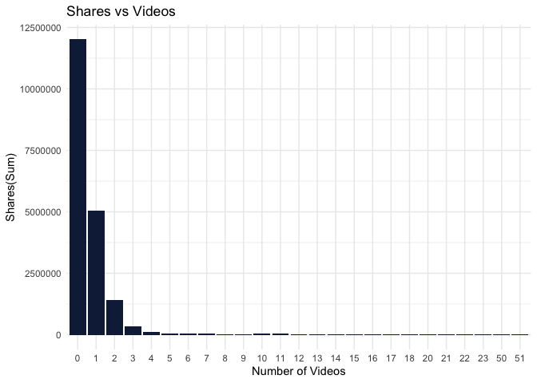
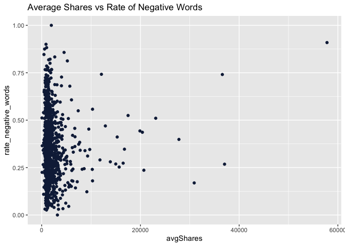
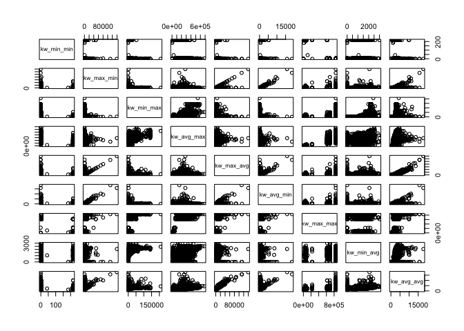
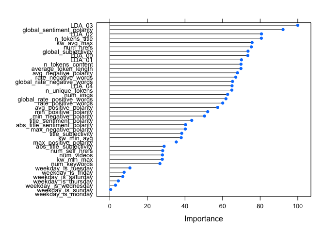

Online News Popularity Analysis
================
Matthieu Cartron and Sneha Karanjai
2022-12-08

- <a href="#introduction" id="toc-introduction">1 Introduction</a>
- <a href="#setup" id="toc-setup">2 Setup</a>
- <a href="#data-import" id="toc-data-import">3 Data Import</a>
- <a href="#exploratory-data-analysis"
  id="toc-exploratory-data-analysis">4 Exploratory Data Analysis</a>
  - <a href="#column-description" id="toc-column-description">4.1 Column
    Description</a>
  - <a href="#summary-statistics" id="toc-summary-statistics">4.2 Summary
    Statistics</a>
  - <a href="#target-variable-distribution"
    id="toc-target-variable-distribution">4.3 Target Variable
    Distribution</a>
  - <a href="#title-tokens-vs-shares" id="toc-title-tokens-vs-shares">4.4
    Title Tokens vs Shares</a>
  - <a href="#number-of-links-in-the-articles-vs-shares"
    id="toc-number-of-links-in-the-articles-vs-shares">4.5 Number of Links
    in the Articles vs Shares</a>
  - <a href="#number-of-images-vs-shares"
    id="toc-number-of-images-vs-shares">4.6 Number of Images vs Shares</a>
  - <a href="#number-of-videos-vs-shares"
    id="toc-number-of-videos-vs-shares">4.7 Number of Videos vs Shares</a>
  - <a href="#days-of-the-week-and-shares"
    id="toc-days-of-the-week-and-shares">4.8 Days of the Week and Shares</a>
  - <a href="#title-polarity-vs-shares"
    id="toc-title-polarity-vs-shares">4.9 Title Polarity vs Shares</a>
  - <a href="#global-polarity-vs-shares"
    id="toc-global-polarity-vs-shares">4.10 Global Polarity vs Shares</a>
  - <a href="#subjectivity-and-shares" id="toc-subjectivity-and-shares">4.11
    Subjectivity and Shares</a>
  - <a
    href="#how-does-the-rate-of-negative-words-in-an-article-affect-the-shares"
    id="toc-how-does-the-rate-of-negative-words-in-an-article-affect-the-shares">4.12
    How does the rate of negative words in an article affect the Shares?</a>
  - <a href="#correlation-analysis" id="toc-correlation-analysis">4.13
    Correlation Analysis</a>
- <a href="#data-splitting" id="toc-data-splitting">5 Data Splitting</a>
- <a href="#modeling" id="toc-modeling">6 Modeling</a>
  - <a href="#linear-regression" id="toc-linear-regression">6.1 Linear
    Regression</a>
    - <a href="#linear-regression-with-dimensionality-reduction"
      id="toc-linear-regression-with-dimensionality-reduction">6.1.1 Linear
      Regression with Dimensionality Reduction</a>
  - <a href="#random-forest" id="toc-random-forest">6.2 Random Forest</a>
  - <a href="#boosted-tree" id="toc-boosted-tree">6.3 Boosted Tree</a>
- <a href="#model-comparison" id="toc-model-comparison">7 Model
  Comparison</a>
  - <a href="#train-model-comparison" id="toc-train-model-comparison">7.1
    Train Model Comparison</a>
  - <a href="#test-model-comparison" id="toc-test-model-comparison">7.2 Test
    Model Comparison</a>
- <a href="#conclusion" id="toc-conclusion">8 Conclusion</a>

# 1 Introduction

The following analysis uses the “Online News Popularity” data set from
the UCI machine learning repository. It consists of a number variables
describing different features of articles, each of which belonging to
one of six “channels.” These channels are effectively genres, and are
the following:

- Lifestyle
- Entertainment
- Business
- Social Media
- World News

For this analysis, we are primarily concerned with the “shares”
variable, which simply describes the number of times an article has been
shared. We often hear that news travels more quickly depending on its
content, title, and maybe even the number of images it uses. In a
similar vein, we would like, for each of the different data channels, to
use certain variables describing the articles to predict the number of
times an article might be shared. But how do we know which variables to
choose?

We could use simple intuition to pick variables. For example, it makes
sense to think that articles with high sentiment polarity (positive or
negative) would tend to, on average, have more shares. We could go
through the variables and pick those that we think would have the
greatest impact on the number of shares. The issue, however, is that
they may change from one data channel to the next. Are lifestyle
articles and world news articles going to be affected by the same
variables? If we choose the same variables across all the different data
channels, then this is the assumption we will be making. To avoid making
this assumption, we will automate the process of variable selection by
deleting one variable of each of the pairs of collinear variables.

# 2 Setup

``` r
library(tidyverse)
library(caret)
library(brainGraph)
library(corrplot)
library(GGally)
```

# 3 Data Import

``` r
unzippedNewDataCSV <- unzip("OnlineNewsPopularity.zip")

newsDataName <- read_csv(unzippedNewDataCSV[1]) # This is the names file
newsData <- read_csv(unzippedNewDataCSV[2])

head(newsData)
```

    ## # A tibble: 6 × 61
    ##   url            timedelta n_tokens_title n_tokens_content n_unique_tokens n_non_stop_words n_non_stop_uniqu… num_hrefs
    ##   <chr>              <dbl>          <dbl>            <dbl>           <dbl>            <dbl>             <dbl>     <dbl>
    ## 1 http://mashab…       731             12              219           0.664             1.00             0.815         4
    ## 2 http://mashab…       731              9              255           0.605             1.00             0.792         3
    ## 3 http://mashab…       731              9              211           0.575             1.00             0.664         3
    ## 4 http://mashab…       731              9              531           0.504             1.00             0.666         9
    ## 5 http://mashab…       731             13             1072           0.416             1.00             0.541        19
    ## 6 http://mashab…       731             10              370           0.560             1.00             0.698         2
    ## # … with 53 more variables: num_self_hrefs <dbl>, num_imgs <dbl>, num_videos <dbl>, average_token_length <dbl>,
    ## #   num_keywords <dbl>, data_channel_is_lifestyle <dbl>, data_channel_is_entertainment <dbl>,
    ## #   data_channel_is_bus <dbl>, data_channel_is_socmed <dbl>, data_channel_is_tech <dbl>, data_channel_is_world <dbl>,
    ## #   kw_min_min <dbl>, kw_max_min <dbl>, kw_avg_min <dbl>, kw_min_max <dbl>, kw_max_max <dbl>, kw_avg_max <dbl>,
    ## #   kw_min_avg <dbl>, kw_max_avg <dbl>, kw_avg_avg <dbl>, self_reference_min_shares <dbl>,
    ## #   self_reference_max_shares <dbl>, self_reference_avg_sharess <dbl>, weekday_is_monday <dbl>,
    ## #   weekday_is_tuesday <dbl>, weekday_is_wednesday <dbl>, weekday_is_thursday <dbl>, weekday_is_friday <dbl>, …

We will subset the data according to the channel passed to analyze
articles in one data channel at a time. Additionally according to the
data report, `url` and `timedelta` are two non-predictive columns so we
will remove them.

``` r
subsettingData <- function(data, area){
  #getting the naming convention as per the dataframe
  subsetVar <- paste("data_channel_is_", area, sep = "")
  
  # filtering the data and removing the data_channel_is_ columns, url, and timedelta
  subsetData <- data %>% 
    filter(!!as.symbol(subsetVar)==1) %>% 
    select(-c(starts_with("data_channel_is_"), url, timedelta))
  
  return(list(subsetData, subsetVar))
}

subsettingDataReturn <- subsettingData(newsData, params$channel)
data <- subsettingDataReturn[[1]]
channel <- subsettingDataReturn[[2]]
```

# 4 Exploratory Data Analysis

## 4.1 Column Description

Let us take a look at the columns available.

``` r
colnames(data)
```

    ##  [1] "n_tokens_title"               "n_tokens_content"             "n_unique_tokens"             
    ##  [4] "n_non_stop_words"             "n_non_stop_unique_tokens"     "num_hrefs"                   
    ##  [7] "num_self_hrefs"               "num_imgs"                     "num_videos"                  
    ## [10] "average_token_length"         "num_keywords"                 "kw_min_min"                  
    ## [13] "kw_max_min"                   "kw_avg_min"                   "kw_min_max"                  
    ## [16] "kw_max_max"                   "kw_avg_max"                   "kw_min_avg"                  
    ## [19] "kw_max_avg"                   "kw_avg_avg"                   "self_reference_min_shares"   
    ## [22] "self_reference_max_shares"    "self_reference_avg_sharess"   "weekday_is_monday"           
    ## [25] "weekday_is_tuesday"           "weekday_is_wednesday"         "weekday_is_thursday"         
    ## [28] "weekday_is_friday"            "weekday_is_saturday"          "weekday_is_sunday"           
    ## [31] "is_weekend"                   "LDA_00"                       "LDA_01"                      
    ## [34] "LDA_02"                       "LDA_03"                       "LDA_04"                      
    ## [37] "global_subjectivity"          "global_sentiment_polarity"    "global_rate_positive_words"  
    ## [40] "global_rate_negative_words"   "rate_positive_words"          "rate_negative_words"         
    ## [43] "avg_positive_polarity"        "min_positive_polarity"        "max_positive_polarity"       
    ## [46] "avg_negative_polarity"        "min_negative_polarity"        "max_negative_polarity"       
    ## [49] "title_subjectivity"           "title_sentiment_polarity"     "abs_title_subjectivity"      
    ## [52] "abs_title_sentiment_polarity" "shares"

``` r
str(data)
```

    ## tibble [8,427 × 53] (S3: tbl_df/tbl/data.frame)
    ##  $ n_tokens_title              : num [1:8427] 10 9 12 9 11 11 11 11 9 12 ...
    ##  $ n_tokens_content            : num [1:8427] 231 1248 682 391 125 ...
    ##  $ n_unique_tokens             : num [1:8427] 0.636 0.49 0.46 0.51 0.675 ...
    ##  $ n_non_stop_words            : num [1:8427] 1 1 1 1 1 ...
    ##  $ n_non_stop_unique_tokens    : num [1:8427] 0.797 0.732 0.635 0.65 0.797 ...
    ##  $ num_hrefs                   : num [1:8427] 4 11 10 9 1 8 7 8 3 5 ...
    ##  $ num_self_hrefs              : num [1:8427] 1 0 0 2 1 6 6 0 1 2 ...
    ##  $ num_imgs                    : num [1:8427] 1 1 1 1 1 1 1 1 1 0 ...
    ##  $ num_videos                  : num [1:8427] 1 0 0 1 0 0 0 0 0 0 ...
    ##  $ average_token_length        : num [1:8427] 5.09 4.62 4.62 5.3 4.82 ...
    ##  $ num_keywords                : num [1:8427] 5 8 6 7 6 6 5 7 6 6 ...
    ##  $ kw_min_min                  : num [1:8427] 0 0 0 0 0 0 0 0 0 217 ...
    ##  $ kw_max_min                  : num [1:8427] 0 0 0 0 0 0 0 0 0 504 ...
    ##  $ kw_avg_min                  : num [1:8427] 0 0 0 0 0 ...
    ##  $ kw_min_max                  : num [1:8427] 0 0 0 0 0 0 0 0 0 0 ...
    ##  $ kw_max_max                  : num [1:8427] 0 0 0 0 0 0 0 0 0 17100 ...
    ##  $ kw_avg_max                  : num [1:8427] 0 0 0 0 0 ...
    ##  $ kw_min_avg                  : num [1:8427] 0 0 0 0 0 0 0 0 0 0 ...
    ##  $ kw_max_avg                  : num [1:8427] 0 0 0 0 0 ...
    ##  $ kw_avg_avg                  : num [1:8427] 0 0 0 0 0 ...
    ##  $ self_reference_min_shares   : num [1:8427] 0 0 0 704 16100 101 638 0 0 3100 ...
    ##  $ self_reference_max_shares   : num [1:8427] 0 0 0 704 16100 2600 3300 0 0 3100 ...
    ##  $ self_reference_avg_sharess  : num [1:8427] 0 0 0 704 16100 ...
    ##  $ weekday_is_monday           : num [1:8427] 1 1 1 1 1 1 1 1 1 0 ...
    ##  $ weekday_is_tuesday          : num [1:8427] 0 0 0 0 0 0 0 0 0 1 ...
    ##  $ weekday_is_wednesday        : num [1:8427] 0 0 0 0 0 0 0 0 0 0 ...
    ##  $ weekday_is_thursday         : num [1:8427] 0 0 0 0 0 0 0 0 0 0 ...
    ##  $ weekday_is_friday           : num [1:8427] 0 0 0 0 0 0 0 0 0 0 ...
    ##  $ weekday_is_saturday         : num [1:8427] 0 0 0 0 0 0 0 0 0 0 ...
    ##  $ weekday_is_sunday           : num [1:8427] 0 0 0 0 0 0 0 0 0 0 ...
    ##  $ is_weekend                  : num [1:8427] 0 0 0 0 0 0 0 0 0 0 ...
    ##  $ LDA_00                      : num [1:8427] 0.04 0.025 0.0333 0.0288 0.0333 ...
    ##  $ LDA_01                      : num [1:8427] 0.04 0.2873 0.0333 0.0286 0.0333 ...
    ##  $ LDA_02                      : num [1:8427] 0.84 0.401 0.867 0.681 0.7 ...
    ##  $ LDA_03                      : num [1:8427] 0.04 0.2619 0.0333 0.0286 0.2 ...
    ##  $ LDA_04                      : num [1:8427] 0.04 0.025 0.0333 0.2334 0.0333 ...
    ##  $ global_subjectivity         : num [1:8427] 0.314 0.482 0.473 0.284 0.396 ...
    ##  $ global_sentiment_polarity   : num [1:8427] 0.0519 0.1024 0.0622 0.0333 0.2108 ...
    ##  $ global_rate_positive_words  : num [1:8427] 0.039 0.0385 0.0499 0.0179 0.048 ...
    ##  $ global_rate_negative_words  : num [1:8427] 0.0303 0.02083 0.03959 0.00512 0 ...
    ##  $ rate_positive_words         : num [1:8427] 0.562 0.649 0.557 0.778 1 ...
    ##  $ rate_negative_words         : num [1:8427] 0.438 0.351 0.443 0.222 0 ...
    ##  $ avg_positive_polarity       : num [1:8427] 0.298 0.404 0.343 0.15 0.281 ...
    ##  $ min_positive_polarity       : num [1:8427] 0.1 0.1 0.05 0.05 0.1 ...
    ##  $ max_positive_polarity       : num [1:8427] 0.5 1 0.6 0.35 0.6 0.7 0.8 1 0.5 1 ...
    ##  $ avg_negative_polarity       : num [1:8427] -0.238 -0.415 -0.22 -0.108 0 ...
    ##  $ min_negative_polarity       : num [1:8427] -0.5 -1 -0.6 -0.167 0 ...
    ##  $ max_negative_polarity       : num [1:8427] -0.1 -0.1 -0.05 -0.05 0 -0.05 -0.125 -0.1 -0.2 -0.1 ...
    ##  $ title_subjectivity          : num [1:8427] 0 0 0.75 0 0.45 ...
    ##  $ title_sentiment_polarity    : num [1:8427] 0 0 -0.25 0 0.4 ...
    ##  $ abs_title_subjectivity      : num [1:8427] 0.5 0.5 0.25 0.5 0.05 ...
    ##  $ abs_title_sentiment_polarity: num [1:8427] 0 0 0.25 0 0.4 ...
    ##  $ shares                      : num [1:8427] 710 2200 1600 598 1500 504 1800 1200 495 755 ...

Whew! That is a long list of columns to analyze. Instead of analyzing
them all, let us think about our data. What might we expect to be
related to how many times an article is shared? We hear frequently about
how the dissemination of news and the content thereof are related in
some way. For our data channels, let’s pay close attention to the number
of shares (dissemination) and variables that we might be able to link to
it. Can we find any interesting relationships in the exploratory
analysis? And do these relationships change across the different
channels? Maybe the sharing of lifestyle articles is less correlated
with sentiment than, say, world news articles.

First, let’s take a look at the variable descriptions for some better
understanding. Here is a data description from the UCI Machine Learning
Repository:

- n_tokens_title: Number of words in the title
- n_tokens_content Number of words in the content
- n_unique_tokens: Rate of unique words in the content
- n_non_stop_unique_tokens: Rate of unique non-stop words in the content
- num_hrefs: Number of links
- num_self_hrefs: Number of links to other articles published by
  Mashable
- num_imgs: Number of images
- num_videos: Number of videos
- average_token_length: Average length of the words in the content
- num_keywords: Number of keywords in the metadata
- self_reference_min_shares: Min. shares of referenced articles in
  Mashable
- self_reference_max_shares: Max. shares of referenced articles in
  Mashable
- self_reference_avg_sharess: Avg. shares of referenced articles in
  Mashable
- global_subjectivity: Text subjectivity
- global_sentiment_polarity: Text sentiment polarity
- global_rate_positive_words: Rate of positive words in the content
- global_rate_negative_words: Rate of negative words in the content
- rate_positive_words: Rate of positive words among non-neutral tokens
- rate_negative_words: Rate of negative words among non-neutral tokens
- title_subjectivity: Title subjectivity
- title_sentiment_polarity: Title polarity
- abs_title_subjectivity: Absolute subjectivity level
- abs_title_sentiment_polarity: Absolute polarity level
- shares: Number of shares (target)

Below we run the five-number summary for each of the variables thus far
still included.

## 4.2 Summary Statistics

``` r
print(paste("******Summary Statistics of", channel, "******"))
```

    ## [1] "******Summary Statistics of data_channel_is_world ******"

``` r
summary(data)
```

    ##  n_tokens_title n_tokens_content n_unique_tokens  n_non_stop_words n_non_stop_unique_tokens   num_hrefs    
    ##  Min.   : 4.0   Min.   :   0.0   Min.   :0.0000   Min.   :0.0000   Min.   :0.0000           Min.   :  0.0  
    ##  1st Qu.: 9.0   1st Qu.: 332.0   1st Qu.:0.4657   1st Qu.:1.0000   1st Qu.:0.6280           1st Qu.:  5.0  
    ##  Median :11.0   Median : 509.0   Median :0.5198   Median :1.0000   Median :0.6837           Median :  8.0  
    ##  Mean   :10.6   Mean   : 597.3   Mean   :0.5107   Mean   :0.9693   Mean   :0.6653           Mean   : 10.2  
    ##  3rd Qu.:12.0   3rd Qu.: 768.0   3rd Qu.:0.5745   3rd Qu.:1.0000   3rd Qu.:0.7350           3rd Qu.: 13.0  
    ##  Max.   :23.0   Max.   :7081.0   Max.   :0.9762   Max.   :1.0000   Max.   :1.0000           Max.   :161.0  
    ##  num_self_hrefs      num_imgs         num_videos      average_token_length  num_keywords     kw_min_min    
    ##  Min.   : 0.000   Min.   :  0.000   Min.   : 0.0000   Min.   :0.000        Min.   : 2.00   Min.   : -1.00  
    ##  1st Qu.: 1.000   1st Qu.:  1.000   1st Qu.: 0.0000   1st Qu.:4.655        1st Qu.: 6.00   1st Qu.: -1.00  
    ##  Median : 2.000   Median :  1.000   Median : 0.0000   Median :4.821        Median : 7.00   Median : -1.00  
    ##  Mean   : 2.412   Mean   :  2.841   Mean   : 0.5495   Mean   :4.678        Mean   : 7.29   Mean   : 15.77  
    ##  3rd Qu.: 3.000   3rd Qu.:  2.000   3rd Qu.: 1.0000   3rd Qu.:4.974        3rd Qu.: 9.00   3rd Qu.:  4.00  
    ##  Max.   :38.000   Max.   :100.000   Max.   :51.0000   Max.   :6.124        Max.   :10.00   Max.   :217.00  
    ##    kw_max_min         kw_avg_min        kw_min_max       kw_max_max       kw_avg_max       kw_min_avg    
    ##  Min.   :     0.0   Min.   :   -1.0   Min.   :     0   Min.   :     0   Min.   :     0   Min.   :  -1.0  
    ##  1st Qu.:   430.5   1st Qu.:  117.0   1st Qu.:     0   1st Qu.:843300   1st Qu.:179378   1st Qu.:   0.0  
    ##  Median :   633.0   Median :  204.3   Median :  1000   Median :843300   Median :221378   Median : 828.0  
    ##  Mean   :  1038.0   Mean   :  268.8   Mean   :  6887   Mean   :785809   Mean   :228503   Mean   : 833.2  
    ##  3rd Qu.:   937.0   3rd Qu.:  321.9   3rd Qu.:  5000   3rd Qu.:843300   3rd Qu.:274983   3rd Qu.:1580.3  
    ##  Max.   :139600.0   Max.   :18687.8   Max.   :208300   Max.   :843300   Max.   :685260   Max.   :3009.0  
    ##    kw_max_avg       kw_avg_avg    self_reference_min_shares self_reference_max_shares self_reference_avg_sharess
    ##  Min.   :     0   Min.   :    0   Min.   :     0            Min.   :     0            Min.   :     0.0          
    ##  1st Qu.:  3454   1st Qu.: 2070   1st Qu.:   459            1st Qu.:   682            1st Qu.:   660.4          
    ##  Median :  3587   Median : 2404   Median :   972            Median :  1700            Median :  1400.0          
    ##  Mean   :  4745   Mean   : 2525   Mean   :  2799            Mean   :  6281            Mean   :  4130.7          
    ##  3rd Qu.:  4721   3rd Qu.: 2785   3rd Qu.:  1800            3rd Qu.:  4400            3rd Qu.:  3100.0          
    ##  Max.   :139600   Max.   :17839   Max.   :690400            Max.   :690400            Max.   :690400.0          
    ##  weekday_is_monday weekday_is_tuesday weekday_is_wednesday weekday_is_thursday weekday_is_friday weekday_is_saturday
    ##  Min.   :0.0000    Min.   :0.0000     Min.   :0.0000       Min.   :0.0000      Min.   :0.0000    Min.   :0.00000    
    ##  1st Qu.:0.0000    1st Qu.:0.0000     1st Qu.:0.0000       1st Qu.:0.0000      1st Qu.:0.0000    1st Qu.:0.00000    
    ##  Median :0.0000    Median :0.0000     Median :0.0000       Median :0.0000      Median :0.0000    Median :0.00000    
    ##  Mean   :0.1609    Mean   :0.1835     Mean   :0.1857       Mean   :0.1862      Mean   :0.1549    Mean   :0.06159    
    ##  3rd Qu.:0.0000    3rd Qu.:0.0000     3rd Qu.:0.0000       3rd Qu.:0.0000      3rd Qu.:0.0000    3rd Qu.:0.00000    
    ##  Max.   :1.0000    Max.   :1.0000     Max.   :1.0000       Max.   :1.0000      Max.   :1.0000    Max.   :1.00000    
    ##  weekday_is_sunday   is_weekend         LDA_00            LDA_01            LDA_02           LDA_03       
    ##  Min.   :0.00000   Min.   :0.0000   Min.   :0.01818   Min.   :0.01818   Min.   :0.0200   Min.   :0.01818  
    ##  1st Qu.:0.00000   1st Qu.:0.0000   1st Qu.:0.02500   1st Qu.:0.02251   1st Qu.:0.5275   1st Qu.:0.02500  
    ##  Median :0.00000   Median :0.0000   Median :0.02950   Median :0.02858   Median :0.7292   Median :0.02935  
    ##  Mean   :0.06728   Mean   :0.1289   Mean   :0.06653   Mean   :0.05421   Mean   :0.6706   Mean   :0.07243  
    ##  3rd Qu.:0.00000   3rd Qu.:0.0000   3rd Qu.:0.04001   3rd Qu.:0.04000   3rd Qu.:0.8625   3rd Qu.:0.04007  
    ##  Max.   :1.00000   Max.   :1.0000   Max.   :0.81801   Max.   :0.81511   Max.   :0.9200   Max.   :0.81994  
    ##      LDA_04        global_subjectivity global_sentiment_polarity global_rate_positive_words global_rate_negative_words
    ##  Min.   :0.01819   Min.   :0.0000      Min.   :-0.35947          Min.   :0.00000            Min.   :0.00000           
    ##  1st Qu.:0.02857   1st Qu.:0.3579      1st Qu.: 0.02228          1st Qu.:0.02196            1st Qu.:0.01101           
    ##  Median :0.04000   Median :0.4142      Median : 0.07273          Median :0.03061            Median :0.01648           
    ##  Mean   :0.13620   Mean   :0.4031      Mean   : 0.07655          Mean   :0.03133            Mean   :0.01701           
    ##  3rd Qu.:0.20041   3rd Qu.:0.4661      3rd Qu.: 0.12592          3rd Qu.:0.03975            3rd Qu.:0.02222           
    ##  Max.   :0.91954   Max.   :0.9500      Max.   : 0.52000          Max.   :0.11273            Max.   :0.07504           
    ##  rate_positive_words rate_negative_words avg_positive_polarity min_positive_polarity max_positive_polarity
    ##  Min.   :0.0000      Min.   :0.0000      Min.   :0.0000        Min.   :0.00000       Min.   :0.000        
    ##  1st Qu.:0.5357      1st Qu.:0.2500      1st Qu.:0.2811        1st Qu.:0.05000       1st Qu.:0.500        
    ##  Median :0.6429      Median :0.3462      Median :0.3306        Median :0.10000       Median :0.700        
    ##  Mean   :0.6234      Mean   :0.3459      Mean   :0.3245        Mean   :0.08849       Mean   :0.699        
    ##  3rd Qu.:0.7417      3rd Qu.:0.4483      3rd Qu.:0.3783        3rd Qu.:0.10000       3rd Qu.:0.900        
    ##  Max.   :1.0000      Max.   :1.0000      Max.   :0.8667        Max.   :0.80000       Max.   :1.000        
    ##  avg_negative_polarity min_negative_polarity max_negative_polarity title_subjectivity title_sentiment_polarity
    ##  Min.   :-1.0000       Min.   :-1.0000       Min.   :-1.0000       Min.   :0.0000     Min.   :-1.00000        
    ##  1st Qu.:-0.3092       1st Qu.:-0.8000       1st Qu.:-0.1000       1st Qu.:0.0000     1st Qu.: 0.00000        
    ##  Median :-0.2464       Median :-0.5000       Median :-0.1000       Median :0.0000     Median : 0.00000        
    ##  Mean   :-0.2523       Mean   :-0.5607       Mean   :-0.0939       Mean   :0.2436     Mean   : 0.03006        
    ##  3rd Qu.:-0.1912       3rd Qu.:-0.4000       3rd Qu.:-0.0500       3rd Qu.:0.4545     3rd Qu.: 0.06818        
    ##  Max.   : 0.0000       Max.   : 0.0000       Max.   : 0.0000       Max.   :1.0000     Max.   : 1.00000        
    ##  abs_title_subjectivity abs_title_sentiment_polarity     shares      
    ##  Min.   :0.0000         Min.   :0.0000               Min.   :    35  
    ##  1st Qu.:0.2000         1st Qu.:0.0000               1st Qu.:   827  
    ##  Median :0.5000         Median :0.0000               Median :  1100  
    ##  Mean   :0.3612         Mean   :0.1277               Mean   :  2288  
    ##  3rd Qu.:0.5000         3rd Qu.:0.2000               3rd Qu.:  1900  
    ##  Max.   :0.5000         Max.   :1.0000               Max.   :284700

## 4.3 Target Variable Distribution

Let’s take a look at the distribution of our target variable using a
histogram.

``` r
ggplot(data) +
  aes(x = shares) +
  geom_histogram(bins = 26L, fill = "#112446") +
  labs(title = "Distribution of Shares") +
  theme_gray()
```

<!-- -->

*What does the distribution show? Does the distribution follow a known
distribution? Is there skewness? What might these features tell us about
the number of shares? The number of shares is plotted along the x-axis,
with frequency (count) on the y-axis.*

## 4.4 Title Tokens vs Shares

Now let’s analyze the affect of the different variables on the shares.
Starting with the number of words in the title and how they affect the
shares.

``` r
data %>% 
  group_by(n_tokens_title) %>% 
  summarise(avgShares = mean(shares)) %>% 
  ggplot() +
  aes(x = avgShares, y = n_tokens_title) +
  geom_point(shape = "circle", size = 1.5, colour = "#112446") +
  labs(title = "Average Shares vs Title Tokens") +
  theme_gray()
```

<!-- --> *The average
number of shares is plotted on the x-axis while the numvber of words in
the article title is plotted on the y-axis. Can we see any relationship
between the two variables?*

## 4.5 Number of Links in the Articles vs Shares

``` r
data %>% 
  group_by(num_hrefs) %>% 
  summarise(avgShares = mean(shares)) %>% 
  ggplot() +
  aes(x = avgShares, y = num_hrefs) +
  geom_point(shape = "circle", size = 1.5, colour = "#112446") +
  labs(title = "Average Shares vs Number of Links") +
  theme_gray()
```

<!-- --> *The average
number of shares is plotted on the x-axis while the number of hyperlinks
is plotted on the y-axis. Like with the previous plot, we use a scatter
plot because we have two numeric variables, with the average number of
shares being continuous. Can we see any relationship between the two
variables?*

## 4.6 Number of Images vs Shares

``` r
data %>% 
  group_by(factor(num_imgs)) %>% 
  summarise(sumShares = sum(shares)) %>% 
  ggplot() +
  aes(x = `factor(num_imgs)`, y = sumShares) +
  geom_col(fill = "#112446") +
  labs(title = "Shares vs Images", x = "Number of Images", y = "Shares(Sum)") +
  theme_minimal()
```

<!-- --> *The above bar
plot demonstrates the relationship between the number of images in an
article (x-axis) and the sum of the shares the article experienced. Can
we see any patterns in the above visualization?*

## 4.7 Number of Videos vs Shares

``` r
data %>% 
  group_by(factor(num_videos)) %>% 
  summarise(sumShares = sum(shares)) %>% 
  ggplot() +
  aes(x = `factor(num_videos)`, y = sumShares) +
  geom_col(fill = "#112446") +
  labs(title = "Shares vs Videos", x = "Number of Videos", y = "Shares(Sum)") +
  theme_minimal()
```

<!-- -->

*In the above bar plot the number of videos featured in an article is
plotted against the summed shares per video number. Do we notice any
patterns? Can we make any comparisons between this plot (with videos) vs
the previous plot, which looks at the number of images in an article?*

## 4.8 Days of the Week and Shares

``` r
mon <- data %>% 
  select(starts_with("weekday_is_monday"), shares) %>% 
  group_by(weekday_is_monday) %>% 
  summarise(sumShares = sum(shares)) %>% 
  rename(day = weekday_is_monday) %>% 
  filter(day==1) 
mon$day[mon$day==1] <- "MON"

tue <- data %>% 
  select(starts_with("weekday_is_tuesday"), shares) %>% 
  group_by(weekday_is_tuesday) %>% 
  summarise(sumShares = sum(shares)) %>% 
  rename(day = weekday_is_tuesday) %>% 
  filter(day==1)
tue$day[tue$day==1] <- "TUE"


wed <- data %>% 
  select(starts_with("weekday_is_wednesday"), shares) %>% 
  group_by(weekday_is_wednesday) %>% 
  summarise(sumShares = sum(shares)) %>% 
  rename(day = weekday_is_wednesday) %>% 
  filter(day==1)
wed$day[wed$day==1] <- "WED"


thu <- data %>% 
  select(starts_with("weekday_is_thursday"), shares) %>% 
  group_by(weekday_is_thursday) %>% 
  summarise(sumShares = sum(shares)) %>% 
  rename(day = weekday_is_thursday) %>% 
  filter(day==1)
thu$day[thu$day==1] <- "THU"

fri <- data %>% 
  select(starts_with("weekday_is_friday"), shares) %>% 
  group_by(weekday_is_friday) %>% 
  summarise(sumShares = sum(shares)) %>% 
  rename(day = weekday_is_friday) %>% 
  filter(day==1)
fri$day[fri$day==1] <- "FRI"

sat <- data %>% 
  select(starts_with("weekday_is_saturday"), shares) %>% 
  group_by(weekday_is_saturday) %>% 
  summarise(sumShares = sum(shares)) %>% 
  rename(day = weekday_is_saturday) %>% 
  filter(day==1)
sat$day[sat$day==1] <- "SAT"

sun <- data %>% 
  select(starts_with("weekday_is_sunday"), shares) %>% 
  group_by(weekday_is_sunday) %>% 
  summarise(sumShares = sum(shares)) %>% 
  rename(day = weekday_is_sunday) %>% 
  filter(day==1)
sun$day[sun$day==1] <- "SUN"

mon %>% 
  bind_rows(tue, wed, thu, fri, sat, sun) %>% 
  ggplot() +
  aes(x = day, y = sumShares) +
  geom_col(fill = "#112446") +
  labs(title = "Most Shared Articles by the Day of the Week") +
  theme_gray()
```

<!-- -->

*The above bar plot looks at the sum of shares given for each day of the
week. Are there any patterns? Are there differences in the number of
shares between weekdays and the weekend? If so, what might cause this?
Are articles also most likely to be published on certain days of the
week, and thus more likely to be shared on those days? We can
speculate.*

*In the three scatter plots below, we take a magnifying glass to some of
the variables measuring features of article sentiment. We suspect there
might be some patterns below (not guaranteed!). Can we use this as a
starting point for investigating how article sentiment influences the
dissemination of information (if at all)?*

## 4.9 Title Polarity vs Shares

Polarity is a float which lies in the range of \[-1,1\] where 1 refers
to a positive statement and -1 refers to a negative statement. Does
title polarity affect the average number of shares?

``` r
data %>% 
  ggplot() +
  aes(x = title_sentiment_polarity, y = shares) +
  geom_point() +
  geom_jitter() +
  labs(title = "Shares vs Title Polarity", x = "Title Polarity", y = "Number of Shares") +
  theme_minimal()
```

<!-- -->

*The above scatter plot looks at title polarity (how negative or
positive an article title might be) and the number of shares for a given
article. Can we see any initial patterns worth exploring? *

## 4.10 Global Polarity vs Shares

``` r
data %>% 
  ggplot() +
  aes(x = global_sentiment_polarity, y = shares) +
  geom_point() +
  geom_jitter() +
  labs(title = "Shares vs Text Polarity", x = "Text Polarity", y = "Number of Shares") +
  theme_minimal()
```

<!-- -->

*The above scatter plot is similar to the previous scatter plot, though
this time we take a look at the text polarity (how positive or negative
the words of the article are) and plot it against the number of times a
given article is shared (y-axis). Again, do we notice any patterns?*

## 4.11 Subjectivity and Shares

Subjective sentences generally refer to personal opinion, emotion or
judgment whereas objective refers to factual information. Subjectivity
is a float which lies in the range of \[0,1\]. A value closer to 0 means
an opinion or an emotion and 1 means a fact. How does the text having a
factual tone or an author’s emotion/opinion affect the total shares?

``` r
ggplot(data) +
  aes(x = shares, y = global_subjectivity) +
  geom_point(shape = "circle", size = 1.5, colour = "#112446") +
  labs(title = "Shares vs Text Subjectivity", x = "Text Subjectivity", y = "Number of Shares") +
  theme_minimal()
```

<!-- -->

*In the above scatter plot, we plot the text subjectivity against the
number of times an article is shared (y-axis). Though subjectivity is
not sentiment, we might have reason to suspect that they could be
related–are subjective articles more mysterious, more enticing, more
prone to “clickbait”? Does this scatter plot seem to convey anything
like this?*

## 4.12 How does the rate of negative words in an article affect the Shares?

``` r
data %>% 
  group_by(rate_negative_words) %>% 
  summarise(avgShares = mean(shares)) %>% 
  ggplot() +
  aes(x = avgShares, y = rate_negative_words) +
  geom_point(shape = "circle", size = 1.5, colour = "#112446") +
  labs(title = "Average Shares vs Rate of Negative Words") +
  theme_gray()
```

<!-- -->

*Here we see how the rate of the usage of negative words throughout the
article tends to affect the shares. Does an article with higher number
of negative words tend to have lesser shares?*

## 4.13 Correlation Analysis

Now that we have completed analysis of how the shares changes with the
different variables, we do notice that there are way too many variables
in this dataset. Feeding all these variables into the training models
would mean “Garbage In and Garbage Out”. One of the easiest ways to
choose the variables to fit into the models is by checking the
correlation. Potential predictors with high correlation between each
other can prove problematic as they introduce multicollinearity into the
model. We can remove some of this redundancy from the outset. While
there are some models that thrive on correlated predictors. other models
may benefit from reducing the level of correlation between the
predictors.

Let us first understand the pair plots for all the variables explaining
keywords.

``` r
pairs(~ kw_min_min + kw_max_min + kw_min_max + kw_avg_max + kw_max_avg + kw_avg_min + kw_max_max + kw_min_avg + kw_avg_avg, data = data)
```

<!-- -->

``` r
cor(data[, c('kw_min_min', 'kw_max_min', 'kw_min_max', 'kw_avg_max', 'kw_max_avg', 'kw_avg_min', 'kw_max_max', 'kw_min_avg', 'kw_avg_avg')])
```

    ##             kw_min_min   kw_max_min  kw_min_max  kw_avg_max  kw_max_avg  kw_avg_min  kw_max_max   kw_min_avg
    ## kw_min_min  1.00000000  0.023271943 -0.07270873 -0.48122459 -0.04388401  0.13423619 -0.87252853 -0.098349837
    ## kw_max_min  0.02327194  1.000000000 -0.06134521 -0.06296493  0.65734836  0.95598117 -0.01787171 -0.002164948
    ## kw_min_max -0.07270873 -0.061345211  1.00000000  0.46068345  0.01575722 -0.10864377  0.07736505  0.513045434
    ## kw_avg_max -0.48122459 -0.062964935  0.46068345  1.00000000  0.05619041 -0.17412852  0.54380604  0.379777965
    ## kw_max_avg -0.04388401  0.657348359  0.01575722  0.05619041  1.00000000  0.61732266  0.06444304  0.037892527
    ## kw_avg_min  0.13423619  0.955981165 -0.10864377 -0.17412852  0.61732266  1.00000000 -0.13181414 -0.023496777
    ## kw_max_max -0.87252853 -0.017871710  0.07736505  0.54380604  0.06444304 -0.13181414  1.00000000  0.105288408
    ## kw_min_avg -0.09834984 -0.002164948  0.51304543  0.37977797  0.03789253 -0.02349678  0.10528841  1.000000000
    ## kw_avg_avg -0.11913262  0.463372008  0.23152311  0.29969357  0.82112187  0.43719083  0.15487981  0.402907987
    ##            kw_avg_avg
    ## kw_min_min -0.1191326
    ## kw_max_min  0.4633720
    ## kw_min_max  0.2315231
    ## kw_avg_max  0.2996936
    ## kw_max_avg  0.8211219
    ## kw_avg_min  0.4371908
    ## kw_max_max  0.1548798
    ## kw_min_avg  0.4029080
    ## kw_avg_avg  1.0000000

``` r
kwCorData <- as.data.frame(as.table(cor(data[, c('kw_min_min', 'kw_max_min', 'kw_min_max', 'kw_avg_max', 'kw_max_avg', 'kw_avg_min', 'kw_max_max', 'kw_min_avg', 'kw_avg_avg')])))

colRemove <- kwCorData %>% 
  filter(abs(Freq)>0.8 & Freq!=1 )

colRemove <- as.vector(colRemove$Var2)

data <- data %>% 
  select(-all_of(colRemove))
```

This removes all the highly correlated keyword variables that convey the
same information. Now we will similarly investigate the self-referenced
shares.

``` r
pairs(~ self_reference_avg_sharess + self_reference_max_shares + self_reference_min_shares, data = data)
```

<!-- -->

If we find that any of the self_reference shares variables have a
correlation of greater than 0.8 with one another, then we will eliminate
it from the analysis. Again, this is done to limit the multicollinearity
in the models we build below as well as reduce their dimension. We want
to simplify our models from the outset as much as possible without
losing predictors that will explain much of the variability in the
number of times an article is shared.

``` r
srCorData <- as.data.frame(as.table(cor(data[, c('self_reference_avg_sharess', 'self_reference_max_shares', 'self_reference_min_shares')])))

colRemove <- srCorData %>% 
  filter(abs(Freq)>0.8 & Freq!=1)

colRemove <- as.vector(colRemove$Var2)

data <- data %>% 
  select(-all_of(colRemove))
```

In this next step, we examine our remaining variables to see if any
share a correlation of 0.70 or higher. If so, we will remove it from the
data.

``` r
descrCor <- cor(data) 
highlyCorVar <- findCorrelation(descrCor, cutoff = .85)
data <- data[,-highlyCorVar]
```

Again, we do not want to remove both the highly correlated variables.
For example, if we were looking at the variables temperature in
Farenheit and temperature in Celcius in predicting the number of people
at a beach, both variable would be telling us the same thing, but we
would still want to keep one of them because of its probable importance
to the model. We will also remove `is_weekend` from our analysis as the
variables `weekday_is_sunday` and `weekday_is_saturday` capture the same
information.

``` r
data <- data %>% 
  select(-c("is_weekend"))
```

We are now down from 61 columns to 41 columns.

Let us finally do a correlation plot for all variables with threshold
greater than 0.55 for the the present dataframe.

``` r
cols <- names(data)

corrDf <- data.frame(t(combn(cols,2)), stringsAsFactors = F) %>%
  rowwise() %>%
  mutate(v = cor(data[,X1], data[,X2]))

corrDf <- corrDf %>% 
  filter(abs(v)>0.55) %>% 
  arrange(desc(v))
corrDf
```

    ## # A tibble: 14 × 3
    ## # Rowwise: 
    ##    X1                         X2                            v[,1]
    ##    <chr>                      <chr>                         <dbl>
    ##  1 global_rate_negative_words rate_negative_words           0.766
    ##  2 global_sentiment_polarity  rate_positive_words           0.740
    ##  3 title_subjectivity         abs_title_sentiment_polarity  0.733
    ##  4 avg_negative_polarity      min_negative_polarity         0.731
    ##  5 n_unique_tokens            average_token_length          0.723
    ##  6 avg_positive_polarity      max_positive_polarity         0.698
    ##  7 global_rate_positive_words rate_positive_words           0.686
    ##  8 global_sentiment_polarity  global_rate_positive_words    0.626
    ##  9 average_token_length       global_subjectivity           0.610
    ## 10 global_subjectivity        avg_positive_polarity         0.596
    ## 11 average_token_length       avg_positive_polarity         0.558
    ## 12 average_token_length       rate_positive_words           0.551
    ## 13 LDA_02                     LDA_04                       -0.627
    ## 14 global_sentiment_polarity  rate_negative_words          -0.674

``` r
#turn corr back into matrix in order to plot with corrplot
correlationMat <- reshape2::acast(corrDf, X1~X2, value.var="v")
  
#plot correlations visually
corrplot(correlationMat, is.corr=FALSE, tl.col="black", na.label=" ")
```

<!-- -->

Now that we have a more concise data set, let’s zero in on the
relationship between our target variable, shares, and the remaining
variables. Below we extract the five variables that have the highest
correlation with the shares variable. This may be a valuable insight
prior to training our models.

``` r
sharesCor <- cor(data[ , colnames(data) != "shares"],  # Calculate correlations
                data$shares)

sharesCor <- data.frame(sharesCor)
sharesCor$names <- rownames(sharesCor)
rownames(sharesCor) <- NULL

sharesCor <- sharesCor %>% 
  rename(corrcoeff=sharesCor) %>% 
  arrange(desc(abs(corrcoeff))) %>% 
  head(6)

par(mfrow=c(2,3))
for (i in sharesCor$names) {
  plot(data$shares, data[[i]], ylab = i, main = paste("Shares vs", i))
}
```

<!-- -->

``` r
#for (i in sharesCor$names) {
 # ggpairs(data[[i]], ylab = i, main = paste("Shares vs", i))
#}
```

# 5 Data Splitting

Data splitting is an important aspect of data science, particularly for
creating predictive models based on data. This technique helps ensure
the creation of data models and processes that use data models – such as
machine learning – are accurate. In a basic two-part data split, the
training data set is used to train and fit models. Training sets are
commonly used to estimate different parameters or to compare different
model performance. The testing data set is used after the training is
done; we see if our trained models are effective in predicting future
values. We will use a 70-30 split on the dataset.

``` r
train_index <- createDataPartition(data$shares, p = 0.7, 
                                   list = FALSE)
train <- data[train_index, ]
test <- data[-train_index, ]
```

We will check the shape of the train and test set

``` r
print("The train set dimensions")
```

    ## [1] "The train set dimensions"

``` r
dim(train)
```

    ## [1] 5900   41

``` r
print("The test set dimensions")
```

    ## [1] "The test set dimensions"

``` r
dim(test)
```

    ## [1] 2527   41

# 6 Modeling

We will be comparing linear and ensemble techniques for predicting
shares. Each section below elucidates the model used and the reasoning
behind it.

## 6.1 Linear Regression

A simple linear regression refers to a linear equation that captures the
relationship between a response variable, $Y$, and a predictor variable
$X$. The relationship is modeled below:

$$Y = \beta_0 + \beta_1X_1 +\epsilon i$$

Where $\beta_0$ is the intercept and $\beta_1$ is the slope of the line.
This relationship can be extended to the case in which the response
variable is modeled as a function of more than one predictor variable.
This is the case of a multiple linear regression, which is as follows:

$$Y = \beta_0 + \beta_1X_1 + \beta_2X_2 + … + \beta_nX_n + \epsilon i$$

Where $\beta_0$ is the intercept and all $\beta$ are slope coefficients.
For both simple and multiple linear regression cases, the Method of
Least Squares is widely used in summarizing the data. The least squares
method minimizes values of $\beta_0$ and all $\beta_n$, seen below:

$$\sum_{i = 1}^{n} (yi - \beta_0 - \sum_{j = 1}^{k} \beta_j x_{ij}^2)$$

Since we are dealing with 41 variables, it is probably important to know
that we would need to employ a feature selection/dimension reduction
technique. Feature selection is the process of reducing the number of
input variables when developing a predictive model. It is desirable to
reduce the number of input variables to both reduce the computational
cost of modeling and, in some cases, to improve the performance of the
model. To prove this, we will first fit a full-model (with all the
available variables) with multiple linear regression.

``` r
trControl <- trainControl(method = "repeatedcv", number = 5, repeats = 5)

mlrWithoutVS <- train(shares ~ .,
                     data = train,
                     preProcess = c("center", "scale"),
                     method = "lm", 
                     trControl = trControl)

summary(mlrWithoutVS)
```

    ## 
    ## Call:
    ## lm(formula = .outcome ~ ., data = dat)
    ## 
    ## Residuals:
    ##    Min     1Q Median     3Q    Max 
    ##  -6178  -1343   -692     55 123301 
    ## 
    ## Coefficients: (2 not defined because of singularities)
    ##                                Estimate Std. Error t value Pr(>|t|)    
    ## (Intercept)                   2188.0259    59.5549  36.740  < 2e-16 ***
    ## n_tokens_title                 165.1888    61.9157   2.668  0.00765 ** 
    ## n_tokens_content               -74.4652   106.1358  -0.702  0.48295    
    ## n_unique_tokens                298.3759   149.5782   1.995  0.04611 *  
    ## num_hrefs                      312.9079    71.1142   4.400 1.10e-05 ***
    ## num_self_hrefs                 -21.2926    64.2114  -0.332  0.74020    
    ## num_imgs                       394.2024    67.9606   5.800 6.96e-09 ***
    ## num_videos                     117.7096    61.4502   1.916  0.05547 .  
    ## average_token_length         -1394.9631   249.3460  -5.594 2.31e-08 ***
    ## num_keywords                    66.6229    71.3814   0.933  0.35068    
    ## kw_min_max                     -22.9570    75.9294  -0.302  0.76240    
    ## kw_avg_max                       0.7523    72.8316   0.010  0.99176    
    ## kw_min_avg                       1.2255    72.5485   0.017  0.98652    
    ## weekday_is_monday             -222.0083   102.6387  -2.163  0.03058 *  
    ## weekday_is_tuesday            -132.4104   106.7087  -1.241  0.21471    
    ## weekday_is_wednesday          -252.3788   107.0040  -2.359  0.01838 *  
    ## weekday_is_thursday           -124.7613   107.0630  -1.165  0.24394    
    ## weekday_is_friday             -160.2363   102.2812  -1.567  0.11726    
    ## weekday_is_saturday            109.0912    81.0697   1.346  0.17847    
    ## weekday_is_sunday                    NA         NA      NA       NA    
    ## LDA_00                          35.6856    67.2094   0.531  0.59547    
    ## LDA_01                          23.4229    64.2198   0.365  0.71533    
    ## LDA_02                        -198.7256    79.4442  -2.501  0.01240 *  
    ## LDA_03                         342.8501    72.7263   4.714 2.48e-06 ***
    ## LDA_04                               NA         NA      NA       NA    
    ## global_subjectivity            276.6987   102.5104   2.699  0.00697 ** 
    ## global_sentiment_polarity       23.0732   174.3945   0.132  0.89475    
    ## global_rate_positive_words    -212.2538   146.0243  -1.454  0.14612    
    ## global_rate_negative_words     321.8008   156.7847   2.053  0.04017 *  
    ## rate_positive_words            940.5097   323.9822   2.903  0.00371 ** 
    ## rate_negative_words            469.7379   289.7341   1.621  0.10501    
    ## avg_positive_polarity         -200.0619   140.2003  -1.427  0.15364    
    ## min_positive_polarity           93.8908    79.3391   1.183  0.23669    
    ## max_positive_polarity           26.7657   106.2526   0.252  0.80112    
    ## avg_negative_polarity           68.7719   143.5260   0.479  0.63184    
    ## min_negative_polarity          -63.5871   121.2452  -0.524  0.59999    
    ## max_negative_polarity           -5.7454    90.0177  -0.064  0.94911    
    ## title_subjectivity            -109.4689    96.1906  -1.138  0.25515    
    ## title_sentiment_polarity       114.5125    63.7589   1.796  0.07254 .  
    ## abs_title_subjectivity          46.6904    71.7175   0.651  0.51505    
    ## abs_title_sentiment_polarity   200.9800    90.4095   2.223  0.02625 *  
    ## ---
    ## Signif. codes:  0 '***' 0.001 '**' 0.01 '*' 0.05 '.' 0.1 ' ' 1
    ## 
    ## Residual standard error: 4574 on 5861 degrees of freedom
    ## Multiple R-squared:  0.05047,    Adjusted R-squared:  0.04432 
    ## F-statistic: 8.199 on 38 and 5861 DF,  p-value: < 2.2e-16

``` r
mlrWithoutVS$results
```

    ##   intercept     RMSE   Rsquared      MAE   RMSESD RsquaredSD    MAESD
    ## 1      TRUE 4536.427 0.03793651 1763.512 801.0425 0.01620301 73.55094

As we can see, the Root Mean Square Error of the model is
`mlrWithoutVS$results$RMSE`. Now let us see how this changes with the
Principle Components Analysis below.

### 6.1.1 Linear Regression with Dimensionality Reduction

Principle Components Analysis (PCA) is a dimension-reduction technique
that can be extended to regression. In a PCA we find linear combinations
of the predictor variables that account for most of the variability in
the model. What this does is it reduces the number of variables $p$ into
$m$ principal components, allowing for a reduction in complexity all the
while retaining most of the variability of the $p$ variables. We extend
this to regression by treating our $m$ principle components as
predictors, though we cannot interpret them in the same way.

``` r
pcs <- prcomp(select(train, -c("shares")), scale = TRUE, center = TRUE)
summary(pcs)
```

    ## Importance of components:
    ##                           PC1     PC2     PC3     PC4     PC5     PC6     PC7     PC8     PC9    PC10    PC11    PC12
    ## Standard deviation     2.2635 1.86386 1.57499 1.51814 1.45889 1.32726 1.20275 1.15576 1.11423 1.10848 1.09827 1.08743
    ## Proportion of Variance 0.1281 0.08685 0.06202 0.05762 0.05321 0.04404 0.03616 0.03339 0.03104 0.03072 0.03015 0.02956
    ## Cumulative Proportion  0.1281 0.21494 0.27695 0.33457 0.38778 0.43182 0.46799 0.50138 0.53242 0.56314 0.59329 0.62285
    ##                           PC13    PC14    PC15    PC16    PC17    PC18    PC19    PC20    PC21    PC22   PC23    PC24
    ## Standard deviation     1.07079 1.05747 1.03624 1.02775 1.01439 0.99079 0.96851 0.93966 0.92259 0.85517 0.7976 0.77609
    ## Proportion of Variance 0.02866 0.02796 0.02684 0.02641 0.02572 0.02454 0.02345 0.02207 0.02128 0.01828 0.0159 0.01506
    ## Cumulative Proportion  0.65152 0.67948 0.70632 0.73273 0.75845 0.78299 0.80644 0.82852 0.84980 0.86808 0.8840 0.89904
    ##                           PC25    PC26    PC27    PC28    PC29    PC30    PC31    PC32    PC33    PC34    PC35    PC36
    ## Standard deviation     0.76475 0.72277 0.69519 0.68962 0.66868 0.63839 0.56479 0.48525 0.44176 0.34495 0.31530 0.27661
    ## Proportion of Variance 0.01462 0.01306 0.01208 0.01189 0.01118 0.01019 0.00797 0.00589 0.00488 0.00297 0.00249 0.00191
    ## Cumulative Proportion  0.91366 0.92672 0.93881 0.95070 0.96187 0.97206 0.98004 0.98592 0.99080 0.99378 0.99626 0.99817
    ##                           PC37    PC38      PC39      PC40
    ## Standard deviation     0.23791 0.12808 1.227e-12 2.515e-15
    ## Proportion of Variance 0.00142 0.00041 0.000e+00 0.000e+00
    ## Cumulative Proportion  0.99959 1.00000 1.000e+00 1.000e+00

How many principle components should we use? This is somewhat
subjective. Consider the plot below. How many principle components would
be required in order to retain say 80 or 90 percent of the variability
in the data? If we can effectively reduce the number of variables by way
of this method, then we may want to consider a regression of these
principle components, even if we lose some interpretability.

``` r
par(mfrow = c(1, 2))
plot(pcs$sdev^2/sum(pcs$sdev^2), xlab = "Principal Component", 
         ylab = "Proportion of Variance Explained", ylim = c(0, 1), type = 'b')
plot(cumsum(pcs$sdev^2/sum(pcs$sdev^2)), xlab = "Principal Component", 
ylab = "Cum. Prop of Variance Explained", ylim = c(0, 1), type = 'b')
```

<!-- -->

``` r
pcaVar <- as.vector(cumsum(pcs$sdev^2/sum(pcs$sdev^2)))
for (i in seq_along(pcaVar)) {
  if(pcaVar[i] > 0.9 & pcaVar[i] < 0.92){
    pcaIndex = i
  }
}

pc_train <- predict(pcs, train)
pc_train <- data.frame(pc_train)
pc_train <- pc_train %>% 
  select(all_of(c(1:pcaIndex))) %>% 
  mutate(shares = train$shares)
pc_test <- data.frame(predict(pcs, test))  %>% 
  mutate(shares = test$shares)
```

We will now fit a multiple linear regression using these principle
components.

``` r
mlrWitVS <- train(shares ~ .,
                  data = pc_train,
                  preProcess = c("center", "scale"),
                  method = "lm", 
                  trControl = trControl)

summary(mlrWitVS)
```

    ## 
    ## Call:
    ## lm(formula = .outcome ~ ., data = dat)
    ## 
    ## Residuals:
    ##    Min     1Q Median     3Q    Max 
    ##  -6284  -1269   -735   -129 124293 
    ## 
    ## Coefficients:
    ##             Estimate Std. Error t value Pr(>|t|)    
    ## (Intercept)  2188.03      59.85  36.560  < 2e-16 ***
    ## PC1           152.56      59.85   2.549 0.010830 *  
    ## PC2           267.47      59.85   4.469 8.02e-06 ***
    ## PC3           247.21      59.85   4.130 3.67e-05 ***
    ## PC4          -223.62      59.85  -3.736 0.000189 ***
    ## PC5           127.25      59.85   2.126 0.033546 *  
    ## PC6          -589.37      59.85  -9.847  < 2e-16 ***
    ## PC7            22.09      59.85   0.369 0.712079    
    ## PC8           324.73      59.85   5.425 6.01e-08 ***
    ## PC9            45.25      59.85   0.756 0.449670    
    ## PC10         -142.80      59.85  -2.386 0.017068 *  
    ## PC11          -45.52      59.85  -0.761 0.446946    
    ## PC12           94.78      59.85   1.584 0.113349    
    ## PC13          -19.78      59.85  -0.331 0.741020    
    ## PC14           39.93      59.85   0.667 0.504677    
    ## PC15          -85.14      59.85  -1.422 0.154937    
    ## PC16          218.69      59.85   3.654 0.000261 ***
    ## PC17         -183.57      59.85  -3.067 0.002172 ** 
    ## PC18           -0.96      59.85  -0.016 0.987204    
    ## PC19         -125.34      59.85  -2.094 0.036293 *  
    ## PC20           58.60      59.85   0.979 0.327590    
    ## PC21          130.97      59.85   2.188 0.028698 *  
    ## PC22          -12.51      59.85  -0.209 0.834498    
    ## PC23           50.56      59.85   0.845 0.398293    
    ## PC24          -20.20      59.85  -0.338 0.735710    
    ## PC25          119.85      59.85   2.002 0.045291 *  
    ## ---
    ## Signif. codes:  0 '***' 0.001 '**' 0.01 '*' 0.05 '.' 0.1 ' ' 1
    ## 
    ## Residual standard error: 4597 on 5874 degrees of freedom
    ## Multiple R-squared:  0.03898,    Adjusted R-squared:  0.03489 
    ## F-statistic: 9.529 on 25 and 5874 DF,  p-value: < 2.2e-16

``` r
mlrWitVS$results
```

    ##   intercept    RMSE   Rsquared      MAE   RMSESD RsquaredSD    MAESD
    ## 1      TRUE 4495.47 0.03281745 1743.418 1079.214 0.01506638 118.4146

Now that we have a Multiple Linear Regression with PCA, let us see how a
Lasso Regression on the original dataset competes in terms of variable
selection.

``` r
tuneGrid <- expand.grid(
  .fraction = seq(0, 1, by = 0.1)
)

lassoModel <- train(
  shares ~ .,
  data = train,
  method = 'lasso',
  preProcess = c("center", "scale"),
  trControl = trControl,
  tuneGrid = tuneGrid
)
```

``` r
lassoModel$results
```

    ##    fraction     RMSE   Rsquared      MAE   RMSESD RsquaredSD    MAESD
    ## 1       0.0 4633.418        NaN 1790.655 667.0032         NA 72.84171
    ## 2       0.1 4568.476 0.03375059 1752.537 661.5949 0.01508652 70.58729
    ## 3       0.2 4558.530 0.03624980 1744.691 660.4087 0.01510418 72.51974
    ## 4       0.3 4553.917 0.03748870 1741.965 659.9144 0.01492557 74.06490
    ## 5       0.4 4552.450 0.03791671 1742.267 659.1662 0.01486237 74.14768
    ## 6       0.5 4552.901 0.03777811 1745.191 657.9098 0.01466044 73.62994
    ## 7       0.6 4553.528 0.03769451 1748.432 657.0982 0.01462459 73.19239
    ## 8       0.7 4554.393 0.03750519 1751.801 656.6025 0.01451931 72.96585
    ## 9       0.8 4554.999 0.03736976 1755.056 656.1799 0.01432879 73.24498
    ## 10      0.9 4555.707 0.03724375 1758.569 655.7397 0.01423253 73.55015
    ## 11      1.0 4556.493 0.03709830 1762.182 655.0635 0.01406479 73.70471

## 6.2 Random Forest

The random forest model refers to an ensemble method of either
classification or regression. In this case, we are predicting a
continuous response variable, and are thus using the latter case. The
random forest creates numerous trees from bootstrap samples of the data.
Bootstrap samples are simply samples taken from the data and are of the
same size (sample $n$ equals bootstrap $m$), meaning that an observation
from the sample data could be used twice in the bootstrap sample, for
example. A tree is fit to each bootstrap sample, and for each fit a
random subset (generally $m = p/3$ predictors) of predictors is chosen.
This is done with the tuning parameter mtry.

Generally speaking, random forests predict more accurately because the
results of the fitted trees are averaged across all trees. This
averaging reduces variance.

``` r
tuneGrid = expand.grid(mtry = 1:3)

rfModel <- train(shares ~ .,
                  data = train,
                  method = "rf", 
                  trControl = trControl,
                  tuneGrid = tuneGrid)
```

Looking at the Variable Importance Plot :

``` r
plot(varImp(rfModel))
```

<!-- -->

``` r
rfModel$results
```

    ##   mtry     RMSE   Rsquared      MAE   RMSESD RsquaredSD    MAESD
    ## 1    1 4530.679 0.02860460 1752.188 926.6950 0.01137727 94.87117
    ## 2    2 4535.526 0.03044916 1788.494 911.4726 0.01284011 95.82753
    ## 3    3 4549.816 0.02958693 1810.320 900.7682 0.01205092 95.76132

## 6.3 Boosted Tree

Boosted tree models, like the random forest, are an ensemble tree-based
method that can be used for classification or regression. Again, in our
case, we are predicting a continuous response and are using regression.

Unlike the random forest, in the boosted tree method, trees are grown
sequentially, and for each tree the residuals are treated as the
response. This is exactly true for the first tree. Updated predictions
can be modeled by the following:

$$\hat{y} = \hat{y}(x) + \lambda \hat{y}^b(x)$$

Below we fit our boosted tree model to the training data set.

``` r
tuneGrid = expand.grid(n.trees = seq(5, 30, 5), interaction.depth = seq(1,10,1), shrinkage = 0.1, n.minobsinnode = 20)

# fit the model
boostingModel <- train(shares ~ .,
                  data = train,
                  method = "gbm", 
                  trControl = trControl,
                  tuneGrid = tuneGrid,
                  verbose = FALSE)
```

# 7 Model Comparison

## 7.1 Train Model Comparison

Now although using the accuracy on the testing data is the gold standard
for model comparison, it can be imperative to check the train model
accuracy to see how the models have fit the dataset. If there is a huge
difference in train accuracies then we know that a certain model does
not fit the data well. Here is a summarisation of the models with their
hyperparameters and model metrics.

``` r
trainModelComparison <- mlrWithoutVS$results[which.min(mlrWithoutVS$results$RMSE),] %>% 
  bind_rows(mlrWitVS$results[which.min(mlrWitVS$results$RMSE),],
            lassoModel$results[which.min(lassoModel$results$RMSE),], 
            rfModel$results[which.min(mlrWithoutVS$results$RMSE),],
            boostingModel$results[which.min(boostingModel$results$RMSE),]) %>% 
  mutate(Model = c("MLR", "MLR with PCA", "Lasso", "Random Forest", "Boosted Tree with PCA")) %>% 
  select(Model, everything())
trainModelComparison
```

    ##                   Model intercept     RMSE   Rsquared      MAE    RMSESD RsquaredSD     MAESD fraction mtry shrinkage
    ## 1                   MLR      TRUE 4536.427 0.03793651 1763.512  801.0425 0.01620301  73.55094       NA   NA        NA
    ## 2          MLR with PCA      TRUE 4495.470 0.03281745 1743.418 1079.2143 0.01506638 118.41461       NA   NA        NA
    ## 3                 Lasso        NA 4552.450 0.03791671 1742.267  659.1662 0.01486237  74.14768      0.4   NA        NA
    ## 4         Random Forest        NA 4530.679 0.02860460 1752.188  926.6950 0.01137727  94.87117       NA    1        NA
    ## 5 Boosted Tree with PCA        NA 4536.759 0.03542856 1744.642  808.5669 0.01638122  79.20022       NA   NA       0.1
    ##   interaction.depth n.minobsinnode n.trees
    ## 1                NA             NA      NA
    ## 2                NA             NA      NA
    ## 3                NA             NA      NA
    ## 4                NA             NA      NA
    ## 5                 3             20      15

We see that the model with the lowest RMSE value is MLR with PCA with an
RMSE value of 4495.47. The model that performs the poorest Lasso with an
RMSE value of 4552.45 which means that the model was incapable of
fitting the data well.

## 7.2 Test Model Comparison

Now that we have created our trained models (models fit to the training
data) we should now see how accurately they predict future values. Once
we have evaluated each of the models, we should be able to compare them
to see which is best at making predictions on future data. We can do
this by comparing the predicted values of the tested with the actual
test set values.

Withe function `postResample()` we can find our RMSE on the test data
set and compare it across models.

``` r
predLinearTest <- predict(mlrWithoutVS, test)
testMLR<- postResample(pred = predLinearTest, obs = test$shares)
```

``` r
predPCAtest <- predict(mlrWitVS, pc_test)
testPCA <- postResample(pred = predPCAtest, obs = pc_test$shares)
```

``` r
predLassoTest <- predict(lassoModel, test)
testLasso <- postResample(pred = predLassoTest, test$shares)
```

``` r
predRandomForest <- predict(rfModel, test)
testRandomForest <- postResample(pred = predRandomForest, obs = test$shares)
```

``` r
predBoosting <- predict(boostingModel, test)
testBoosting <- postResample(pred = predBoosting, obs = test$shares)
```

In comparing the above models, we should be looking at which among the
models best minimizes the RMSE, as the model with the lowest RMSE will,
on average, make the most accurate predictions.

``` r
testModelComparison <- testMLR %>% 
  bind_rows(testPCA, testLasso, testRandomForest, testBoosting) %>% 
  mutate(Model = c("MLR", "MLR with PCA", "Lasso", "Random Forest", "Boosted Tree with PCA")) %>% 
  select(Model, everything())
testModelComparison
```

    ## # A tibble: 5 × 4
    ##   Model                  RMSE Rsquared   MAE
    ##   <chr>                 <dbl>    <dbl> <dbl>
    ## 1 MLR                   8455.  0.0150  2089.
    ## 2 MLR with PCA          8477.  0.00978 2082.
    ## 3 Lasso                 8459.  0.0142  2059.
    ## 4 Random Forest         8458.  0.0160  2077.
    ## 5 Boosted Tree with PCA 8443.  0.0210  2089.

We see that the model with the lowest RMSE value is Boosted Tree with
PCA with an RMSE value of 8443.06. The model that performs the poorest
MLR with PCA with an RMSE value of 8477.43.

# 8 Conclusion

Here’s is general observation on the modelling with data with high
dimension : When there are large number of features with less
data-sets(with low noise), linear regressions may outperform Decision
trees/random forests. There is no thumb rule on which model will perform
the best on what kind of dataset. If you are dealing with a dataset with
high dimensionality then your first approach must be to decrease this
dimensionality before fitting the models. Both LASSO and PCA are
dimensionality reduction techniques. Both methods can reduce the
dimensionality of a dataset but follow different styles. LASSO, as a
feature selection method, focuses on deletion of irrelevant or redundant
features. PCA, as a dimension reduction method, combines the features
into a smaller number of aggregated components (a.k.a., the new
features).
